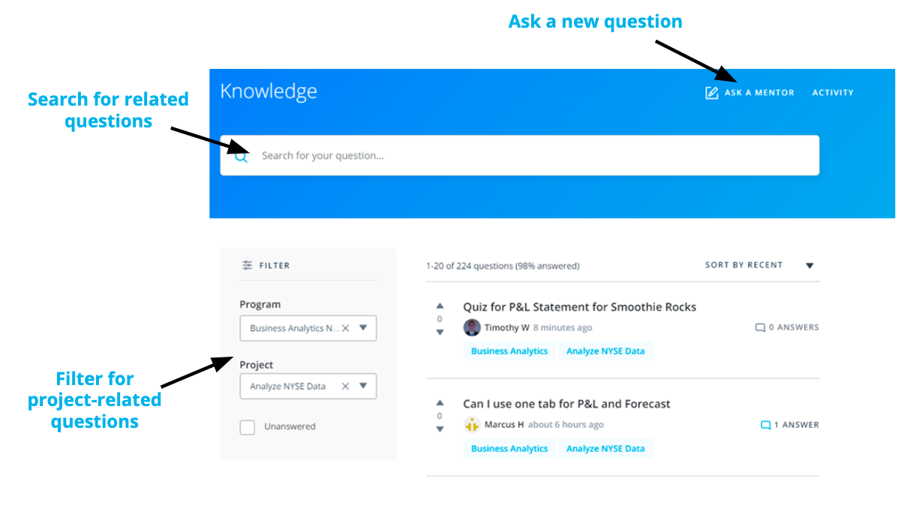
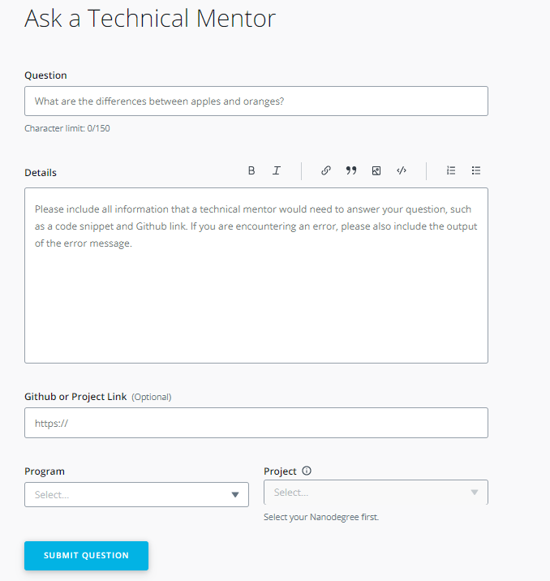
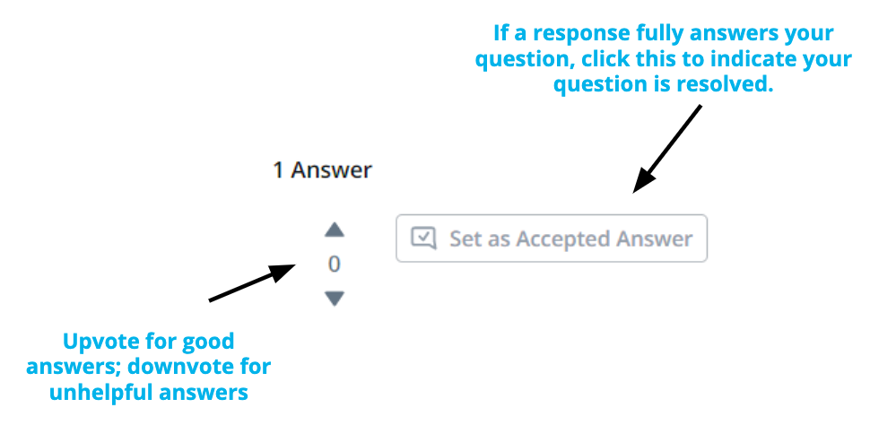
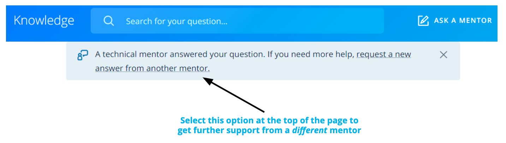

# Mentor Help

> Part of: **Getting Help**

## Images

## Additional Content

__Technical Mentor Support__: is provided through Knowledge, our expert Q&A platform. You can search for answers to questions similar to yours or post new questions related to your project or lessons. __Udacity’s expert technical mentors answer all-new questions.__   

### How to Use Knowledge 

To ensure you’re getting the quality and prompt support you need, it’s helpful to follow these best practices and guidelines for Knowledge.   
* **Search for Similar Existing Questions**:
with tens of thousands of students enrolled in our programs, many of your questions may have already been asked and answered. To look for existing answers to similar questions that may provide the immediate support you need, use the **filter on the left side of your screen** to select your course and related project or write in the key terms related to your question in the **search bar** at the top of the page.      

* **Ask a New Question**: 
if you want to ask a new question, select “Ask a Mentor” at the top of the page. Kindly remember that Knowledge is for technical questions only; for other types of support and feedback, please write to support at support@udacity.com.      

When you ask a new question, the platform immediately assigns it to one of our expert mentors spread across the globe to ensure prompt replies. Of note, when a mentor answers your question, you will see “Mentor” next to their name to differentiate their support from comments your fellow learners may also provide.
If you don't see your question, simply create a new post. You are likely to get an answer within 24 hours and you'll be helping future students who may encounter the same problem. 

### How to Ask a Good Question?

Students that follow these tips typically receive the strongest initial support and avoid back-and-forth with mentors:   

* **Ask Specific Questions**: if you have closely related questions that form part of a general theme, it’s okay to ask them all together. But consider using bullet points to separately list each of the questions in your post. Keeping your questions organized helps ensure mentors provide clear answers to each specific question. If your questions are less closely connected, it’s best to submit new, separate questions for each one.        

* **Provide Details and Links:** explaining what (if anything) you’ve already attempted to solve the problem helps mentors know where to start when answering your question. Likewise, if your question is not related specifically to a project, but rather to an exercise, quiz, or lesson, it’s helpful to include information such as lesson or quiz name, screenshots, and classroom links.  

> Overall the key to asking a good question is to imagine yourself trying to answer your own question. Imagine you were coming to it without any prior knowledge. Does the question make complete sense? Or are there gaps around the context?    
>

* **Start with a Clear Question Title**: attempt to summarize your entire question in one sentence. You may even write the title at the end, just before posting the question. This will help you summarize the issue before you include details in the question itself.      

* **Share Code Correctly**:  by using the “Code Block” option to properly format your code. If your question concerns a piece of external code, include a link to the file on Github.    

> In fact, Github lets you create a link to a specific line in a file.  To do so, just click to the left of the line number, and then select *copy permalink* in the ellipsis that appears in the margin. Paste the *permalink* right into the Github box on your question submission form.       
>

* **Figuring out Errors**: if your question is about an error message or stack trace, include the entire error message, by either formatting the error message using the “Code Block” option or creating a Gist or a Paste on Pastebin, and including a link to it in the description.    

* **Avoid Screenshots of Code or Error Messages**: do not use screenshots of code or error messages. They are hard to read and the text cannot be copied to debug it.   

If you receive a helpful answer, kindly select it as the “accepted answer.” For questions from other students, if you see other helpful answers kindly select the “upvote” option. Conversely, if you don’t think an answer strongly answers a question, select the “downvote” option.
### Getting Additional Support

At times, students want support from a different mentor. As everyone learns differently, we want to make this a simple process for learners like you.    

If you receive an answer that you are not satisfied with and want a different mentor to chime in, kindly select the option at the top of the page in Knowledge. If you reply directly in the comments section, without clicking on the link at the top of the page, your question will not be answered by another mentor.
