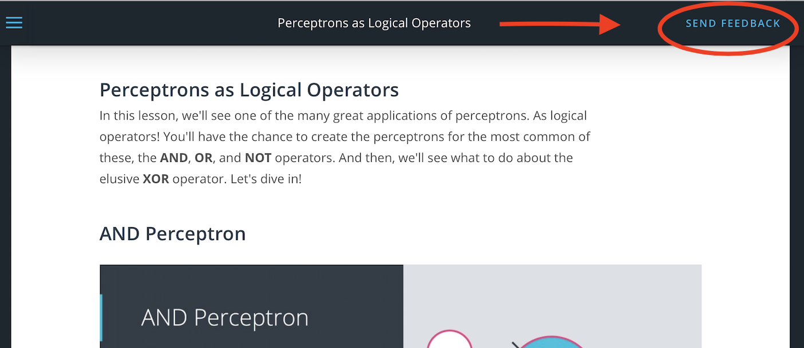
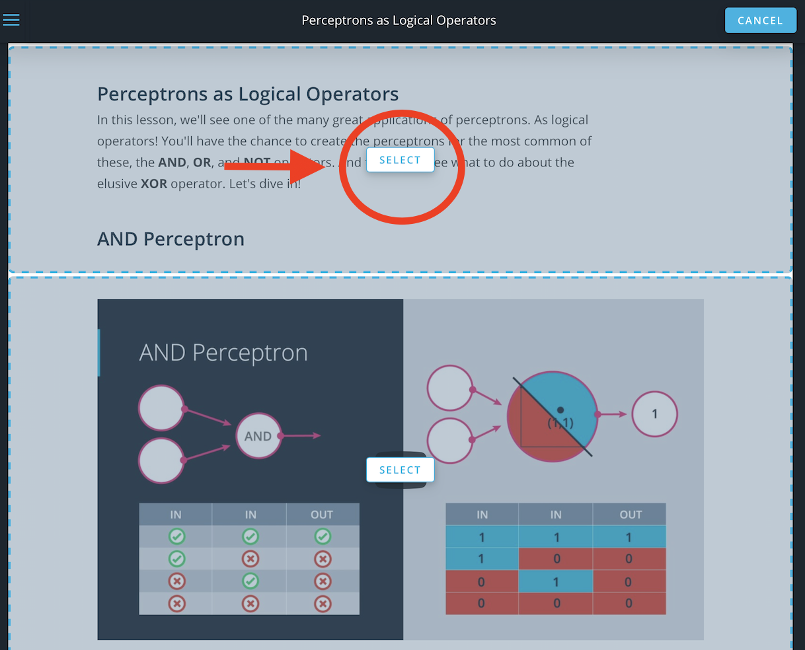
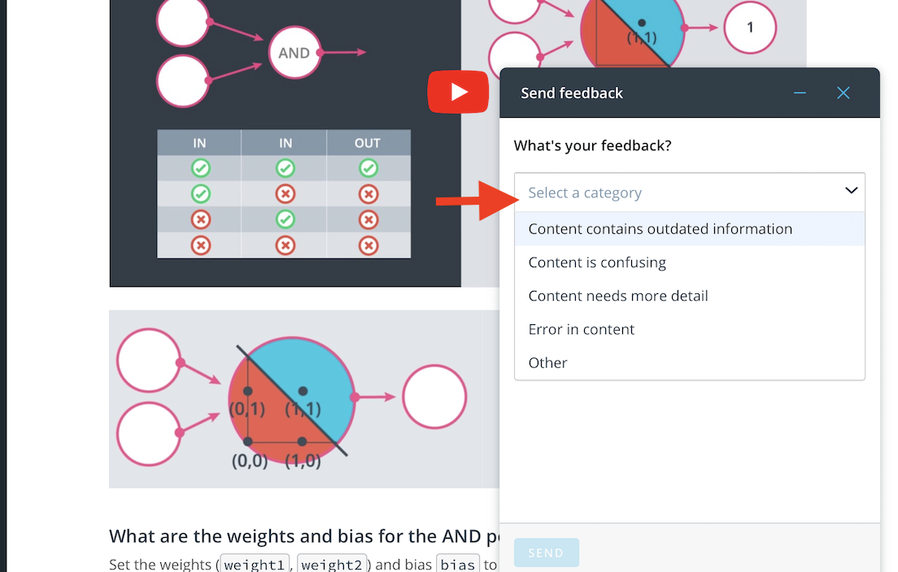
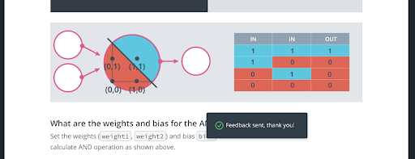

# Submitting Classroom Feedback

> Part of: **Getting Help**

## Images

## Additional Content

If you would like to share feedback on your learning experience or need to report any errors in the classroom content, click the ‘Submit Feedback’ button on the upper-right corner of the classroom. This feature is available in all of your lessons and allows you to provide comments on specific sections of the lesson you’re on.

NOTE: When you report feedback through the classroom, you won’t receive a direct response, but don’t worry! Your feedback will be documented and shared with the appropriate team for review. We strive to create the best learning experience for each unique individual and we’ll take your feedback into account as we continue to improve the program!

**How Classroom Feedback Works**

Click the ‘Submit Feedback’ button on the upper-right corner of the classroom:
This will highlight different sections on the current concept that you’re in. Click ‘Select’ on the section you would like to provide feedback on:
Once you select a section, you will see a feedback box appear on the bottom-right corner of the classroom where you can fill in additional information that you would like to share with us. Once you click ‘Send,’ you will see a confirmation message that your feedback has been sent and received.
And that’s it! As a reminder, you won’t receive a direct response for classroom feedback submission, but please know that your comments have been shared with the appropriate team for review.
