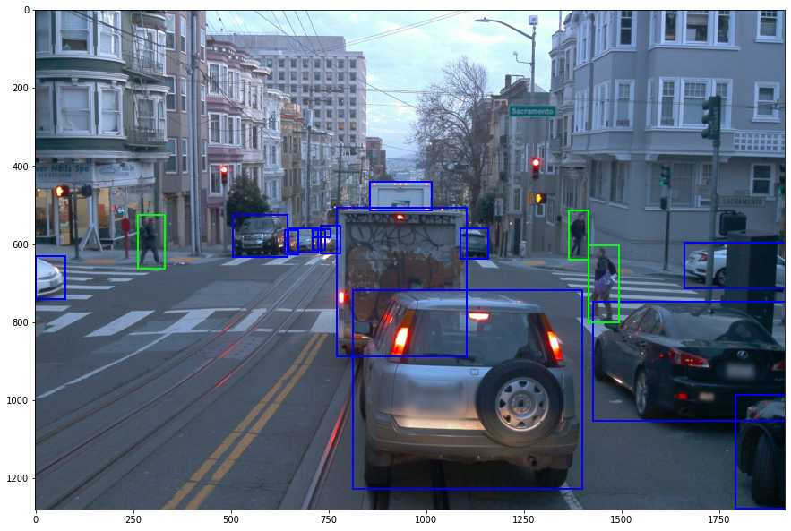

# Big Picture

> Part of: **Object Detection in Images**

## Video

[Watch on YouTube](https://www.youtube.com/watch?v=fAiH8un5JRE)

## Summary

**Image Classification and Object Detection**
=============================================

Image classification is a fundamental task in computer vision, but it has limitations when applied to complex environments like self-driving cars. To overcome these limitations, we need to extract more information from images, which leads us to object detection.

### Key Concepts
* **Object Detection**: A technique that allows systems to identify and locate specific objects within an image.
* **Regression and Classification**: Two key elements of object detection algorithms, where regression is used for localization (positioning) and classification is used for identifying the type of object.
* **Multi-Class Object Detection**: The ability to detect and classify multiple types of objects within a single image.

### Practical Notes
To build an effective object detector, you need to combine the concepts of regression and classification. This involves using algorithms that can both localize objects (regression) and identify their class labels (classification). While this lesson focuses on the basics of object detection, it sets the stage for more advanced topics in computer vision.

## Transcript

Image classification is a landmark task in computer vision. However, for systems navigating in complex environments such as self-driving cars, we need to extract more information from the image. Let's consider this example. Wouldn't it be great to localize the car in image, allowing the self-driving car system to make optimal decisions? Well, this is exactly what object detection is about.

In this example, we only have one class, cars. However, you can build object detector that also classify objects between multiple classes. Object detection algorithm contains the element from regression and classification. You should recognize them from the previous lessons.

## Images

*Object Detection Example*

## Additional Content

## Big Picture
Let's look at the image above. We can quickly understand why image classification is not the way to go to fully understand the environment - there are multiple objects of multiple classes. We need an **object detection** algorithm here, where each object in the image is located and classified.
