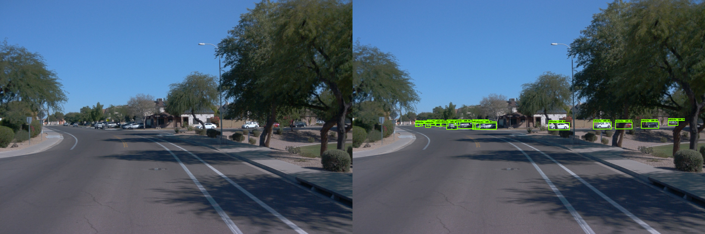

# Project: Object Detection in an Urban Environment

> Part of: **Introduction to Deep Learning for Computer Vision**

## Video

[Watch on YouTube](https://www.youtube.com/watch?v=UiZ2p4dRuek)

## Summary

**Object Detection Project with TensorFlow**
=============================================

This project is an exciting opportunity to apply the knowledge gained from this course to a real-world problem. You'll train an object detection algorithm using the Waymo open datasets to detect and classify cars, pedestrians, and cyclists.

### Key Concepts
* **TensorFlow Object Detection API**: A pre-trained model that can be fine-tuned for specific tasks.
* **Object Detection Algorithm**: A machine learning approach to detecting and classifying objects in images or videos.
* **Waymo Open Datasets**: A collection of annotated data used for training and testing object detection models.

### Practical Notes
To complete this project, you'll need to:

1. Use the TensorFlow Object Detection API to train a model on the Waymo open datasets.
2. Perform an in-depth error analysis to understand your model's limitations.
3. Refine your model using personalized feedback from a machine learning professional.
4. Create a GitHub repository to showcase your project and add it to your portfolio.

Note: You'll have access to a machine with a GPU, allowing you to train your algorithm multiple times with different sets of parameters. Additionally, we'll provide code to generate videos from the Waymo open dataset for analysis.

## Transcript

The final project is the part of this course I'm the most excited about because you will get to take all the knowledge you have acquired during the lessons and apply it to real world problem. The project consist the training in object detection algorithm to detect and classify cars, pedestrian, and cyclist using the Waymo open datasets. With this project, you will learn how to use the Tensorflow object detection API. You will have access to a machine with a GPU, giving you the opportunity to train your algorithm multiple times with different sets of parameters. You will also get to perform an in-depth error analysis to understand your model's limitation.

With this project, you will have a better understanding of the full workflow of a machine learning engineer. Once you are done with the project, you will get personalized feedback from a machine learning professional. You can use this feedback to improve on a GitHub repository you created making this project ready to be added to your portfolio. We will also provide the code to generate such video of any trip of the Waymo open dataset. I'm looking forward to seeing what you will build.

## Images

*Example of detections output from the created model*

## Additional Content

## Project: Object Detection in an Urban Environment
For the final project of this course, you will have to train an object detection model using the **TensorFlow Object Detection API**. This API simplifies the training and development of object detection models in TensorFlow. You will learn how to master it in this project. This API makes the exploration of the optimal parameters for your model extremely easy by using **config files**. Because you should try to create the best possible model, you will have to **tweak and test different parameters**. Finally, you will have to perform an in-depth **error analysis**.
