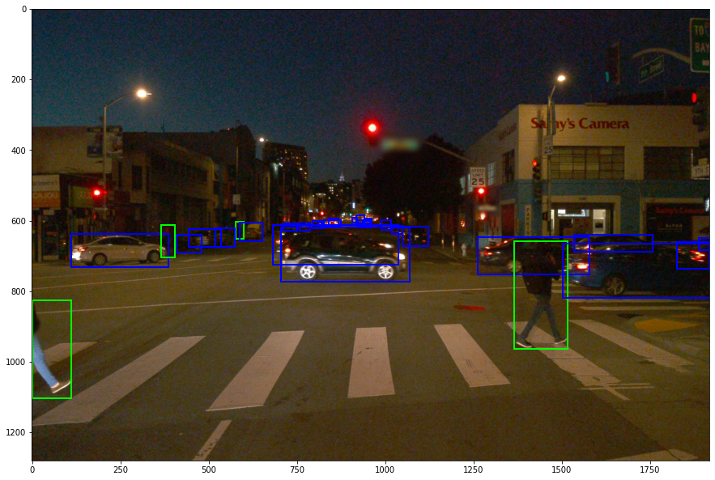

# Introduction

> Part of: **Object Detection in an Urban Environment**

## Images

*An example night image from the Waymo dataset, with annotations for vehicles and pedestrians.*

## Additional Content

## Project Introduction

In this project, you will apply the skills you have gained in this course to use a pretrained neural network to detect and classify objects using data from Waymo. You will be provided with a dataset of images of urban environments containing annotated cyclists, pedestrians and vehicles.
You will monitor the training with TensorBoard and decide when to end it. Finally, you will experiment with different hyperparameters to improve  your model's performance. 

This project will include use of the [TensorFlow Object Detection API](https://github.com/tensorflow/models/tree/master/research/object_detection), where you can deploy you model to get predictions on images sent to the API. You will also be provided with code to create a short video of their model predictions.
