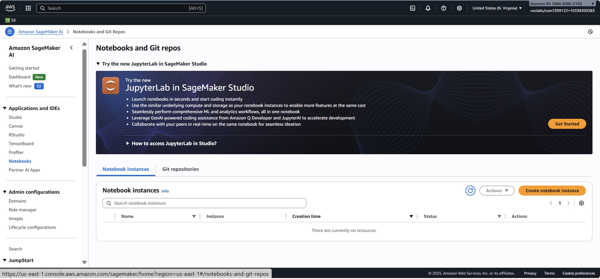
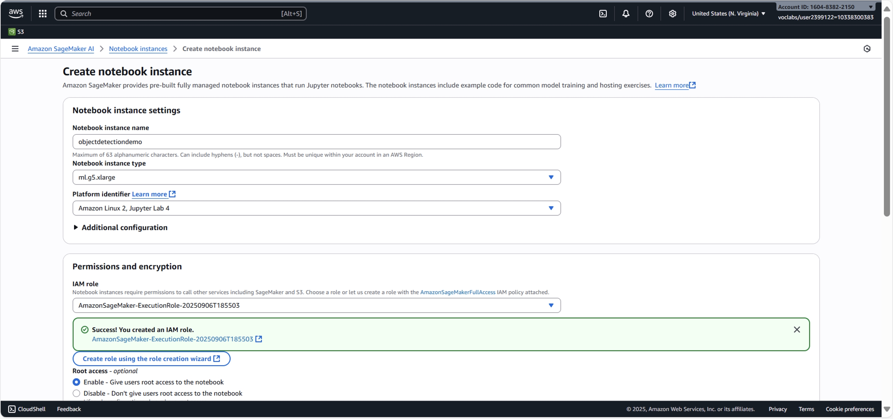
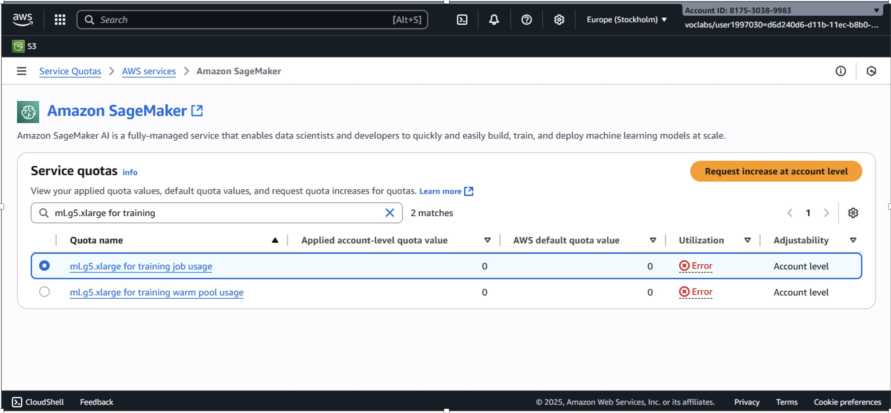
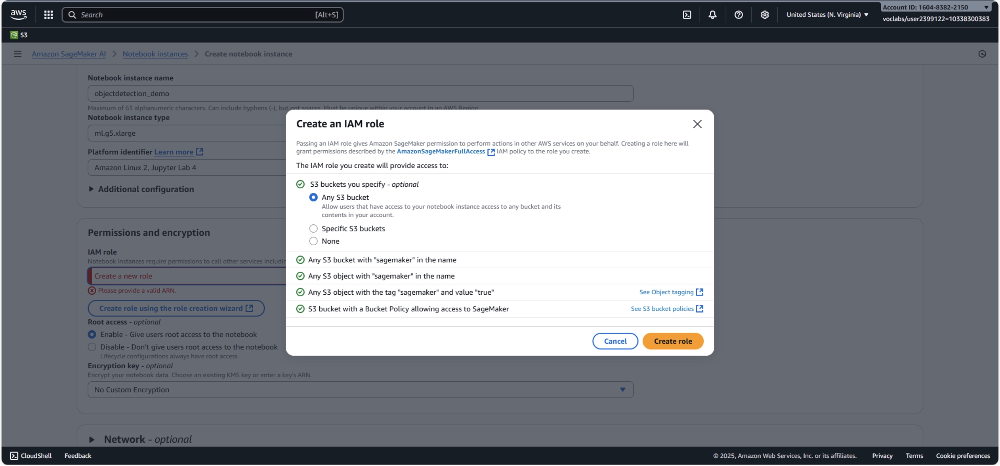
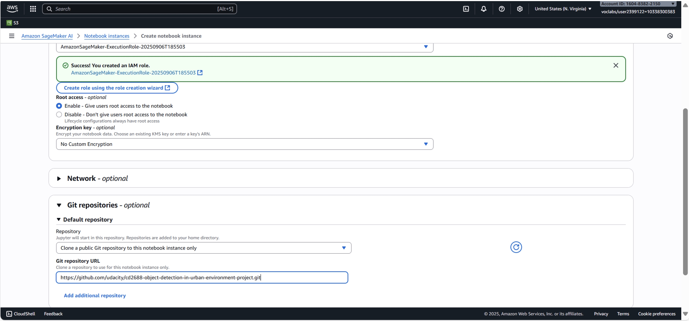
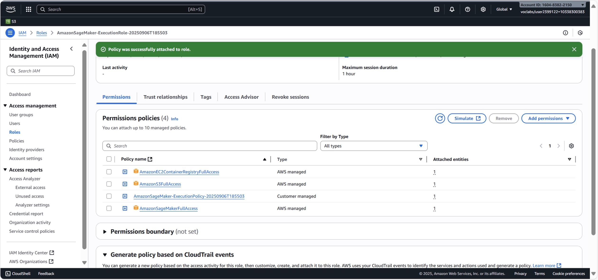
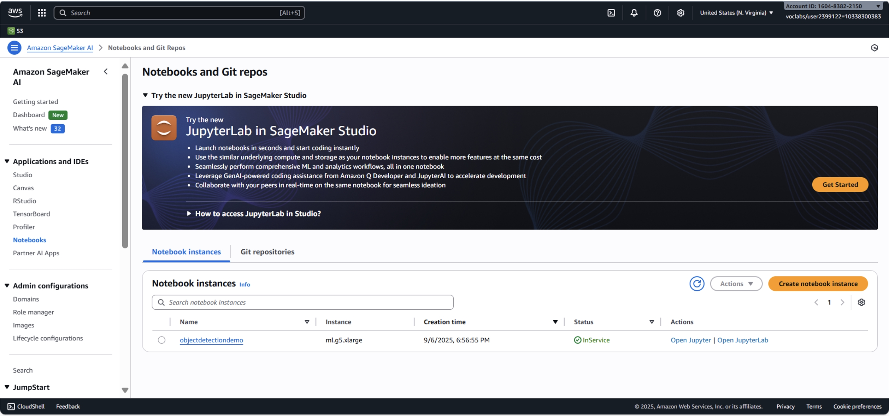
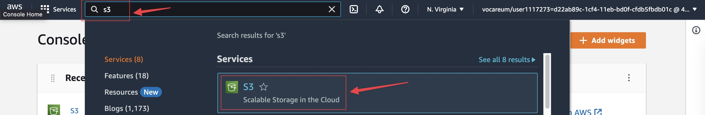
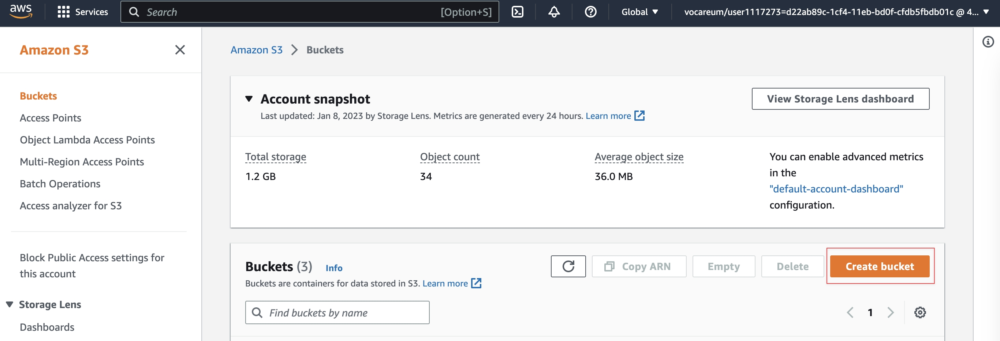
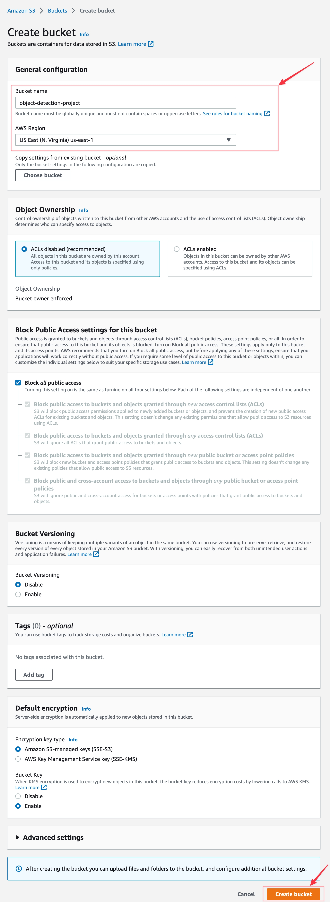

# Setup Instructions

> Part of: **Object Detection in an Urban Environment**

## Images

*Navigate to Sagemaker dashboard*

*Configure the **Notebook instance***

*A screenshot highlighting the Sagemaker service quota issue*

*A screenshot of creating and configuring IAM Role*

*A screenshot of configuring the Git repository in the notebook instance*

*A screenshot of an IAM Role with updated policies*

*A screenshot of a successfully created notebook instance *

*Navigate to Amazon S3*

*Create bucket - I*

*Create Bucket - II*

## Additional Content

## Setting up a Sagemaker notebook instance

Below are the steps to create a SageMaker notebook instance with the required settings for this project.

#### 1. Navigate to Amazon SageMaker AI 
First, open the AWS Management Console and navigate to the **Amazon SageMaker AI** service. 

#### 2. Create a Notebook Instance
In the left navigation menu, click on Notebook instances. On the following page, click the Create notebook instance button to begin.

#### 3. Configure the Notebook Instance 
On the "Create notebook instance" page, you will configure the basic settings:
  - Notebook instance name: Enter a unique name for your notebook.
  - Notebook instance type: From the dropdown, select `ml.g5.xlarge`.
  - Note on **Cost**: The `ml.g5.xlarge` is an expensive resource. Please be mindful of the usage hours to stay within your budget.

  - Note on **Quotas**: If you encounter an error related to service quotas, you may need to request an increase for the `ml.g5.xlarge` instance type, as the default quota can sometimes be zero. You can increase the quota by following [these instructions](https://docs.aws.amazon.com/servicequotas/latest/userguide/request-quota-increase.html).
#### 4. Create and Configure IAM Role

For the notebook to function correctly, it needs permissions to access other AWS services like S3 and EC2.

* **Create a New Role**: Under the Permissions and encryption section, find the IAM role dropdown and select Create a new role.
* **Specify S3 Access**: A pop-up window will appear. Ensure the option for Any S3 bucket is selected and click Create role.
* **Edit the Role for More Permissions**: The newly created role (AmazonSageMaker-ExecutionRole-...) has limited permissions. To add the required policies, click on the name of the role you just created. This will open the IAM management console in a new browser tab.
* **Git Repositories**: Scroll down to this section. In the Repository dropdown, select "Clone a public Git repository to this notebook instance only" and enter the following URL:
**https://github.com/udacity/cd2688-object-detection-in-urban-environment-project.git**
#### 5.	Attach Policies
In the new IAM tab, ensure you are on the Roles tab. 
Search for and select the **AmazonSageMaker-ExecutionRole** you created while configuring the notebook instance. 
Click the  Add permissions button and select Attach policies.

On the "Attach policies" screen, search for and check the boxes next to the following policies:
* AmazonSageMakerFullAccess 
* AmazonS3FullAccess
* AmazonEC2ContainerRegistryFullAccess

#### 6.	Confirm Attachment 
Click the Attach policies button. You should now see all required policies (AmazonSageMakerFullAccess, AmazonS3FullAccess, and AmazonEC2ContainerRegistryFullAccess) listed under the permissions policies. You can now close the IAM tab and return to the SageMaker notebook creation page.
#### 7.	Create and Launch the Notebook
* Finalize Creation: Back on the "Create notebook instance" page, scroll to the bottom and click the Create notebook instance button.

* Wait for Service: It will take a few minutes for the instance to be ready. Wait for the   Status to change from Pending to InService.

* Open Jupyter: Once the status is InService, click the Open Jupyter button to access the notebook's interface, where you will find the files from the cloned GitHub repository.

## Setting up an S3 bucket for storing logs

1. Search and navigate to AWS S3 from the AWS Console.
2. Create an S3 bucket for storing model artifacts and logs.

	a. Click on **Create bucket**.
    
	b. Fill **Bucket Name** and select **AWS Region**. The region should be set to `us-east-1`. Leave all other settings as default. Finally, click on **Create bucket** again.
Proceed further as per the project instructions.
