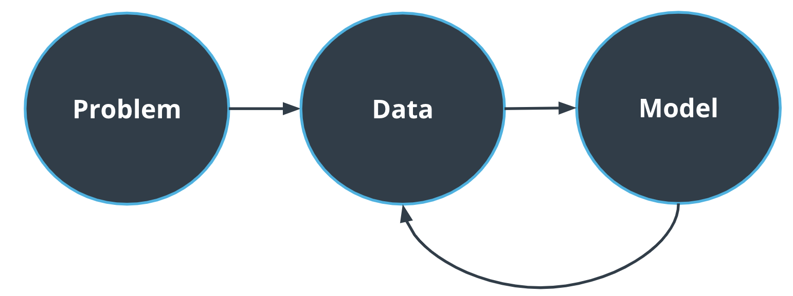

# Big Picture

> Part of: **The Machine Learning Workflow**

## Video

[Watch on YouTube](https://www.youtube.com/watch?v=APCSNVo3sJU)

## Summary

**Machine Learning Workflow**
=====================================

The machine learning workflow is a structured approach to solving problems that involve complex data analysis and prediction. It involves breaking down the problem into manageable steps, from framing the question to evaluating the results.

### Key Concepts
* **Problem Framing**: Identifying the problem, understanding its significance, and determining whether machine learning is the best approach.
* **Data Requirements**: Assessing the amount of data needed, its availability, and processing requirements.
* **Model Selection**: Choosing an appropriate algorithm or model based on the problem constraints, such as hardware limitations.
* **Feedback Loop**: Iterating between data collection and model evaluation to refine the solution.

### Practical Notes
When working with machine learning problems, it's essential to follow a structured approach. This includes:

* Defining the problem clearly and identifying whether machine learning is necessary.
* Gathering sufficient data, considering its quality, quantity, and processing requirements.
* Experimenting with different models, such as logistic regression and neural networks, to find the best fit for the problem.

Example code snippet:
```python
# Import necessary libraries
import pandas as pd
from sklearn import datasets

# Load traffic sign dataset (example)
traffic_signs = datasets.load_traffic_signs()

# Explore data and prepare it for modeling
data = pd.DataFrame(traffic_signs.data, columns=traffic_signs.feature_names)
target = traffic_signs.target

# Experiment with different models (e.g., logistic regression, neural networks)
```

## Transcript

The machine learning workflow is always following these steps. First, we need to frame the problem. What are we trying to achieve here? Why? Who cares about this problem?

Do we even need machine learning? Once we have answered this question, we need to focus on data. How much data do we need? Is it easy to obtain? How much processing is required?

When our data set is ready, we can focus on the model. Which approach is best for this problem? What are the constraints? For example, are limited because of the hardware? We then have a feedback loop between data and model.

We can use the model predictions to decide if we need more data or not for example. Let's go back to the traffic sign data set. In this machine learning problem, we are trying to classify traffic signs just by using images. The available data, consisting thousands of images for each type of traffic sign. As for the model, we will experiment with different algorithm, such as logistic regression and neural networks.

## Images


*The ML Workflow*

## Additional Content

## Big Picture
In the following videos and lessons, we are going to take a deeper dive into each component of the workflow. 
* **Problem setup** is the phase where we set the boundaries of the problem and will be tackled in the next few videos.
* The **Data** part of the workflow consists in getting familiar with the available dataset and will be the main focus of the next lesson on the camera sensor.
* **Modeling** is such a critical step that we will spend 3 lessons on it. Modeling consists in choosing and training different models and picking the best one.
