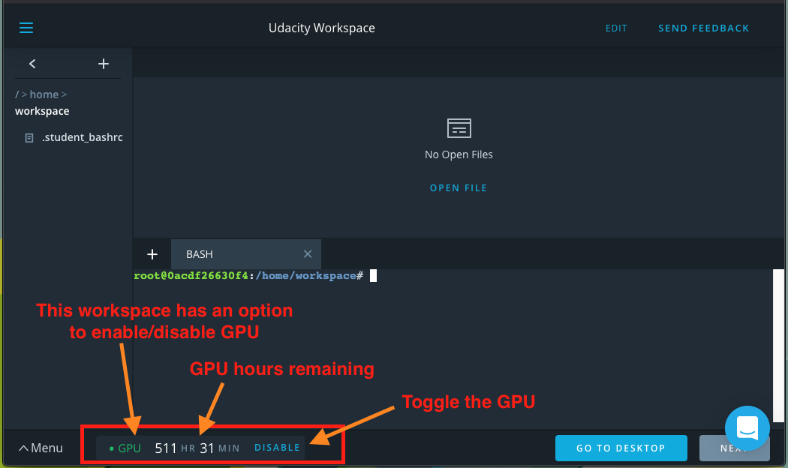

# Using A Desktop Workspace

> Part of: **The Machine Learning Workflow**

## Images

*A GPU Workspace Example*

## Additional Content

## Using a Desktop Workspace

Certain exercises in this course make use of Workspaces attached to a virtual desktop that you can use to display visual output from your programs or to work with Linux desktop applications, such as

[Visual Studio Code](https://code.visualstudio.com)

.

### Viewing the Desktop

You can view the Desktop by clicking on the "Desktop" button in the lower right side of the Workspace. This will open a new window in your browser with the virtual desktop. The desktop has a Visual Studio Code application along with a terminal app called *Terminator*, which can be used to browse files or run code. 

Try the desktop now in the workspace below! 

**Note:** Just as with other Workspace types, the Desktop will disconnect after 30 minutes of inactivity.
Note that if you are working on exercises that make use of `matplotlib` to show plots or images, you *can* still choose to work directly out of the main workspace window when programming, but viewing the pop ups for any visualizations will require you to navigate to the Desktop button to view them.
### Enabling GPU Mode in Desktop Workspaces

Several desktop workspaces require the use of a GPU to display the desktop. If a desktop workspace has support for GPU, it will be displayed on the bottom left corner of the workspace, as shown in the snapshot below:
You are provided with a fixed number of GPU hours at the beginning of this Nanodegree program. The amount of GPU time you have remaining in your account is displayed in the lower-left corner of your workspace.

GPU Workspaces can also be run without time restrictions when the GPU mode is disabled. The "Enable"/"Disable" button can be used to toggle GPU mode. Note that in GPU-enabled workspaces, some libraries will not be available without GPU support.

**NOTE:** Toggling GPU support may switch the physical server your session connects to, which can cause data loss unless you click the save button before toggling GPU support.
