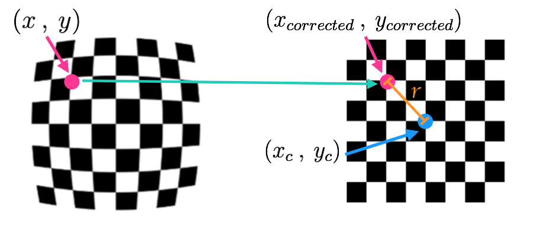

# Pinhole Camera Model

> Part of: **Sensor and Camera Calibration**

## Video

[Watch on YouTube](https://www.youtube.com/watch?v=FBHyHUN-A8c)

## Summary

**README: Understanding Camera Distortion**

This project aims to correct for distortion in images captured by cameras. The goal is to produce undistorted images that accurately reflect the real world surroundings.

### Key Concepts

* **Pinhole Camera Model**: A simple model of how a camera forms an image, focusing light reflected off objects through a small pinhole.
* **Camera Matrix (C)**: A transformative matrix used to transform 3D object points into 2D image points. It is essential for calibrating the camera later on.
* **Radial Distortion**: The most common type of distortion caused by lenses bending light rays too much or too little at the edges, creating curved lines and objects in images.
* **Tangential Distortion**: A type of distortion that occurs when a camera's lens is not aligned perfectly parallel to the imaging plane, making images appear tilted.
* **Distortion Coefficients**: Five numbers (or more) that reflect the amount of radial and tangential distortion in an image. These coefficients can be used to calibrate the camera and undistort images.

### Practical Notes

To correct for distortion, you will need to:

1. Understand how cameras form images using the pinhole camera model.
2. Familiarize yourself with the camera matrix (C) and its role in transforming 3D object points into 2D image points.
3. Learn about radial and tangential distortions and their effects on images.
4. Use distortion coefficients to calibrate your camera and undistort images.

Note: The mathematical details of correcting for distortion are covered in the notes below.

## Transcript

<v English>Before we get into the code and</v>
<v English>start correcting for</v> <v English>distortion, let's get some intuition</v>
<v English>as to how this distortion occurs.</v> <v English>Here's a simple model of a camera</v>
<v English>called the pinhole camera model.</v> <v English>When the camera forms an image,</v> <v English>it's looking at the world</v>
<v English>similar to how our eyes do.</v> <v English>By focusing the light that's reflected</v>
<v English>off of objects in the world.</v> <v English>In this case through a small pinhole,</v>
<v English>the camera focuses the light that's</v> <v English>reflected off of a 3D traffic sign,</v>
<v English>and forms a 2D image</v> <v English>at the back of the camera or</v>
<v English>a sensor or some film would be placed.</v> <v English>In fact the image it forms</v>
<v English>here will be upside down, and</v> <v English>reversed because rays of light that</v>
<v English>enter from the top of an object </v> <v English>will continue on that angled path through the pinhole and</v> <v English>end up at the bottom</v>
<v English>of the formed image.</v> <v English>Similarly, light that reflects</v>
<v English>off the right side of an object</v> <v English>will travel to the left</v>
<v English>of the formed image.</v> <v English>In math this transformation from 3D</v>
<v English>object points, P of X, Y, and Z.</v> <v English>To 2D image points, P of just X, and</v> <v English>Y is done by a transformative</v>
<v English>matrix called the camera matrix.</v> <v English>Which I'll call C for camera and</v> <v English>we'll need this to calibrate</v>
<v English>the camera later on.</v> <v English>However, real cameras don't</v>
<v English>use tiny pinholes like this,</v> <v English>they use lenses to focus</v>
<v English>multiple light rays at a time.</v> <v English>Which allows them to</v>
<v English>quickly form images.</v> <v English>But lenses can introduce distortion too.</v> <v English>Light rays often bend</v>
<v English>a little too much or</v> <v English>too little at the edges of a curved lens</v>
<v English>of a camera, and this creates the effect</v> <v English>we looked at earlier that</v>
<v English>distorts the edges of images.</v> <v English>So that lines or objects appear, more or</v>
<v English>less, curved than they actually are.</v> <v English>This is called radial distortion, and</v>
<v English>it's the most common type of distortion.</v> <v English>Another type, is tangential distortion,</v>
<v English>if the camera's lens is not aligned</v> <v English>perfectly parallel to the imaging</v>
<v English>plane where the camera film or</v> <v English>sensor is,</v>
<v English>this makes an image look tilted.</v> <v English>So that some objects appear further</v>
<v English>away or closer than they actually are.</v> <v English>And this is tangential distortion.</v> <v English>There are even example of lenses that</v>
<v English>purposefully distort images like fisheye</v> <v English>or wide angle lenses which keep radial</v>
<v English>distortion for stylistic effect.</v> <v English>But for</v>
<v English>our purposes we are using this images</v> <v English>to position ourself driving car and</v>
<v English>eventually steer it the right direction.</v> <v English>So we need undistorted images</v>
<v English>that accurately reflect</v> <v English>our real world surroundings.</v> <v English>Luckily, this distortion can generally</v>
<v English>be captured by five numbers called</v> <v English>distortion coefficients, whose values</v>
<v English>reflect the amount of radial and</v> <v English>tangential distortion in an image.</v> <v English>In severely distorted cases,</v>
<v English>sometimes even more than</v> <v English>five coefficients are required to</v>
<v English>capture the amount of distortion.</v> <v English>If we know these coefficients,</v> <v English>we can use them to calibrate our</v>
<v English>camera and undistort our images.</v> <v English>And the mathematical</v>
<v English>details of correcting for</v> <v English>distortion are in the notes below.</v> <v English>Next we'll see how to get these</v>
<v English>coefficients and calibrate a camera.</v>

## Images

*Points in a distorted and undistorted (corrected) image. The point (x, y) is a single point in a distorted image and (x_corrected, y_corrected) is where that point will appear in the undistorted (corrected) image.*

## Additional Content

## Pinhole Camera Model
**Types of Distortion**

Real cameras use curved lenses to form an image, and light rays often bend a little too much or too little at the edges of these lenses. This creates an effect that distorts the edges of images, so that lines or objects appear more or less curved than they actually are. This is called **radial distortion**, and it’s the most common type of distortion.

Another type of distortion, is **tangential distortion**. This occurs when a camera’s lens is not aligned perfectly parallel to the imaging plane, where the camera film or sensor is. This makes an image look tilted so that some objects appear farther away or closer than they actually are.
**Distortion Coefficients and Correction**

There are three coefficients needed to correct for **radial distortion**: **k1**, **k2**, and **k3**. To correct the appearance of radially distorted points in an image, one can use a correction formula.

In the following equations,

$(x, y)$

is a point in a distorted image. To undistort these points, OpenCV calculates **r**, which is the known distance between a point in an undistorted (corrected) image

$(x_{corrected}, y_{corrected})$

and the center of the image distortion, which is often the center of that image

$(x_c, y_c)$

. This center point

$(x_c, y_c)$

is sometimes referred to as the *distortion center*. These points are pictured below.

*Note*: The distortion coefficient **k3** is required to accurately reflect *major* radial distortion (like in wide angle lenses). However, for minor radial distortion, which most regular camera lenses have, k3 has a value close to or equal to zero and is negligible. So, in OpenCV, you can choose to ignore this coefficient; this is why it appears at the end of the distortion values array: [k1, k2, p1, p2, k3]. In this course, we will use it in all calibration calculations so that our calculations apply to a *wider* variety of lenses (wider, like wide angle, haha) and can correct for both minor and major radial distortion.

$$x_{distorted} = x_{ideal} (1 + k_1r^2 + k_2r^4 + k_3r^6)$$

$$y_{distorted} = y_{ideal} (1 + k_1r^2 + k_2r^4 + k_3r^6)$$

###### Radial distortion correction.
There are two more coefficients that account for **tangential distortion**: **p1** and **p2**, and this distortion can be corrected using a different correction formula.

$$x_{corrected} = x + [2p_1xy + p_2(r^2 + 2x^2)]$$

$$y_{corrected} = y + [p_1(r^2 + 2y^2) + 2p_2xy]$$

###### Tangential distortion correction.
