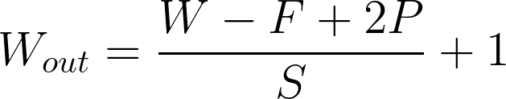

# Introducing Convolutional Layers

> Part of: **Image Classification with CNNs**

## Video

[Watch on YouTube](https://www.youtube.com/watch?v=L3yDNwv0du0)

## Summary

**Convolutional Layers: A Summary**
=====================================

A convolutional layer is a fundamental component of deep learning models, particularly in image recognition tasks. It's made up of filters that slide over the input volume, performing element-wise matrix multiplications and activations to produce feature maps.

### Key Concepts

* **Filters**: 3D volumes of learnable weights that convolve over the input volume.
	+ Each filter has a fixed height and width (hyperparameters), but its depth is equal to the input volume's depth.
	+ Filters are typically spatially small, with common sizes being 3x3, 5x5, or 7x7.
* **Convolution**: The process of sliding filters over the input volume to produce feature maps.
* **Feature Maps**: 2D arrays produced by each filter, which capture local features in the input image.
* **Activation Maps**: Another term for feature maps, emphasizing their role in activating neurons.
* **Receptive Field**: The spatial extent of a neuron's connectivity, similar to the filter size.
* **Padding**: Adding zeros to the border of the input volume to preserve its spatial dimensions.

### Practical Notes

When implementing convolutional layers, you'll need to specify several parameters:

* **Number of Filters**: Controls the depth of the output volume.
* **Stride**: The number of pixels to shift the filter by, affecting the size of feature maps.
* **Padding**: Adds zeros to the input border to preserve spatial dimensions.

The output width and height can be calculated using the following formula:

`Output Width = (Input Width - Filter Size + 2 \* Padding) / Stride + 1`

Similarly, replace `Input Width` with `Input Height` to calculate the output height.

## Transcript

What is exactly a convolutional layer? Well, a convolutional layer is made of filters. A filter, in this case, is a 3D volume of learnable weights. Each filter is going to slide over the input volume. For each sliding location, the filter will output a single value.

By the way, another term for sliding here is convolving, hence the name of this layer. Once the filter has been convolved over the entire input volume, we have a 2D output for this particular filter. The filter's height and width are hyperparameters, meaning that their value is set by the user. However, the depths of a filter is always equal to the depths of the input volume. The output array is called an activation map or feature map.

In general, we have more than one filter per convolutional layer. We're going to repeat this operation for such filter and therefore create a set of 2D feature maps. These feature maps are then stack together to create the output volume. The depths of these output volume is controlled by the number of filters. In the following videos, we'll learn how exactly this output volume is built.

But for now, I want you to remember that a convolutional layer is made of filters convolving over the input volume. Let's talk about these filters a little bit more. Convolutional filters are usually spatially small. Common values are three by three, five by five or seven by seven. Even though modern architecture tend to use smaller filter sizes.

As we learned in the previous slide, each neuron of the output volume is only connected to a small spatial area of the input volume. Well, we will also use the term receptive field of a neuron to describe the spatial extent of its connectivity. It is similar to the filter size, as I mentioned in the previous slide, the depths of the filter is equal to the depths of the input volume. Let's consider a convolutional layer with a seven by seven filter that's taking as input an RGB image. While each filter of such layer will have dimension of seven by seven by three.

Filters are made of learnable weights that we are going to tweaks through back propagation. If we consider an example of a seven by seven by three filter, such a filter is made of a 147 learnable weights. Similarly to the feedforward neural network, we also have a bias parameter per filter. Let's look at an example together. Our input volume here is an RGB image, and we are using a three by three filter.

Well, our filter is actually made of three channels, and they will be convolved over the entire depth of the input image. In the following video, we are going to learn about the different parameters of a convolutional layer. Before we look at an example of a convolution, we need to define a few parameters of the convolutional layer. We actually talked about the first parameter, which is the number of filters in the layer. Well, this parameter is also called depths on number of output channels.

Because we are going to stack the 2D features map created by each filter, the depth of the output volume is going to be equal to the number of filters. When convolving the filter, we need to decide on the step size, or stride. The step size, control the number of pixels we need to shift the filter by. If we increase the stride, we are going to reduce the number of sliding position of the filter, and therefore, reduce the size of the 2D feature map. Finally, we sometimes want to control the size of the output image.

For example, we may be interesting in preserving the spatial dimension of the input. To do so, we can pad the input volume by adding zeros to its border. For example, our 64 by 64 input image may be padded to 70 by 70, where all the border pixels are zeros. I know this is a lot of information, but hopefully it will all make sense in the next slide, where we see a convolution operation in action. Let's look at what is happening when convolving a filter over an input volume.

Here, our input volume is RGB image, and we use a three by three filter. For each position of this filter on this input volume, we're going to perform the following operation. Multiply each 2D slice of the filter with the local 2D slice of the input volume at the same depth. For example, the blue slice of the filter will be used to convolve over the blue slice of the input layer. The convolution operation is made of an element-wise matrix multiplications.

We then sum all the elements of this matrix, and activate the output using an activation function such as ReLU. Keep in mind that this whole operation, we only calculate one element of the output volume. Because we are using three by three filters with a stride of one over a five by five input volume, our output feature map for this filter is a three by three array. In the next slide, we will go over the calculation of the output volume dimension given the different parameters of the convolution layer. Thanks to the previous slide, we now have a good idea of how a convolution layer works.

Well, the last thing we need to tackle really is the formula to calculate the output dimensions of a convolutional layer. Because the depth of this output is controlled by the number of filters, we will only focus here on the spatial dimensions. Keep in mind that padding, filter size, and stride, can be different for each of the two spatial dimensions. In this case, we are going to focus on calculating the output width. Well, the output width is given by the following formula.

It is equal to the input width minus the filter size plus two times the padding divided by the stride, to which we add one. We can calculate the output height by applying the same formula, and replacing the input width by the input height. However, we should keep in mind that the output spatial dimensions should be integers, which limits the value the stride parameters can take. To remediate this, we often increase the padding size. We will go over this concept again in the quizzes.

Let's summarize what we have learned about the convolutional layer so far. A convolutional layer is made of a set of learnable filters. These filters are being convolved over an input volume. A convolutional layer has the following hyperparameter: the stride, the padding, and the filter size. They all control, the spatial dimension of the output.

The number of filters dictates the depth of the output. The convolutional layer, takes an input volume and outputs another volume. There are few more things that we have not mentioned about the convolutional layer, and we're going to tackle them in the next video.

## Images

*The output shape equation*

## Additional Content

## Introducing Convolutional Layers
A convolutional layer is made of **filters**. Such filters are `HxWxD` arrays of learnable weights that are sliding or convolving over the input volume. Each filter is convolved over the entire input volume. The convolution of such a filter creates an 2D output array called a **feature map**. Because a convolutional layer has multiple filters, it outputs multiple feature maps. They will be stacked together to create the output volume. 

The filters in a convolutional layer are defined by two hyperparameters: the height and width. They are usually small and the most common filter sizes are `3x3` or `5x5`. 
### The Convolution Operation
In addition to the filter size `F` , a convolutional layer has additional hyperparameters. The **stride** `S` controls the size of the step by which the filter is moving. The **padding** `P` controls the size of the output by adding zeros (or other values) to the border of the input. 

The spatial dimensions of the output volume can be calculated using the formula below. We are calculating the width of the output volume but the same formula would apply for the height.
