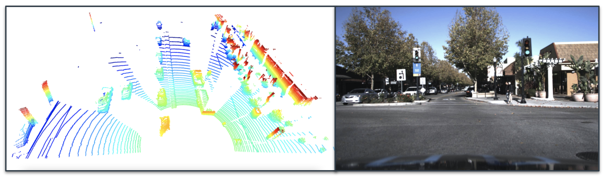

# Introduction to Sensor Fusion & Perception

> Part of: **Introduction to Sensor Fusion and Perception**

## Video

[Watch on YouTube](https://www.youtube.com/watch?v=CVWTxtsgKFM)

## Summary

**Object Tracking and Sensor Fusion**
=====================================

This lesson introduces object tracking, which is a crucial component of environment perception systems. It enables us to predict the movement and position of objects over time, not just detect them at a single point in time.

### Key Concepts
* **Sensor fusion**: Combining data from multiple sensors (e.g., camera, Lidar) to improve accuracy and reliability.
* **Object tracking**: Predicting the movement and position of objects over time using deep neural networks.
* **Lidar technology**: A type of sensor that uses laser light to create high-resolution 3D maps of the environment.

### Practical Notes
Sensor fusion is essential for building a reliable environment perception system. By combining data from multiple sensors, we can improve accuracy and robustness in object detection and tracking. In this lesson, you will learn about Lidar technology and its role in sensor fusion. You will also get an overview of the Lidar perception and sensor fusion modules that you will implement in this course.

Note: There are no specific code patterns or real-world applications mentioned in this transcript, so there is no additional information to include under "Practical Notes".

## Transcript

So far, you've learned how to detect objects in camera images using deep neural networks. But we do not only want to detect objects in a single time-frame, we also want to know where the objects are moving and where they will be in the next time-frame. To this end, we will learn how to track objects over time and estimate their position and velocity. We will also include Lidar data to improve the tracking results through sensor fusion. In this lesson, you will learn why we cannot rely on a single sensor, but we need sensor fusion to build a reliable environment perception system.

Andreas will give you a quick overview of the different car sensors with a focus on Lidar technology. You will get some insights on the history of Lidar sensors and sensor fusion. We will also give you an overview of the Lidar perception and sensor fusion modules you will implement in this course. Have fun.

## Images

*Lidar point clouds vs. a camera image (note: these are not the same location)*

## Additional Content

## Introduction to Sensor Fusion & Perception
So far, you have learned how to detect objects in camera images using deep neural networks. But we do not only want to detect objects in a single time frame, we also want to know where the objects are moving and where they will be in the next time frame. To this end, we will learn how to track objects over time and estimate their position and velocity. We will also include lidar data to improve the tracking results through sensor fusion.
