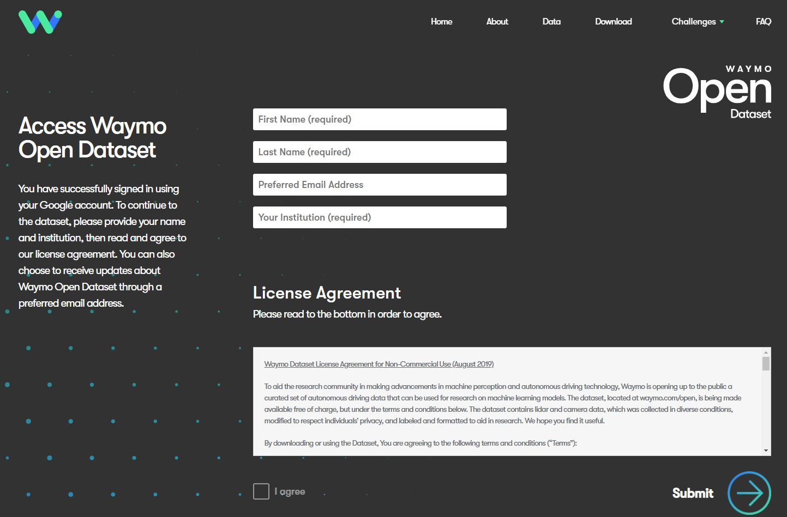
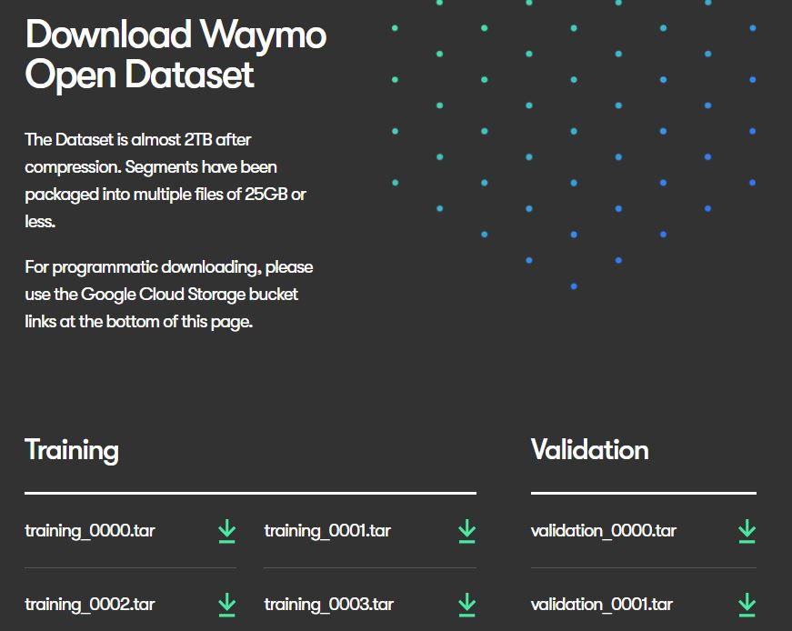
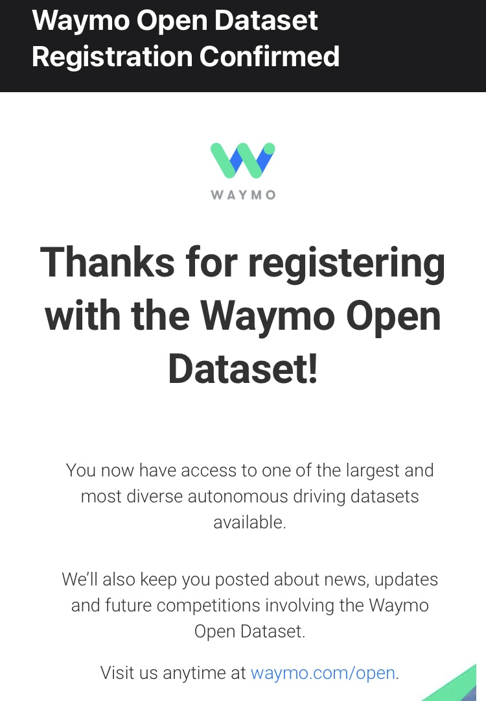
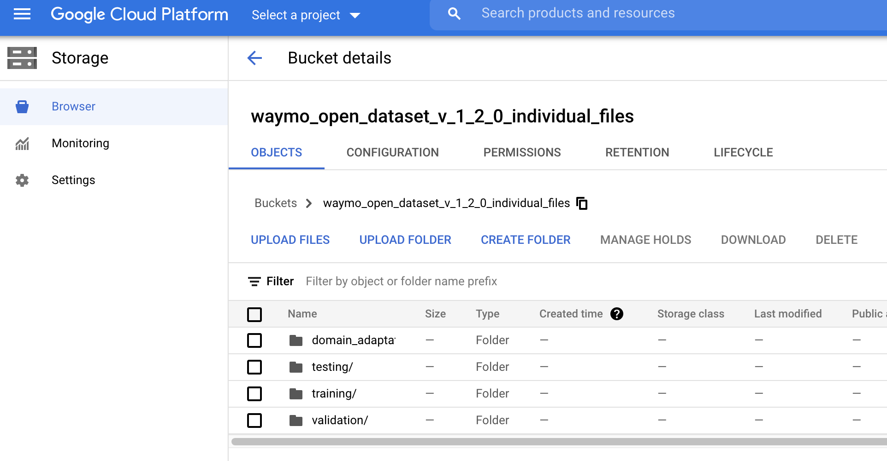
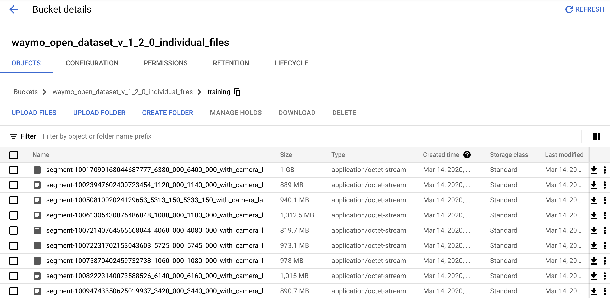

# Register for the Waymo Open Dataset

> Part of: **Introduction to Sensor Fusion and Perception**

## Images

*Registering for the Waymo Open Dataset*

*Dataset Download Page*

*Waymo Registration Confirmation Email*

*The top level of the cloud bucket*

*Individual dataset files within the training subdirectory*

## Additional Content

## Register for the Waymo Open Dataset
One of the truly exciting parts of this version of the Self-Driving Car Engineer Nanodegree program is the usage of the Waymo Open Dataset in some of the exercises and projects. Formerly the Google Self-Driving Car project (also originally headed by Sebastian Thrun, Udacity's founder, years ago), [Waymo](https://waymo.com/) is one of the leaders of self-driving car technology. The Waymo Open Dataset contains [tons of high quality data](https://waymo.com/open/about/) from both lidar and camera sensors from diverse locations and conditions.

Before we continue in the course, it's important to go ahead and register for the Waymo Open Dataset, making sure to put your *Institution* as "Udacity" using [this link](https://waymo.com/open/terms). As it may take up to 48 hours for your request to be approved, it's important to get it done now so you are able to more easily complete any related exercises and projects.
Once you have been successfully registered, or if you return to the Waymo Open Dataset site, you should see the below page, where you are able to download chunks of the dataset 25GB at a time from the ~2TB total dataset. There is also another method further download the page that further splits these up; note that Udacity workspaces in some cases will have smaller chunks ~1GB pre-loaded for you post-registration as well.
Additionally, once you have successfully registered, you should receive an email that looks like the below image.
### The Waymo Open Dataset Cloud Bucket

Earlier, we mentioned that the dataset files come in ~25GB chunks if you download from the earlier shown page. However, there are smaller chunks available from a cloud storage bucket as well. Some of the files you will be provided later on in workspaces come from these buckets so that they are easier to work with.

Travel to [this link for the cloud bucket](https://console.cloud.google.com/storage/browser/waymo_open_dataset_v_1_2_0_individual_files/). Once again, it's important to note that your registration may take 48 hours to become effective, so you may not be able to access it just yet, but you may want to bookmark it if you later want to download files from the bucket locally.

While you do not need to download any portions of the dataset right now, please make sure to have registered for the Waymo Open Dataset before proceeding.
