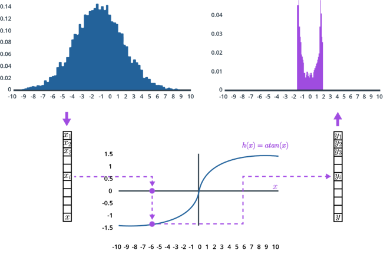
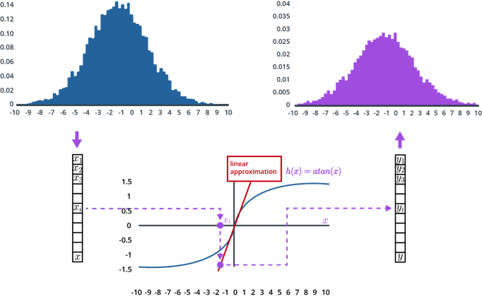

# Extended Kalman Filter (EKF)

> Part of: **Extended Kalman Filters**

## Video

[Watch on YouTube](https://www.youtube.com/watch?v=yCR3X_Na4Os)

## Summary

**Extended Kalman Filter and Non-Linear Transformations**
===========================================================

The Extended Kalman filter (EKF) is an extension of the traditional Kalman filter that can handle non-linear transformations in the measurement or state transition functions. This lesson explores how non-linearity affects the applicability of the Kalman filter and introduces a method to linearize non-linear functions.

**Key Concepts**
---------------

* **Gaussian Distribution**: A probability distribution where data points are randomly scattered around a mean value, following a bell-shaped curve.
* **Non-Linear Transformation**: A function that changes the shape or properties of a Gaussian distribution, making it no longer applicable for Kalman filter update equations.
* **Extended Kalman Filter (EKF)**: An extension of the traditional Kalman filter that can handle non-linear transformations by linearizing them using first-order Taylor expansion.
* **First-Order Taylor Expansion**: A method to approximate a non-linear function with a linear one, tangent to the original function at its mean location.

**Practical Notes**
------------------

To implement an EKF, you need to:

1. Identify non-linear functions in your measurement or state transition equations.
2. Linearize these functions using first-order Taylor expansion.
3. Use the resulting linearized functions in place of the original non-linear ones.

Example code for linearizing a function `h` might look like this:
```python
import numpy as np

def h(x):
    return np.arctan(x)

# Evaluate h at the mean location Mu
Mu = 0
h_Mu = h(Mu)

# Compute the first derivative of h
dh_dx = 1 / (1 + x**2)

# Linearize h using first-order Taylor expansion
linear_h = dh_dx * (x - Mu) + h_Mu
```
Note that this is a simplified example and actual implementation may vary depending on your specific use case.

## Transcript

Say that we have our predicted state X described by a Gaussian distribution. If we map this Gaussian to a non-linear function h, then the result is not a Gaussian distribution anymore. So the Kalman filter is not applicable anymore. To illustrate the impact of this non-linear transformation, here is a simple test. As an example, we use a list of 10,000 random values drawn from a normal distribution with a mean of zero and a standard deviation of three.

Here is the histogram of these values. You can see that it follows a Gaussian shape. Then for each of these values x_i, we have to compute the corresponding h of x_i. In our example, h is the arctangent of x_i, which is a non-linear function. The result is stored in an output list.

Finally, we use the output list to generate a new histogram. What we see here is that the resulting distribution is not a Gaussian anymore because of the non-linearity of h. So the Kalman filter update equations are not applicable here. How can we fix that? A possible solution is to linearize the h of x function.

That's the key idea of the so-called extended Kalman filter. We have to approximate our measurement function, h by a linear function which is tangent to h at the mean location of the original Gaussian. Here is the same test repeated with the same Gaussian input values. But instead of applying the non-linear function h, all the x_i values were passed through the linear approximation of h. We can see now that unlike in the non-linear case, this time our resulting distribution is still a Gaussian.

How do we linearize a non-linear function? The extended Kalman filter uses a method called first-order Taylor expansion. What we do is, we first evaluate the linear function h at the mean location Mu. Then we extrapolate the line with slope around Mu. This slope is given by the first derivative of h.

Similarly, extended Kalman filters use exactly the same linearization when the state transition function f is non-linear. You will find more information in the text below the video. In the next quiz, I would like you to compute the linearization of a given function.

## Images


*Follow the arrows from top left to bottom to top right: (1) A Gaussian from 10,000 random values in a normal distribution with a mean of 0. (2) Using a nonlinear function, arctan, to transform each value. (3) The resulting distribution.*


*This one looks much better! Notice how the blue graph, the output, remains a Gaussian after applying a first order Taylor expansion.*

## Additional Content

## Extended Kalman Filter (EKF)
### How to Perform a Taylor Expansion

The general form of a Taylor series expansion of an equation,

$h(x)$

, at point

$\mu$

is as follows:

$$h(x) = h(\mu) + h'(\mu) ( x - \mu)+ \frac{h''(\mu)}{2!} ( x - \mu)^2+...,$$

where

$n!$

denotes the factorial of

$n$

. You don't have to fully understand the Taylor series, but if you want more details, you can find them [here](https://en.wikipedia.org/wiki/Taylor_series). If

$\mu$

is close to

$x$

,

$(x-\mu)^2$

and higher order terms become very small, so we can neglect them. 

Therefore we get:

$$h(x) \approx h(\mu) + h'(\mu) ( x - \mu).$$

Simply replace

$h(x)$

with a given equation, find the derivative, and plug in the value

$\mu$

to find the Taylor expansion at that point

$\mu$

.

See if you can find the Taylor expansion of

$\arctan(x)$

! Let’s say we have a predicted state with mean:

$$\mu = 0$$

The function that projects the predicted state,

$x$

, to the measurement space is:

$$h(x) = \arctan(x)$$

and its derivative is:

$$h'(x) = \frac 1{1+ x^2}$$

I want you to use the first order Taylor expansion to construct a linear approximation of

$h(x)$

to find the equation of the line that linearizes the function

$h(x)$

at the mean location

$\mu=0$

.
### Further Quiz Explanation

Remember:

$$h(x) \approx h(\mu) + h'(\mu) ( x - \mu)$$

In our example

$\mu=0$

, therefore:

$$h(x) \approx \arctan(0) + \frac{1}{1+0}(x-0) = x$$

So, the function

$h(x) = \arctan(x)$

will be approximated by a line:

$h(x) \approx x$

.

And now, let's keep going!
