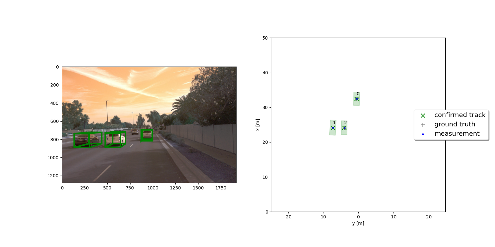

# Track Initialization

> Part of: **Multi-Target Tracking**

## Video

[Watch on YouTube](https://www.youtube.com/watch?v=T33j1oz8qBc)

## Summary

**Track Initialization**
=========================

This README file summarizes the key concepts of initializing a new track in a tracking system.

### Key Concepts

* **Track Management**: A data structure that stores all currently valid tracks. The track list is initially empty and populated as measurements arrive.
* **Track ID**: A unique identifier assigned to each track, which increments with each new track initialization.
* **Measurement Conversion**: Converting measurements from sensor-specific coordinates to the vehicle's coordinate system using a rotation and translation matrix obtained through calibration.
	+ **Homogeneous Coordinates**: Representing 3D points in a 4D vector space for easier transformation.
	+ **Transformation Matrix**: A matrix that combines rotation and translation operations to convert between different coordinate systems.

### Practical Notes

* To initialize a new track, you need to:
	1. Set the initial position coordinates of the track based on the measurement from the sensor (e.g., lighter).
	2. Initialize velocity components to zero with high uncertainty.
	3. Assign a unique track ID by incrementing the next available ID.
	4. Convert the measurement from the sensor's coordinate system to the vehicle's coordinate system using the rotation and translation matrix.

Example code for converting a measurement from homogeneous coordinates to the vehicle's coordinate system:
```python
import numpy as np

# Define the transformation matrix (rotation and translation)
T = np.array([...])  # obtained through calibration

# Convert measurement from homogeneous coordinates to vehicle coordinates
measurement_vehicle_coords = np.dot(T, measurement_homogeneous_coords)
```
Note: This code snippet is a simplified example and may require additional dependencies or modifications based on your specific implementation.

## Transcript

In the last lesson, we've learned how to track an object over time. But how do we initialize a new track in the first place? The track management contains a track list where all currently valid tracks are stored. At first, the track list is empty. When the first measurement arrives, we assume that the measurement originated from an existing target.

Therefore, we initialize a new track at the position of the detection. For example, assume a lighter, generates a 3D measurement z with coordinates P_x, P_y, and P_z. Then we can initialize a track with state x, where the position coordinates are given by the lighter measurement. Since we can't measure velocity with the lighter, we don't know anything about the velocity of the object. We set the velocity components to zero, and start with the high velocity uncertainty.

We also set a unique track ID for the new track. We give the new track, the next available track ID, which in our case, is one, and add the track to the track list. There's one more thing to consider. Remember that we have different sensors, and every sensor has its own coordinate system, which may differ from the vehicle coordinate system in rotation and translation. When we receive a lighter measurement and want to initialize a new track, we first have to convert the measurement from lighter to vehicle coordinates.

The rotation and translation matrix is given through calibration. Therefore, we first convert the measurement to homogeneous coordinates, then multiply it with the transformation matrix, as learned in the last lesson. The result is the lighter measurement converted to the vehicle coordinate system, and we can use it to initialize the track now.

## Images


*Example from the final project: Here our track list contains three tracks with the unique IDs 0, 1, and 2.*

## Additional Content

## Track Initialization
- An unassigned lidar measurement

$\mathbf z = (z_1, z_2, z_3)^T$

first has to be converted from sensor to vehicle coordinates:

$$\begin{pmatrix}
p_x\\ p_y\\p_z\\1
\end{pmatrix}
=
\left(\begin{array}{c|c}
  \begin{matrix}
  r_{11} & r_{12}& r_{13} \\
r_{21} & r_{22}& r_{23}\\
r_{31} & r_{32}& r_{33}
  \end{matrix}
  &  
\begin{matrix}
t_1 \\
t_2\\
t_3
  \end{matrix}\\

 \overline{\begin{matrix}
0 &0&0
  \end{matrix}}  &
  \overline{\begin{matrix}
1
  \end{matrix}}
\end{array}\right)
\cdot
\begin{pmatrix}
z_1\\ z_2\\z_3\\1
\end{pmatrix}
=
\left(\begin{array}{c|c}
{\mathbf M_{\text{rot}}}
  &  
{\text t}\\

 \overline{\begin{matrix}
0 &0&0
  \end{matrix}}  &
  \overline{\begin{matrix}
1
  \end{matrix}}
\end{array}\right)
\cdot
\begin{pmatrix}
z_1\\ z_2\\z_3\\1
\end{pmatrix}$$

- Then we can initialize the state of a new track as follows:

$$\mathbf x_0 = \begin{pmatrix}
p_x\\ p_y\\ p_z\\0\\0\\0
\end{pmatrix}$$
