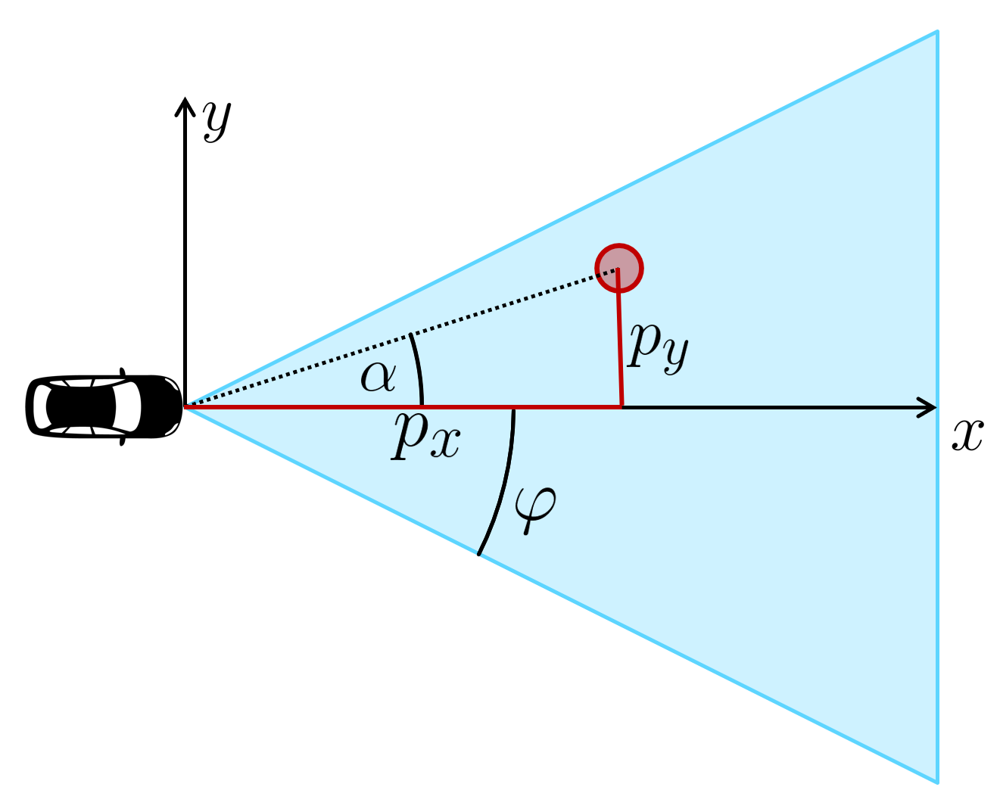

# Exercise: Visibility

> Part of: **Multi-Target Tracking**

## Video

[Watch on YouTube](https://www.youtube.com/watch?v=MQ98H3DWSn4)

## Summary

**Camera Field of View Implementation**
=====================================

This project involves implementing a function to determine if a point lies within the camera's field of view. The camera has an opening angle of **Pi/4** radians to the left and right of its optical axis, which is aligned with the x-axis.

**Key Concepts**
-----------------

* **Camera Field of View**: The range of angles within which objects can be seen by the camera.
* **Opening Angle**: The angle between the optical axis and the edges of the field of view (Pi/4 radians in this case).
* **Trigonometric Calculations**: Used to determine if a point lies within the field of view.
* **Transformation Matrices**:
	+ **Sensor to Vehicle**: A matrix that transforms points from sensor coordinates to vehicle coordinates.
	+ **Vehicle to Sensor**: The inverse of the sensor to vehicle matrix, used for transforming points back to sensor coordinates.

**Practical Notes**
-------------------

To implement the `in_field_of_view` function:

1. Use trigonometric calculations to determine if a point lies within the camera's field of view.
2. Take into account the opening angle and optical axis alignment (x-axis).
3. Test your implementation using random points generated by the script.

Note: The hint provided below the video can be consulted for guidance on implementing the visibility check.

## Transcript

Let's have a look at the starter code. The script includes a camera class with a given field of view. The camera has an opening angle of Pi 4 to the left and to the right of the optical axis, which is the x axis. You are already familiar with the transformation matrix named, sensor to vehicle, and the inverse matrix named, vehicle to sensor. Now I want you to implement the function named in field of view.

It takes the current state x as an input and should return true if x lies in the camera's field of view, otherwise, it should return false. You will need to implement some trigonometric calculations. If you are uncertain how to do it, take a look at the hint below the video. Let's see what happens if I run the script. You can see the opening angle of the camera in blue, the visible range is in this area between the blue lines.

The script generates random points and calculates whether the points lie inside the field of view. At the moment the function always returns false. Please implement the visibility check and see what changes in the plot.

## Images

*Overview of variables for visibility reasoning*

## Additional Content

## Exercise: Visibility
### Hint

Take a look at the image. We want to check the visibility of the red object, whose coordinates $p_x$ , $p_y$ are already transformed to sensor coordinates in this image. We have to calculate the angle $\alpha$ of the red target with respect to the vehicle. If the absolute value of $\alpha$ is smaller than the camera's opening angle $\phi$ , we can see the object, otherwise we can't. So how can we calculate $\alpha$?

Note that we have a right-angled triangle here, so we can calculate $\alpha$ with trigonometric functions. We have given the opposite side $p_y$ and the adjacent side $p_x$ of the triangle, where we assume $p_x > 0$ , therefore we can use the tangent function: $$\tan(\alpha) = \frac{p_y}{p_x}$$

This leads to the required angle $\alpha$ using the inverse tangent function, or arcus tangens:

$$\alpha = \arctan\left(\frac{p_y}{p_x}\right)$$

Can you find out how to use the arc tan in Python?
