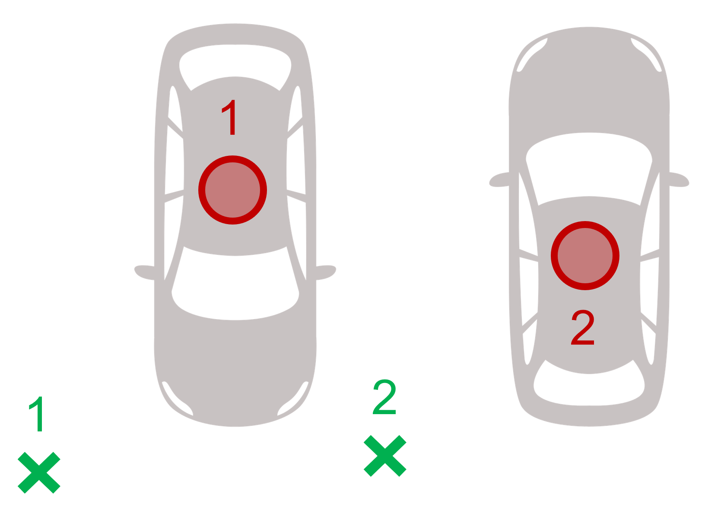

# Association

> Part of: **Multi-Target Tracking**

## Video

[Watch on YouTube](https://www.youtube.com/watch?v=1Sc2soEZBNQ)

## Summary

**Simple Nearest Neighbor Data Association (SNN)**
=====================================================

The Simple Nearest Neighbor data association algorithm is a method used to determine which track is closest to which measurement in a tracking system. This algorithm calculates all distances between tracks and measurements, then searches for the smallest distance to find associations.

### Key Concepts
* **Simple Nearest Neighbor Association (SNN)**: A basic data association method that calculates distances between tracks and measurements.
* **Image D**: The set of distances from a track to multiple measurements.
* **Association Pair**: A pair consisting of a track and its closest measurement, where the track is updated with the measurement's information.

### Practical Notes
To implement SNN, follow these steps:

1. Calculate all image D for each track by computing distances between tracks and measurements.
2. Search for the smallest distance between a track and a measurement to find an association pair.
3. Update the associated track with the measurement's information.
4. Remove the updated track and measurement from further consideration to reduce complexity.

Note that SNN has some limitations, including making hard decisions in ambiguous situations, which can lead to future errors. More advanced data association techniques, such as probabilistic data association algorithms, are available to address these issues.

## Transcript

How can we determine which track is closest to which measurement? Let's take a closer look at the data association algorithm. We will introduce a simple data association method called simple nearest neighbor association, or SNN. Consider this example with four tracks and three measurements. The SNN calculates all distances between tracks and measurements.

We first calculate the image D of track 1 to all three measurements. Then we calculate all distances for track 2, and so on until we have calculated all image thesis. Once we are done, we search for the smallest distance between a track and the measurement. In this example, the closest distance is between track 3 and measurement 2. We have found our first association pair and we would update track 3 with measurement 2.

According to our assumption, we can only update track 3 with a single measurement. We remove all other possible associations of tracks 3. Similarly, we can only use measurement 2 once to update a track so we can remove all other possible associations of measurement 2. The remaining association problem is already much less complex. Again, we find the closest remaining distance between track 2 and measurement 3, and therefore we update track 2.

Then we can remove the remaining distances for this track measurement pair. Finally, we find the closest remaining distance between track 1 and measurement 1 and we update track 1 accordingly. Note that there's no measurement left for track 4 to be updated with, so track 4 remains in the predicted position. The simple nearest neighbor data association is straightforward, but it also has some disadvantages. For example, it enforces hard decisions in ambiguous situations, where wrong associations may lead to future errors.

They are much more advanced data association techniques, for example, probabilistic data association algorithms, where such hard decisions are avoided and ambiguities can be resolved in the next time steps. Also, the simple nearest neighbor association is not globally optimal. Check out the quiz below to find out why.

## Images

*Data Association Example*

## Additional Content

## Association
- The $\textbf{Simple Nearest Neighbor (SNN)} data association calculates all Mahalanobis distances between tracks an measurements, then iteratively updates the closest association pair.
- The SNN is not globally optimal, this can be resolved using the $\textbf{Global Nearest Neighbor (GNN)}$ data association, which we will not cover here. You can check out [this paper](http://ecet.ecs.uni-ruse.bg/cst/docs/proceedings/S3/III-7.pdf) if you want to read more about it.
- Both data association methods enforce hard decisions in ambiguous situations. More advanced $\textbf{Probabilistic Data Association (PDA)}$ techniques can avoid these hard decisions and resulting errors. Again, we will not cover them here, but you can search the web for the different variants (e.g. PDA, JPDA, JIPDA) if you are interested, for resources such as [this paper](https://www.researchgate.net/publication/224083228_The_probabilistic_data_association_filter).
