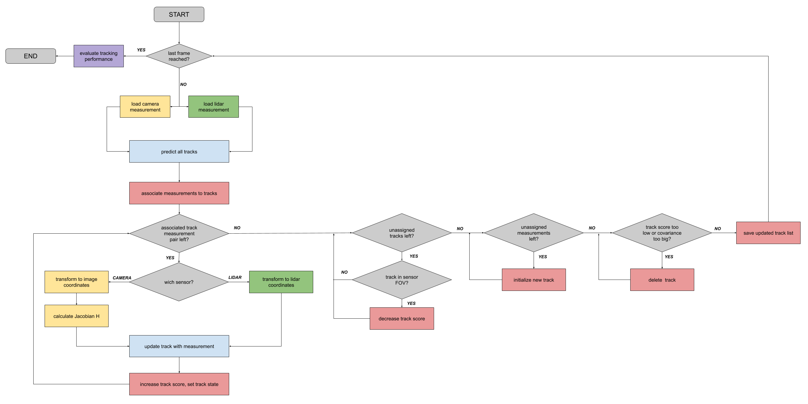

# Fusion Flow Chart

> Part of: **Multi-Target Tracking**

## Video

[Watch on YouTube](https://www.youtube.com/watch?v=Vj_DP38vabU)

## Summary

**Multi-Target Tracking Loop Summary**
=====================================

The multi-target tracking loop is a process used to manage multiple targets in a surveillance system. It involves predicting, associating, and updating tracks of these targets based on incoming measurements.

**Key Concepts**
---------------

* **Track initialization**: In the first measurement cycle, new tracks are initialized for every measurement.
* **Predictive step**: Tracks are predicted to the new measurement timestamp in each subsequent measurement cycle.
* **Association step**: Simple nearest neighbor association with gating is used to associate measurements with existing tracks.
* **Update step**: Associated measurements are used to update track scores and states.
* **Track deletion**: Tracks with low scores or high covariance are deleted from the system.

**Practical Notes**
------------------

The multi-target tracking loop involves a predictive, associating, and updating cycle. This process is repeated until all measurements have been processed. The algorithm uses simple nearest neighbor association to associate measurements with existing tracks, and deletes tracks that do not meet certain criteria (e.g., low score or high covariance). 

Example code for this process might look like:
```python
def multi_target_tracking_loop(measurements):
    # Initialize new tracks in the first measurement cycle
    tracks = []
    
    # Repeat predictive, associating, and updating cycle until all measurements have been processed
    while measurements:
        # Predict tracks to the new measurement timestamp
        predicted_tracks = predict_tracks(tracks)
        
        # Associate measurements with existing tracks using simple nearest neighbor association with gating
        associated_pairs = associate_measurements(measurements, predicted_tracks)
        
        # Update tracks with associated measurements
        updated_tracks = update_tracks(associated_pairs)
        
        # Delete tracks that do not meet certain criteria (e.g., low score or high covariance)
        deleted_tracks = delete_low_score_tracks(updated_tracks)
        
        # Add new tracks for unsigned measurements
        new_tracks = initialize_new_tracks(measurements)
        
        # Update track list and repeat cycle
        tracks = updated_tracks + new_tracks
        
        # Remove processed measurements from the list
        measurements = [m for m in measurements if not is_associated(m, associated_pairs)]
```
Note: This code snippet is a simplified example and may need to be adapted based on specific requirements.

## Transcript

Well then, we have now completed the overall tracking loop. Let's summarize how the multi target tracking loop works. In the first measurement cycle, we initialize a new track for every measurement. In the next measurement cycle, when we receive new measurements we predict all tracks to the new measurement timestamp. We run the simple nearest neighbor association, including gating to associate measurements to tracks.

Then we update all tracks with the associated measurements, increase the track score and set the updated tracks state. Once there's no associated track measurement pair left, we look for tracks that have not been updated. If they are in the current sensors field of view but have not been detected, we decrease the track score. If we have an unsigned measurements left, we initialize new tracks. Finally, we check for tracks whose score is below the threshold, or whose covariance is too big, and we delete these tracks.

Then we repeat the whole predict associate update cycle with the new track list until all measurements have been processed.

## Images


*Overview of multi-target tracking steps you have learned in this lesson*

## Additional Content

## Fusion Flow Chart
