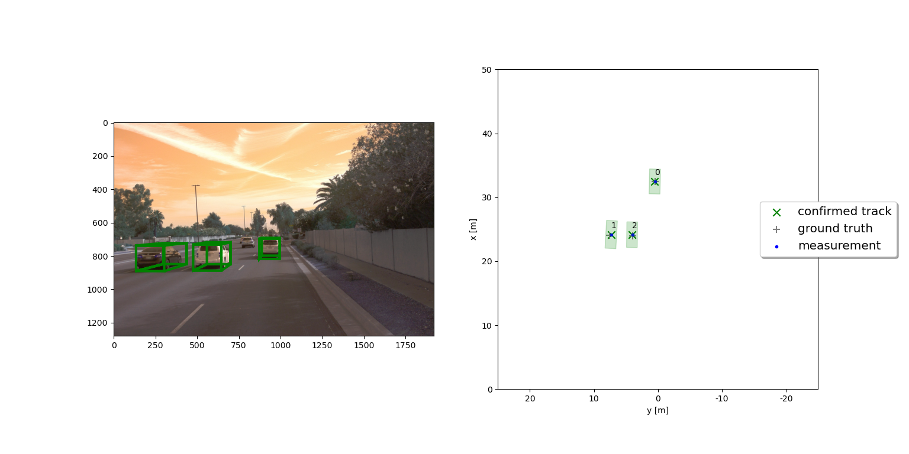

# Introduction

> Part of: **Final Project: Sensor Fusion and Object Tracking**

## Images

*Tracking Image Project Result*

## Additional Content

### Introduction
The final project consists of four main steps:
- Step 1: Implement an extended Kalman filter.
- Step 2: Implement track management including track state and track score, track initialization and deletion.
- Step 3: Implement single nearest neighbour data association and gating.
- Step 4: Apply sensor fusion by implementing the nonlinear camera measurement model and a sensor visibility check.

After completing the final project, you will have implemented your own sensor fusion system that is able to track vehicles over time with real-world camera and lidar measurements!
