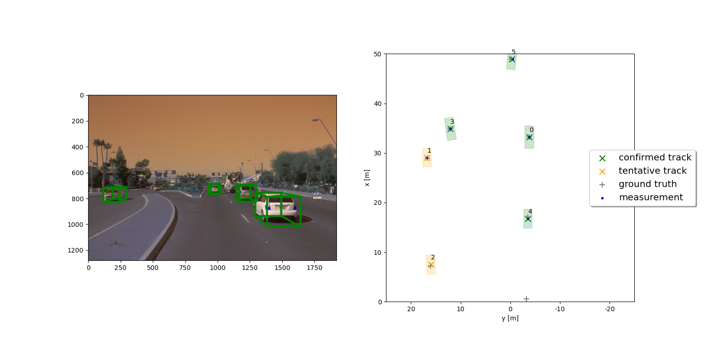

# Stand Out Suggestions

> Part of: **Final Project: Sensor Fusion and Object Tracking**

## Images

*Tracking Results, including tentative tracks*

## Additional Content

### Stand Out Suggestions
Here are some suggestions for you to go above and beyond if you like. These tasks are completely optional!
1.	Fine-tune your parameterization and see how low an RMSE you can achieve! One idea would be to apply the standard deviation values for lidar that you found in the mid-term project. The parameters in `misc/params.py` should enable a first running tracking, but there is still a lot of room for improvement through parameter tuning!
2.	Implement a more advanced data association, e.g. Global Nearest Neighbor (GNN) or Joint Probabilistic Data Association (JPDA).
3.	Feed your camera detections from Project 1 to the tracking.
4. Adapt the Kalman filter to also estimate the object's width, length, and height, instead of simply using the unfiltered lidar detections as we did. 
5. Use a non-linear motion model, e.g. a bicycle model, which is more appropriate for vehicle movement than our linear motion model, since a vehicle can only move forward or backward, not in any direction.
