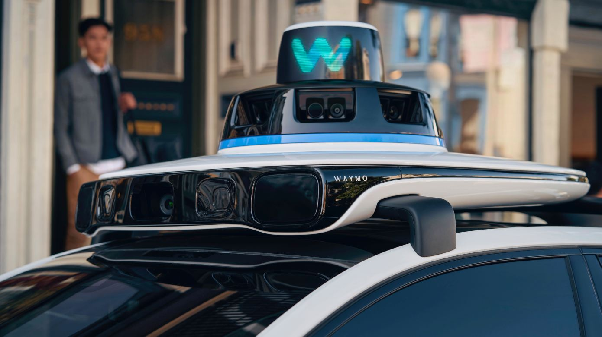
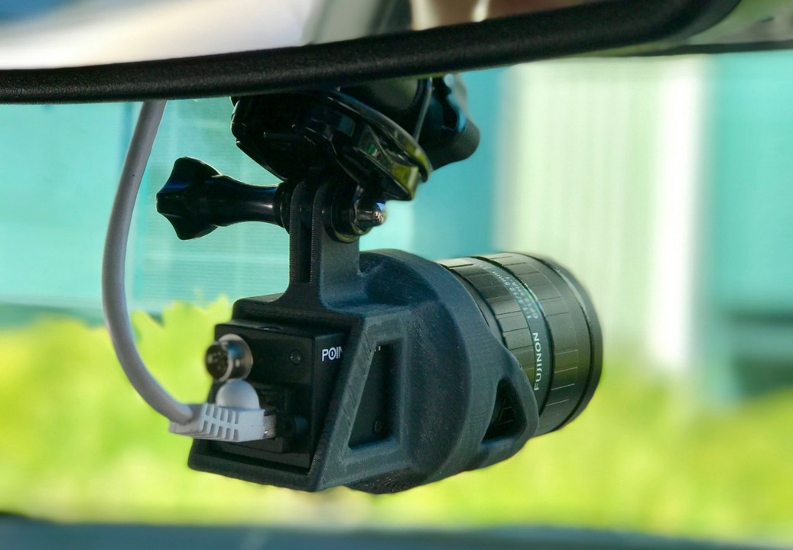
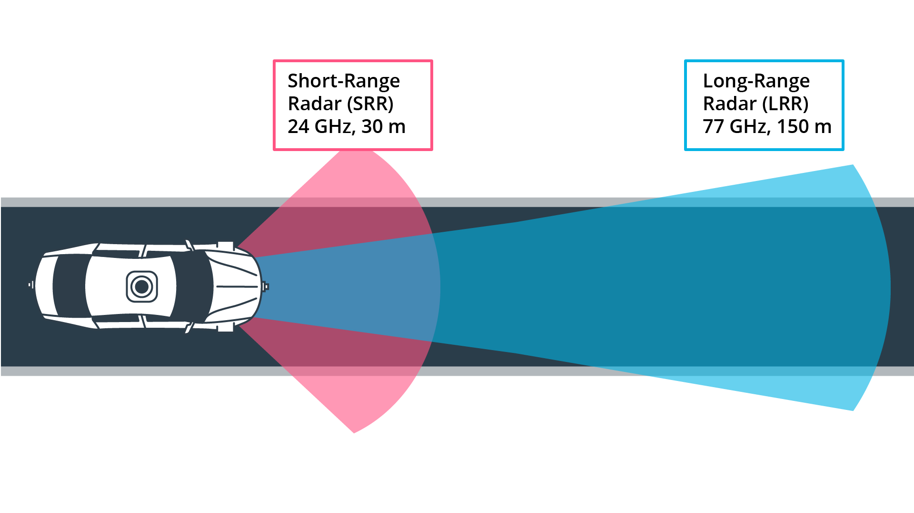
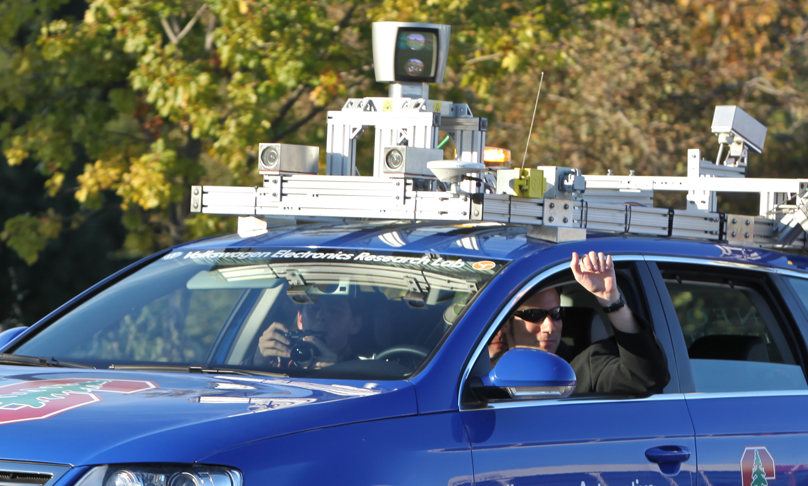

# The Role of Lidar in Autonomous Driving

> Part of: **The Lidar Sensor**

## Video

[Watch on YouTube](https://www.youtube.com/watch?v=oHd0bGbwukc)

## Summary

**Autonomous Driving Sensor Technologies**
=====================================

This lesson provides an overview of the different levels of autonomy used by the Society of Automotive Engineers (SAE) and introduces key sensor technologies used in driverless vehicles, including cameras, LiDAR, and radar sensors. The debate between LiDAR and radar sensors is also discussed, highlighting the approaches taken by companies such as Waymo and Tesla.

**Key Concepts**
---------------

* **Levels of Autonomy**: SAE defines six levels of autonomy, from Level 0 (no automation) to Level 5 (full automation).
* **Sensor Types**:
	+ **Camera Sensors**: used for object detection and recognition.
	+ **LiDAR (Light Detection and Ranging)**: uses laser light to create high-resolution 3D maps of the environment.
	+ **Radar Sensors**: use radio waves to detect speed and distance of objects.
* **LiDAR vs. Radar Debate**: highlights the trade-offs between LiDAR's high accuracy but high cost, and radar's lower cost but lower accuracy.

**Practical Notes**
------------------

This lesson focuses on providing context for understanding the role of sensor technologies in autonomous driving, rather than providing coding examples. The goal is to equip you with knowledge to participate in expert discussions and assess different sensor types using relevant parameters from automotive practice.

## Transcript

In this chapter you will learn about the different levels of autonomy used by the Society of Automotive Engineers, the SAE, and also about the main sensor types which we find in driver's vehicles, which are camera and LiDAR, and also the radar sensor. Also, we will discuss the current debate of LiDAR versus radar, which is fiercely discussed all over the Internet, in expert communities as well, and this debate exposes a fundamentally different approach to autonomous driving of companies such as Waymo on one end of the spectrum favoring the LiDAR sensor, and Tesla on the other end, favoring the camera and the radar sensor. At the end of this section here, you will understand how to assess and also compare different sensor types using a large number of relevant parameters from automotive practice. Enjoy the lesson and don't be disappointed that you will not yet encounter coding examples here. The main idea is to give you the context to fully appreciate the role of LiDAR and also enable you to chime in on expert discussions currently taking place all over the globe.

## Images

*Levels of Automated Driving - [Source](https://www.nhtsa.gov/technology-innovation/automated-vehicles-safety)*

*Waymo roof-mounted sensors - [Source](https://techcrunch.com/2020/03/02/waymo-brings-in-2-25-billion-from-outside-investors-alphabet/)*

*Udacity front-facing camera*

*Night-time driving in heavy rain - [Source](https://commons.wikimedia.org/wiki/File:Driving_in_the_Monsoon_Rain_%288000987873%29.jpg)*

*Long-range and short-range radar cones*

*Roof-mounted LiDAR sensor - [Source](https://upload.wikimedia.org/wikipedia/commons/6/65/Hands-free_Driving.jpg)*

## Additional Content

## The Role of Lidar in Autonomous Driving
### Levels of Autonomous Driving

Before we analyze a selection of autonomous vehicle prototypes and their respective sensors, let us look at a way to define autonomy - because not all autonomous cars and driver assistance systems are created equal. The following graphic shows the "levels of autonomous driving", which the Society of Autonomous Engineers (SAE) has defined.
For many years, driver assistance systems (ADAS) such as forward collision warning and braking or adaptive cruise control were the only systems available that at least automated a single vehicle function in some driving situations (either safety or comfort). 

Tesla has been one of the first companies world-wide to introduce a system into the market that implied a high degree of autonomy, the Auto Pilot. On the SAE chart however, this first version of their system has „only“ been at level 2, which means the driver must remain engaged and should monitor the environment at all times. 

The step to level 3 is a large one as the driver is no longer required to monitor the environment, even though he must be able to take back control at all times. From a legal viewpoint this means that the responsibility for the driving task is with the car and thus the manufacturer. This is why we do not see a large number of commercially available vehicles with level 3 systems on board. Several manufacturers have announced such systems but we do not find them in the market yet. The reason for this is three-fold: 

1. Such systems must be built reliable enough that faulty decisions are minimized. Engineers usually solve this problem by adding a large number of sensors to the car, which makes such systems (very) costly. 

2. The fear of lawsuits arising from accidents results in an intentionally reduced availability of  systems, for example by limiting the driving speed or the scenario (e.g. only in traffic jams on highways with clearly visible lane markings at speeds below 60kph). 

3. The readiness of the driver to take control of the vehicle can not be guaranteed at all times. There are many situations in which this is not possible due to human reaction times and alertness levels.

Based on this reasoning, many experts believe that level 3 systems will only be a transition step to more advanced systems which are operating on levels 4 and 5. At those levels, the vehicle is capable of performing all driving tasks and the „driver“ is not required to take control. Obviously, such systems will require a strong engineering effort to guarantee driver and road user safety at all times. However, there are some companies in the market which aim at skipping levels 3 and 4 entirely and instead try to go for level 5 directly. Well-known examples are Waymo and Tesla.

In the next section, we will take a closer look at the sensor types used in autonomous vehicles such as LiDAR, cameras and radar. But for now, you should try to test your knowledge by answering the following quiz questions. 

Please assess the following systems with regard to their SAE level of autonomy:
### Autonomous Vehicle Sensor Types
In autonomous driving, there are four major sensor types for object detection, which are used in various combinations to surveil the surrounding of a vehicle. Let us briefly revisit these types so that you can better appreciate the role of the LiDAR sensor in the lessons ahead.
#### Cameras
Cameras are already commonplace on many cars and used for various purposes, such as vehicle and pedestrian detection, lane detection, road sign recognition or simply to present a view of the rear area to the driver. Cameras belong to the group of *passive sensors*, which means that they take the ambient light that is reflected from objects and transform it into a two-dimensional image. 
Autonomous vehicles extensively rely on cameras for many of the various functions they have to perform, which extends well beyond obstacle detection (e.g. high-precision mapping and localization). 

However, there are many situations in traffic, where the light reflected from objects is not sufficient for a stable detection (e.g. at night-time in badly lit areas, in heavy rain, direct sunlight). In such situations, other types of sensors are needed which are not as dependent on ambient conditions. 
#### Radar
As with cameras, many vehicles today are already equipped with one or more radar sensors. This sensor type is most commonly used in driver assistance systems such as "adaptive cruise control" or "autonomous emergency braking". 

Radars are active sensors, as they emit an electromagnetic wave, which is reflected from objects with certain properties (e.g. metal). Based on the run-time of the signal, radar sensors can estimate the distance very accurately. Also, based on a physical principle called the "Doppler effect", radars can measure the speed of moving objects by evaluating the frequency shift in the return signal, which is proportional to the velocity of the object. 

One of the primary advantages of radar sensors are their ability to work reliably in almost all weather conditions. However, radars have a very low spatial resolution, which is why they are not suitable to measure the dimension of objects very accurately. Also, objects with little or no metal content (e.g. pedestrians) do not produce a strong return signal and are hard to separate from background noise. 

Automotive radar sensors typically work in one of two frequency bands: 24GHz radar sensors are used for short-range applications and have a wider opening angle, while 77GHz sensors are used for long-range sensing in a narrow cone.
#### LiDAR

LiDAR also belongs to the group of active sensors. The basic principle is based on emitting beams of laser light and measuring the time it takes the light to bounce back from objects and return to the sensor. The most prominent LiDAR types currently used in autonomous vehicle are top-mounted devices on the roof of the vehicle, spinning rapidly in a 360 degree arc and generating thousands of measurements per second. Such rotating LiDAR sensors create very accurate 3D point maps of the surrounding environments and as a result can detect vehicles, pedestrians, cyclists, and other obstacles. This sensor type is also called *scanning LiDAR*, because it needs to move its parts to progressively raster ("scan") the field of view. 
The currently available sensor types however have one significant drawback: They usually cost several thousand dollars, depending on the model and on their capabilities. Even though engineers have worked hard on reducing the cost, LiDAR is still the most expensive (and bulkiest) sensor in an autonomous vehicle. 

Currently, the LiDAR industry is working on three core issues: 
1. Lowering the price per unit
2. Decreasing package size
3. Increasing sensing range and resolution

As an alternative to a scanning LiDAR, there are also non-scanning sensors, which are also referred to as *Flash LiDAR*. The term “Flash” refers to the idea that the field of view is entirely illuminated by the laser source, like a camera with a flash light, while an array of photodetectors simultaneously receives the reflected laser pulses. 

Flash LiDAR sensors do not have any moving parts, which is why they are resistant to vibrations and have a significantly smaller package size than scanning LiDAR sensors. A drawback of this sensor type is the limited range and the comparatively narrow field of view compared to the roof-mounted LiDAR types. In autonomous vehicles, both scanning and non-scanning LiDARs are used to observe different areas around the vehicle: The roof-mounted scanning LiDAR generates a 360-degree view up until a range of approx. 80-100m while the non-scanning LiDAR sensors (usually mounted at the four corners) observe the direct vicinity of the vehicle in areas where the top-mounted sensor is blind. 

#### Other sensor types

In addition to camera, radar and LiDAR there are other sensor types available, such as ultrasonic sensors (widely used for parking applications since the 1990s) or stereo cameras (sometimes also called pseudo-LiDAR). However, these sensors are beyond the scope of this course. From a sensor fusion viewpoint, it makes the most sense to combine the camera sensor with either LiDAR or radar or both in order to obtain a reliable and accurate reconstruction of the vehicle surroundings.
