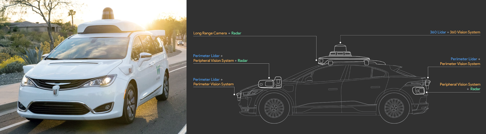
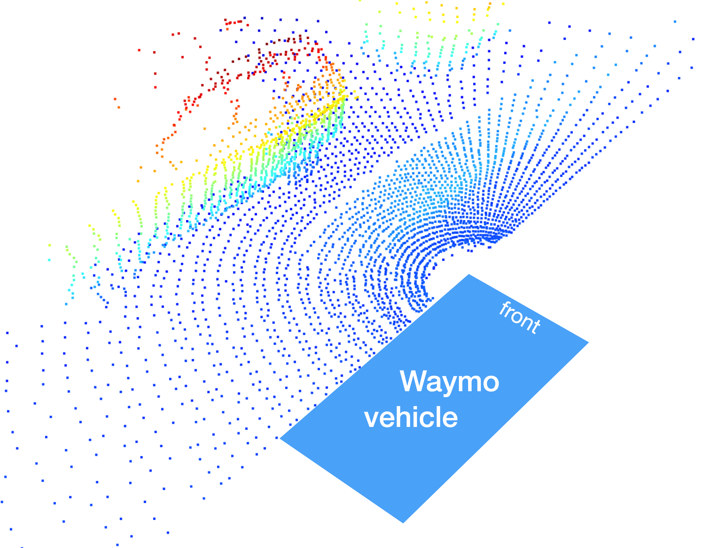
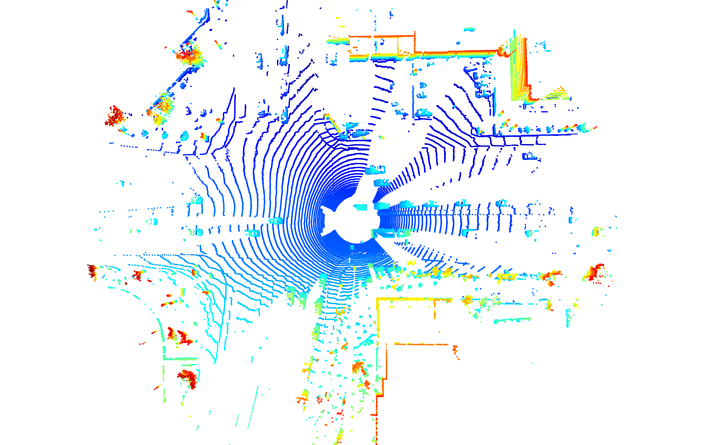
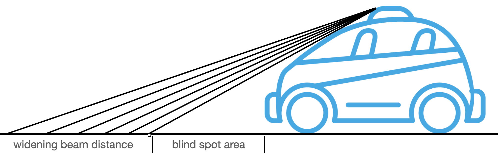

# Lidar Data in the Waymo Dataset

> Part of: **The Lidar Sensor**

## Video

[Watch on YouTube](https://www.youtube.com/watch?v=ZcM3i49b8W0)

## Summary

**Lidar Sensors in Waymo Sensor Suite**
=====================================

This chapter introduces you to the various Lidar sensors used in the Waymo sensor suite. You will learn how to access and process individual frames of the Waymo dataset sequence using starter code provided on GitHub.

### Key Concepts

* **LiDAR (Light Detection and Ranging)**: a remote sensing technology that uses laser light to measure distances between objects.
* **Waymo Sensor Suite**: a collection of sensors used in autonomous vehicles, including LiDAR sensors.
* **Waymo Open Dataset**: a publicly available dataset containing sensor data from Waymo's autonomous driving platform.
* **Sensor Calibration Parameters**: parameters required to calibrate the position and orientation of sensors.

### Practical Notes

To get started with processing the Waymo dataset sequence:

1. Download the starter code repository from GitHub, which includes tools for loading sequences from the dataset and processing them frame by frame.
2. Familiarize yourself with the basic structure of the midterm project and final project using the provided starter code.
3. Use the starter code to extract and display camera images, access lidar data, and sensor calibration parameters.

Note: This chapter prepares you for subsequent exercises and projects in the course, including the midterm and final projects.

## Transcript

Now in this chapter here you will learn about the various Lidar sensors used in the Waymo sensor suite. Also you will be introduced to the starter code of a course which will enable you to access the individual frames of Waymo dataset sequence, which you can download from the internet. Using this starter code and all the information on the structure of Waymo frames, you will be able to extract and also display camera images, access lidar data, and also the sensor calibration parameters. With the knowledge within this chapter here, you will be well prepared to carry out many of the exercises in subsequent chapters as well as the actual midterm project. See you soon further on in this chapter here.

Now that you have a first understanding of what the LiDAR sensor is all about, it's time to get your feet wet and code your first exercise. In order to set you up quickly, we have prepared a starter code repo for you on GitHub, which contains all the necessary tools to properly use the Waymo Open Dataset. This action here will introduce you to the codebase, which you can use to load sequences from the dataset and also process them frame by frame. The starter code will also familiarize you with the basic structure of the midterm project, and also the final project as you progress through this and also through the subsequent chapters.

## Images

*Waymo Sensor Suite - [Source 1](https://blog.waymo.com/2020/03/introducing-5th-generation-waymo-driver.html) & [Source 2](https://waymo.com/lidar/)*

*Waymo Front-Left LiDAR 3D Point-Cloud*

*Waymo Top LiDAR 3D Point-Cloud*

*LiDAR Blind Spot and Beam Gap Widening*

## Additional Content

## Lidar Data in the Waymo Dataset
### Waymo LiDAR technical specifications
In this section, you will get a brief overview of the LiDAR sensor we will be using throughout the course. We will take a brief look at the Waymo driverless vehicle and look at some technical specifications of the main 360° LiDAR. The aim of this section is to give you a first impression of the data you will be dealing with in the object detection part of this course.

In the last section, we have looked at three of the main sensor types used in autonomous driving. Also, you have learned that there is an intense discussion going on with regard to the necessity of LiDAR as part of the sensor set. One of the major advocates of LiDAR technology is Waymo, which uses a total of five LiDAR sensors to equip its driverless vehicles. 

As you can see from the following image, Waymo also used several cameras as well as radar sensors for front / back surveillance. 
The LiDAR sensors can be categorized into two broad groups: 

1. **Perimeter LiDAR**: This sensor has a vertical field of vision ranging from -90° to + 30° with a range limited to 0-20m. The range limit is imposed on the data by Waymo and is only present in the Waymo Open Dataset. It can be assumed that the actual sensor range is significantly higher. Perimeter LiDARs are located on the front and back of the Waymo driverless vehicle as well as on the left / right front corners. Interestingly, the perimeter LiDAR is sold to companies not in direct competition with Waymo under the brand name [Laser Bear Honeycomb ](https://waymo.com/lidar/). The following image shows the 3d point-cloud generated by the front-left LiDAR sensor:
2. **360 LiDAR**: The top LiDAR has a vertical field of vision ranging from -17.6° to +2.4° with a range limited to 75m in the dataset. This LiDAR rotates around its vertical axis and produces a high-resolution 3d image over the 360° circumference of the vehicle. In the course, we will work with data from this sensor type to detect vehicles. The following image shows a 3d point-cloud generated by this LiDAR sensor in birds-view perspective: 
Two aspects are noteworthy here: (1) the distance between adjacent scanner lines increases with growing distance and (b) the area in the direct circumference of the vehicle does not contain any 3d points. Both observations can be easily explained by a look at the geometry of the sensor-vehicle setup: 
Directly in front of the vehicle, there is a large gap in perception ("blind spot") due to the occlusion of the laser beam by the vehicle. Also, it can be seen that the gap between adjacent beams is widening with distance due to the fixed angle in which laser diodes are positioned vertically. 

The idea of this section is to give you a top-level understanding of the general setup of the Waymo sensor suite. We will look more deeply into the technical properties of LiDAR technology in the next section of this course. Let us now take a look at the starter code which you can use to load, visualize and process the LiDAR data. 
### Course Starter Code Overview
We'll dive into the starter code on the next page.
