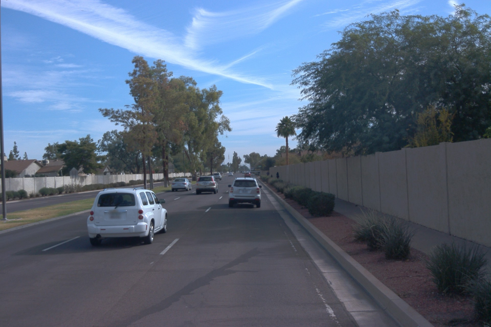

# The Structure of Frames in the Waymo Dataset

> Part of: **The Lidar Sensor**

## Video

[Watch on YouTube](https://www.youtube.com/watch?v=TSCoBFfdmRM)

## Summary

**Summary of Waymo Open Data Set**

This lesson covers the basics of using the Waymo open data set and accessing individual frames within a sequence. You will learn how to navigate the structure of frames and retrieve specific information such as sensor calibration, timestamps, and weather conditions.

### Key Concepts

* **Waymo Open Data Set**: A publicly available dataset containing autonomous driving sequences.
* **Frames in a Sequence**: Individual images or data points within a sequence that contain metadata and sensor readings.
* **Frame Structure**: The organization of data within each frame, including sensor calibration, timestamp, and weather conditions.

### Practical Notes

This lesson does not include any coding exercises. Instead, it focuses on laying the groundwork for working with Lidar technology in future chapters. You will need to understand these theoretical foundations before moving on to practical applications such as reconstructing scenes and detecting objects.

## Transcript

You have successfully completed this chapter. That's really great, because you now know how to properly use the Waymo open data set and also access the individual frames of a sequence. Also you now know how frames are structured and where to look in case you need entries such as the sensor calibration, a timestamp, or even information on the weather conditions at the time the sequence was recorded. In the next chapter you will learn a lot about Lidar technology and also about different categories of Lidar sensors available on the market today. But please don't despair if you don't find any coding exercises in there, because before we can properly work with actual Lidar data to, let's say, reconstruct scenes and also detect objects, we will need to lay some theoretical foundations, which is exactly what the next chapter is all about, which is a bit more theoretical.

See you again very soon.

## Images


*Front-camera image*

## Additional Content

## The Structure of Frames in the Waymo Dataset
In this section, you will learn how a frame is structured within the Waymo Open Dataset. Also, you will familiarize yourself with the code required to extract data elements from a frame, such as a specific camera image or LiDAR data. 

### How to Access Frames
The Waymo dataset stores information in `.tfrecord` files. For this lesson, you will be using three files with different content (number of vehicles, presence of clutter, various driving conditions, etc.). These are: 
- Sequence 1 : `training_segment-1005081002024129653_5313_150_5333_150_with_camera_labels.tfrecord`
- Sequence 2 : `training_segment-10072231702153043603_5725_000_5745_000_with_camera_labels.tfrecord`
- Sequence 3 : `training_segment-10963653239323173269_1924_000_1944_000_with_camera_labels.tfrecord`
All sequences contain approx. 200 individual frames, which have the following top-level structure: 
```
|-- LaserName
|-- CameraName
|-- RollingShutterReadOutDirection
|-- Frame
|-- Label
```

While the actual sensor data is stored in the `Frame` structure, we can use `LaserName` and `CameraName` to select specific sensors, which we want to access. For each laser and camera, there is a sub-branch nested under  `Frame` , which contains the following items: 
```
-- Frame
   |-- images
   |-- Context
   |   |-- name
   |   |-- camera_calibrations
   |   |-- laser_calibrations
   |   |-- Stats
   |   |-- laser_object_counts
   |   |-- camera_object_counts
   |   |-- time_of_day
   |   |-- location
   |   |-- weather
   |-- timestamp_micros
   |-- pose
   |-- lasers
   |-- laser_labels
   |-- projected_lidar_labels (same as camera_labels)
   |-- camera_labels
   |-- no_label_zones
```


### Accessing Camera Data
In order to access a specific camera, you can use the following code: 
```
camera_name = dataset_pb2.CameraName.FRONT
image = [obj for obj in frame.images if obj.name == camera_name][0]
```

The `image` branch has the following structure: 
```
|-- Frame
   |-- images ⇒ one branch for each entry in CameraName
      |-- name (CameraName)
      |-- image
      |-- pose
      |-- velocity (v_x, v_y, v_z, w_x, w_y, w_z)
      |-- pose_timestamp
      |-- shutter
      |-- camera_trigger_time
      |-- camera_readout_done_time
```
It might cause some confusion that the camera data structure has been named `image`, even though the actual image is only one out of many items within (also called `image`). 

In case you want to access and display the camera image, you can use the following code: 
```
from PIL import Image
import io

# convert the image into rgb format
image = np.array(Image.open(io.BytesIO(camera.image)))
image = cv2.cvtColor(image, cv2.COLOR_BGR2RGB)

# resize the image to better fit the screen
dim = (int(image.shape[1] * 0.5), int(image.shape[0] * 0.5))
resized = cv2.resize(image, dim)

# display the image 
cv2.imshow("Front-camera image", resized)
cv2.waitKey(0)
```

This code produces the following output: 
### Example C1-3-2 : Display camera image
*You can experiment with the code in file `lesson-1-lidar-sensor/examples/l1_examples.py` by calling the function `display_image` from `basic_loop.py`. You'll need to have the Desktop window open (see button in bottom right of workspace) to view the output.*
### Accessing LiDAR Data
Let us now access the LiDAR data in a similar manner by using the following code: 
```
lidar_name = dataset_pb2.LaserName.TOP
lidar = [obj for obj in frame.lasers if obj.name == lidar_name][0]
```

When you inspect the `lidar` sub-branch in the debugger, you will find that it has the following structure: 
```
-- lasers ⇒ one branch for each entry in LaserName
		|-- name (LaserName)
		|-- ri_return1 (RangeImage class)
			|-- range_image_compressed
			|-- camera_projection_compressed
			|-- range_image_pose_compressed
			|-- range_image
		|-- ri_return2 (same as ri_return1)
```

You might be wondering why there is no direct access to a point-cloud as could be expected. The reason for this is that within the Waymo dataset, LiDAR measurements are stored in a structure called a *range image*. You will soon learn more about this concept and how to generate a point-cloud from it. Before we look into this more deeply however, you will require a better understanding of the physical principle behind LiDAR technology, which will be the main goal of the next chapter in this lesson. 

But first, let us conclude this chapter by looking at some of the remaining entries in the `frame` structure: 

```
|-- Frame
		|-- Context
			|-- name
			|-- camera_calibrations ⇒ one branch for each entry in CameraName
			|-- laser_calibrations ⇒ ⇒ one branch for each entry in LaserName
			|-- Stats
			|-- laser_object_counts
			|-- camera_object_counts
			|-- time_of_day
			|-- location
			|-- weather
		|-- timestamp_micros
		|-- laser_labels ⇒ one branch for each entry in LaserName
		|-- camera_labels ⇒ one branch for each entry in CameraName
```

Within the `Context` subbranch, there is a large number of useful data entries, some of which we will be using in this course. From `laser_calibrations` for example, you can retrieve the beam inclinations of the individual laser LEDs as well as the extrinsic calibration. 

With the following code, you can retrieve the calibration data for the top LiDAR sensor: 
```
lidar_name = dataset_pb2.LaserName.TOP
calib_lidar = [obj for obj in frame.context.laser_calibrations if obj.name == lidar_name][0]
```

Using the debugger to inspect the calibration data yields the following results: 
```
vfov_rad = calib_lidar.beam_inclination_max - calib_lidar.beam_inclination_min
print(vfov_rad*180/np.pi)
--> 20.360222720319797
```
### Example C1-3-3 : Print vertical field-of-view

*You can experiment with the code in file 'lesson-1-lidar-sensor/examples/l1_examples.py' by calling the function 'print_vfov_lidar' from `basic_loop.py` in the workspace further above.*

From the

[paper](https://arxiv.org/pdf/1912.04838.pdf)

describing the Waymo dataset, we can glean a vertical field of view of 20 degrees, which is consistent with the above output. 

Also, we can learn from the extrinsic calibration matrix, that the top LiDAR is located `+1.43m` away from the origin of the vehicle coordinate system with a height of `+2.184m`. These values can be found in the data structure `calib_lidar.extrinsic.transform`:

$$\small \begin{bmatrix} - 0.8526719509207284 & -0.5224378704141576 & -0.0030357322277815815 & 1.43 \\ 0.5224451202853144 & -0.8526692389088371 & -0.0025030598650299957 & 0.0 \\ 0.0012807822227881296 & -0.0037202924272838555 & 0.9999922594806188 & 2.184 \\  0.0 & 0.0 & 0.0 & 1.0 \end{bmatrix}$$

Finally, the sub-branch `laser_labels` contains a list of all hand-labeled ground-truth objects that are present in the current frame. We will look at these in the section on visualizing LiDAR data. 

Remember that this section is about obtaining an overview of the `frame` data structure. We will revisit many of the individual elements later in the relevant chapters of this course. In the next chapter, we will look into the physical properties of LiDAR sensors and at some of the models available on the market today.
### Outro
### Additional Resources:
- [Waymo Frame Structure Details](https://github.com/Jossome/Waymo-open-dataset-document)
- [Waymo Open Dataset Tutorial](https://colab.research.google.com/github/waymo-research/waymo-open-dataset/blob/master/tutorial/tutorial.ipynb#scrollTo=-pVhOfzLx9us)
