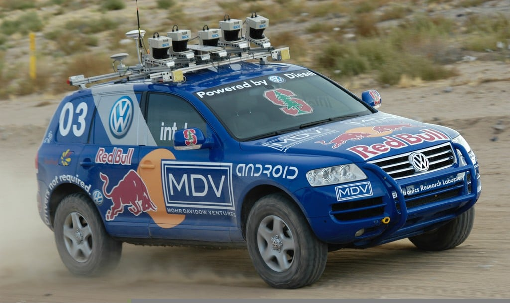
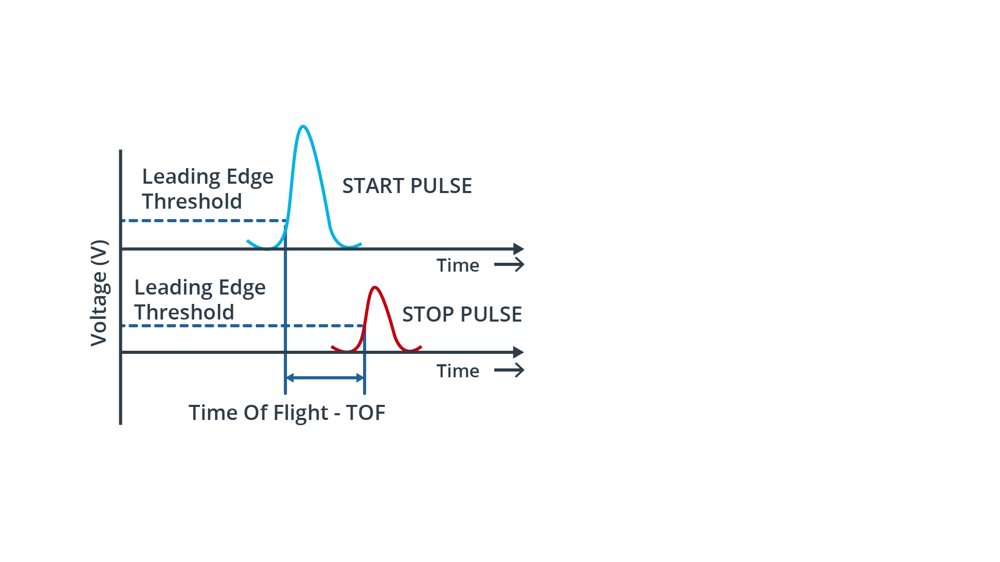
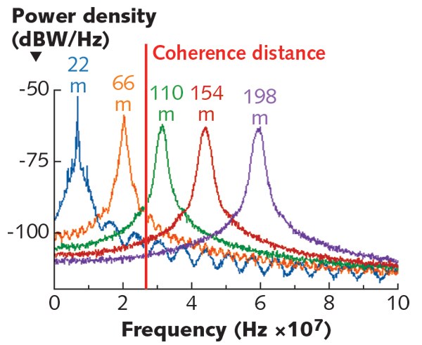
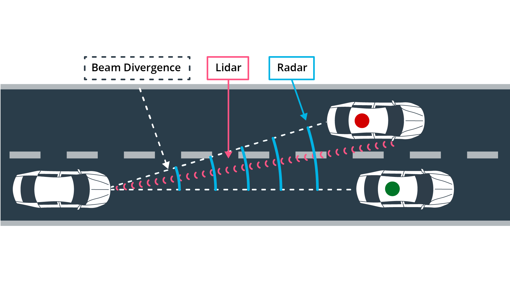
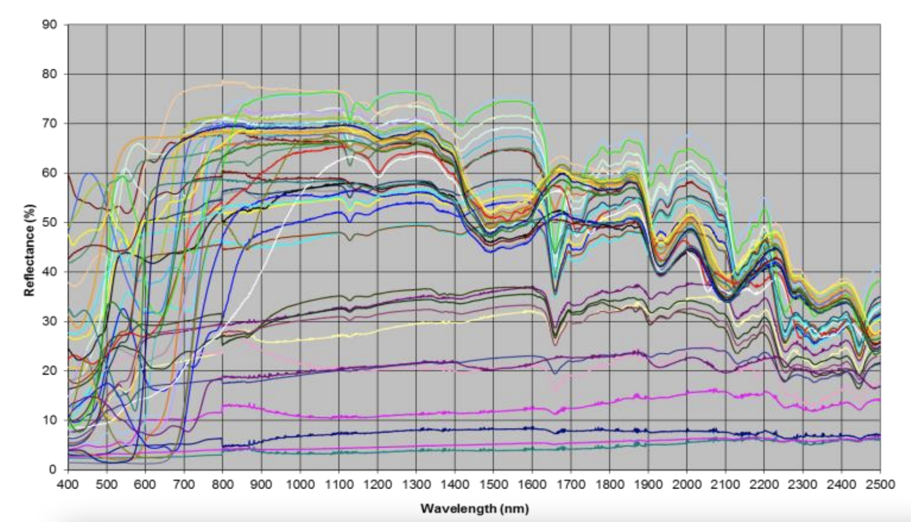
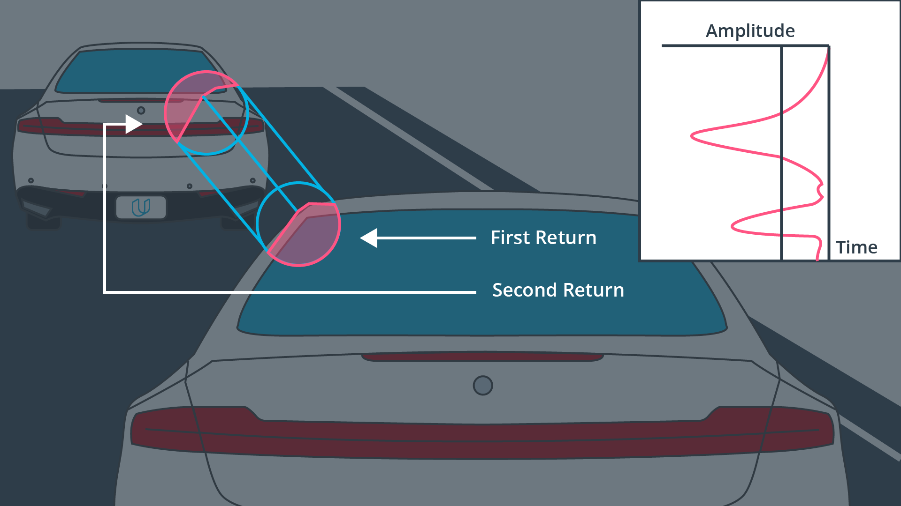

# Lidar Technical Properties

> Part of: **The Lidar Sensor**

## Video

[Watch on YouTube](https://www.youtube.com/watch?v=4kpq5akVtC0)

## Summary

**Lidar Sensor Technology Overview**
=====================================

This project provides an introduction to the technology behind lidar sensors, focusing on the basic principles and key concepts that govern their operation.

### Key Concepts

* **Time of Flight (ToF) System**: A common type of lidar sensor that measures the time it takes for a laser pulse to travel to an object and return.
* **Lidar Equation**: A mathematical formula used to understand the parameters that influence the amount of laser power returned to the receiver, including range, reflectivity, and noise.
* **Types of Lidar Sensors**:
	+ Non-scanning solid state devices
	+ MEMS (Micro-Electro-Mechanical Systems) mirrors
	+ Optical phase arrays
	+ Frequency modulated continuous wave lidar sensors
* **Lidar Sensor Selection Criteria**: A list of factors to consider when choosing a lidar sensor for a project, including:
	+ Range and accuracy requirements
	+ Power consumption and size constraints
	+ Environmental conditions (temperature, humidity, etc.)

### Practical Notes

This project includes an overview of the different types of lidar sensors available in the market, as well as their characteristics and applications. The next chapter will provide coding examples and exercises to help you develop a deeper understanding of lidar sensor technology.

Note: This README file provides a summary of the key concepts and practical notes from the lesson transcript. It is intended to serve as a reference for future development and exploration of lidar sensor technology.

## Transcript

Now in this chapter we will have a detailed look into the technology of lidar sensors. You will learn about the basic principle behind one of the most common lidar types, which is called a time of flight system. Once you have understood the underlying principle, we will move on to analyzing the well-known lidar equation, which you can use to gain an understanding of the parameters that influence the amount of laser power that returns to the receiver. Once this has become clear, we will look at different types of lidar, such as the non-scanning solid state device, MEMS mirrors, optical phase arrays, and also frequency modulated continuous wave lidar sensors. The idea behind this chapter here is to present you with all this information so that you can develop an understanding of what's currently available in the market, what the differences between these different types are, and also what's about to emerge from the development pipelines of lidar companies all over the globe in the next years to come, also, potential game changers included.

Lastly, we will also go through a list of criteria you need to consider when you are tasked, let's say, with selecting a lidar sensor for one of your work projects. In case you missed the coding part, don't disappear yet, the next chapter will include plenty of exercises and coding examples you can dive right into. See you soon at the end of this chapter.

## Images

*Stanford Stanley in the DARPA Grand Challenge, 2005 - [Source](https://stanford.edu/~cpiech/cs221/apps/driverlessCar.html)*

*Stanford Junior in the DARPA Urban Challenge, 2007 - [Source](http://robots.stanford.edu/papers/junior08.pdf)*

*LiDAR sensor components*

*LiDAR beam start and stop pulse*

*LiDAR signal returns at varying distances - [Source](https://www.laserfocusworld.com/home/article/16556322/lasers-for-LiDAR-fmcw-LiDAR-an-alternative-for-selfdriving-cars)*

*LiDAR and radar beam divergence*

*LiDAR beam start and stop pulse - [Source](https://core.ac.uk/download/pdf/129148998.pdf)*

*Primary and secondary LiDAR returns*

## Additional Content

## Lidar Technical Properties
### A Brief History of LiDAR

LiDAR technology has been around for quite a while. The basic idea has been originally conceived in the 1930s by Irish physicist Edward H. Synge. Over the following decades, some first applications emerged, such as the Lunar Ranging Experiment on board Apollo 11 in 1969 or the creation of the first digital elevation model of archaeological sites in 2000. In 2005, the Stanford Racing Team won the [DARPA Grand Challenge](https://www.youtube.com/watch?v=saVZ_X9GfIM), a race between autonomous vehicles in the Mojave desert, using an array of SICK line scanners. 
Two years later, in 2007, the Stanford team was first to finish the [DARPA Urban Challenge](https://www.youtube.com/watch?v=p9XsldQjs_M), a race within a mock-up city on George Air Force Base in the West United States, using a rotating 360° Velodyne LiDAR sensor as one of its primary sensing devices. 
Since then, with the advent of autonomous driving, significant improvements of LiDAR technology have been developed, making it one of the cornerstones of the autonomous vehicle sensor suite. But before we look at further details, let us revisit the basic working principle of LiDAR. 
### The LiDAR Working Principle

The most common LiDAR sensor used today is called a "pulsed LiDAR". It is a system consisting of a laser source and a receiver with the source emitting short bursts of tight laser beams into a scene. When a beam hits an object, a fraction of the laser light is refracted back to the LiDAR sensor and can be detected by the receiver. Based on the time of flight of the laser light, the range `R` to the target can be computed using the equation:

$R = \frac{1}{2n}\cdot c \Delta t$

where

$c$

is the speed of light in vacuum and

$n$

is the index of refraction of the propagation medium (for air,

$n$

can be assumed as

$1.0$

). 

Before we look at an example, let us first discuss the components of a typical LiDAR sensor:
In the schematic, you can see the major parts "laser source", "emitter", "receiver" and "timer". First, a very short pulse in the order of a few picoseconds or nanoseconds is generated by the laser  source. The laser pulse is then amplified by the amplifier and then directed into the atmosphere with  the help of a beam scanner and transmitter optics. Each pulse is directed to a specific location  within the sensors field of view as it scans over the region of interest. A portion of the backscattered pulse energy that reaches the receiver lens is collected through the receiver optics, then amplified and converted to a voltage signal.

In order to accurately measure the time between beam emission and detection, a very precise clock is needed. As can be seen from the following figure, a leading edge thresholding technique is used on the voltage signal to detect the moment in time, when the laser pulse returns. 
Based on the range equation above, the distance to the target can now be computed.
The attainable **range resolution** is directly proportional to the resolution of the timing device. A typical resolution value of the time interval measurement can be assumed to be in the 0.1 ns range, which results in a range resolution of 1.5 cm. 

The **maximum range** at which a target can be detected is mainly determined by the energy losses of the laser beam during its travel through the atmosphere. The lower the return energy and the higher the ambient noise, the harder it is for the receiver to detect a clear flank. The ratio between signal energy and background noise is described by the signal-to-noise-ratio (SNR), which is shown for several signals returned from targets at varying distances. 
It can also be seen from the figure, that the signal peaks flatten out in proportion to the target distance, which is caused by a lack of beam coherence. This effect is referred to as "beam divergence" and it is directly proportional to the wavelength

$\lambda$

of the laser light. For a LiDAR with

$\lambda = 1550nm$

for example, the smallest resolvable feature size in lateral direction due to beam divergence is

$\approx 4cm$

at a distance of 100m. Just for comparison, a 77GHz radar sensor with a wavelength of

$\lambda = 0.3cm$

, the smallest resolvable feature size at the same distance is 2m. 

Also, as can be seen from the figure, the signal peak SNR decreases with increasing distances, which is caused by particles (such as water or dust) in the atmosphere that obstruct the laser path. An in-depth analysis of the performance degradation of LiDAR under the influence of fog and rain can be found

[in this paper](https://arxiv.org/pdf/1906.07675.pdf)

. 

There are two basic solutions for improving the SNR, which are (a) to increase the laser energy and (b) to increase the sensitivity of the receiver to detect weak signals in the presence of noise. While (a) is limited by the regulations on eye-safety, the approach (b) adds on significant complexity to the receiver electronics. 

Another factor to be considered concerning maximum range is signal ambiguity, which states that at each point in time, there should be only a single laser pulse "in flight" so that the received pulse can be unambiguously associated with the previously emitted pulse.
Despite of the discussed limitations, time-of-flight pulsed LiDAR systems are the most frequently selected type (at present) for use in autonomous vehicles, mainly due to their simplicity and their capability to perform well outdoors, even under challenging environmental conditions.

Other time-of-flight methods are radar and ultrasound. Of these three ToF techniques,  LiDAR provides the highest angular resolution, because of its significantly smaller beam divergence. It thus allows a better separation of adjacent objects in a scene, as illustrated in the following figure: 
With currently available LiDAR systems however, the maximum range at which objects can be detected is still inferior to radar, which limits the speed at which LiDAR can be used as a primary sensing device (e.g. in highway scenarios). 
### The LiDAR Equation

In the last section, we have looked at the basic working principle of a time-of-flight pulsed LiDAR. You now know that two of the challenging factors which influence the detection quality of a LiDAR system are (a) beam coherence and (b) the signal-to-noise ratio. In this section, you will be briefly introduced to the so-called "LiDAR equation", which relates the power of a laser beam returned to the receiver with a number of factors, such as the transmission power in the sender, the target reflectivity and the atmospheric conditions between the optics and the target. 

Please note that there is not "one" LiDAR equation but several, depending on the area of application. In automotive sensing, the following equation is used most frequently:

$$P(R) = P_0\cdot \rho \cdot \frac{A_0}{\pi \cdot R^2}\cdot \eta_0 \cdot e^{-2\gamma R}$$

Let us take a quick look at the individual parameters and their respective implications for autonomous driving: 

*

$P(R)$

: *power received* -> As can easily be seen, we want to maximize this expression for a high signal-to-noise-ratio (SNR) and thus a stable and accurate detection of the reflected laser pulse. 
*

$P_0$

: *peak power transmitted* -> The more power used in the amplifier, the more photons will make it back to the receiver. There are two limiting factors which govern this parameter, which are eye safety regulations and power consumption. 
*

$\rho$

: *target reflectivity* -> The more reflective the target surface is, the more photons will return to the receiver. The following diagram shows the reflectivity for a series of cotton samples worn by a pedestrian mannequin:
As can be seen in the diagram, the reflectance varies significantly between the various samples (each cotton type is represented by an individual color). Also, reflectivity varies with the wavelength of the emitted laser light: For most materials, reflectivity is between 50 and 70% at a wavelength of around 1000nm and decreases to around 20-40% for 2500nm. A perfect reflection with no power loss would obviously be 100%. 

*

$A_0$

: *receiver aperture area* -> As with classical photography, the size of the

[aperture](https://en.wikipedia.org/wiki/Aperture)

directly influences the amount of light passing through to impact onto the receiver. The larger the aperture, the higher the number of returning photons will be.
*

$\eta_0$

: *transmission coefficient* of receiver optics -> When passing through a non-vacuum medium, photons are scattered due to obstructions in their flight path. The transmission coefficient indicates the degree of scattering, which the returning photons experience on their path through the optics. The more photons are lost, the fewer arrive at the receiver, which lowers the signal voltage level and thus the SNR. 
*

$\gamma$

: *atmospheric extinction coefficient* -> Similar to the optics transmission coefficient, the atmospheric extinction coefficient describes the amount of photon loss due to collisions with airborne particles in the atmosphere, such as water molecules or dust. The more particles are in the air, the fewer photons return to the receiver, which also lowers the SNR.

Based on these parameters, you can develop an idea of how the various components from laser beam generation to photon detection influence the amount of received power and thus the signal-to-noise ratio.
### Multiple Signal Returns

You might have noticed the entry `ri_return2` in the previous section on the structure of Waymo frames. This data structure holds a "second return" of the LiDAR beam, which arrives after the first (i.e. primary) return. As the laser beam has a finite diameter, it is very well possible that only part of it is reflected by an object, especially when the laser strikes near a depth discontinuity, such as the edge of a vehicle. In the following figure, the laser beam first strikes the preceding vehicle on its left side, generating the first return. However, as the target has been hit only partially by the beam, a fraction of laser light continues in its path until it eventually strikes another target, which, in this case, is another vehicle. The return signal, which is usually weaker than the primary return due to the higher distance, arrives at the receiver after the primary return signal, hence the name "second return".
In this course though, we will not be using the `ri_return2` structure from the Waymo dataset, but in principle it could be leveraged to detect object more accurate boundaries, similar to edge detection techniques used in computer vision.
