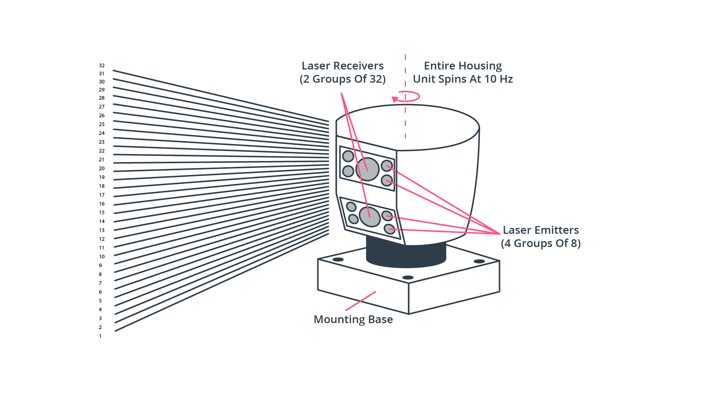
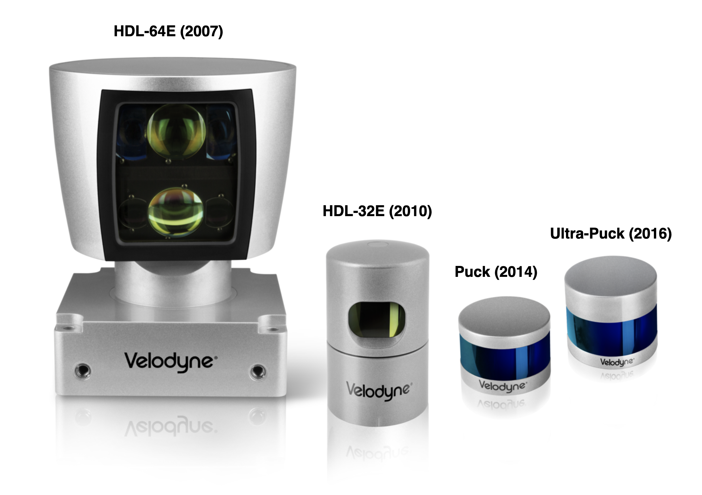
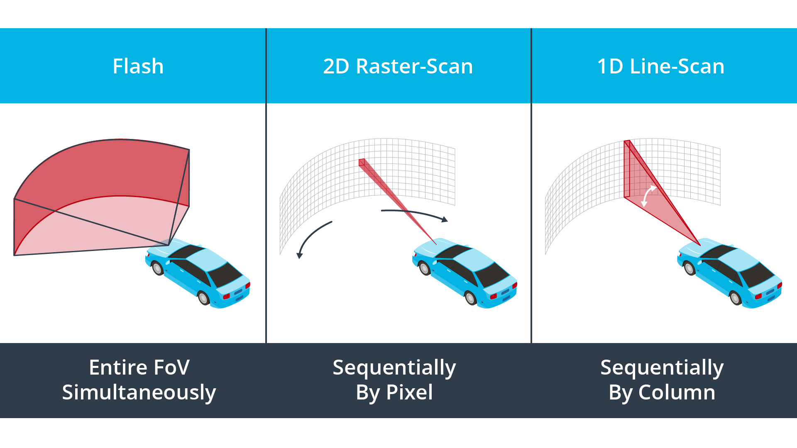
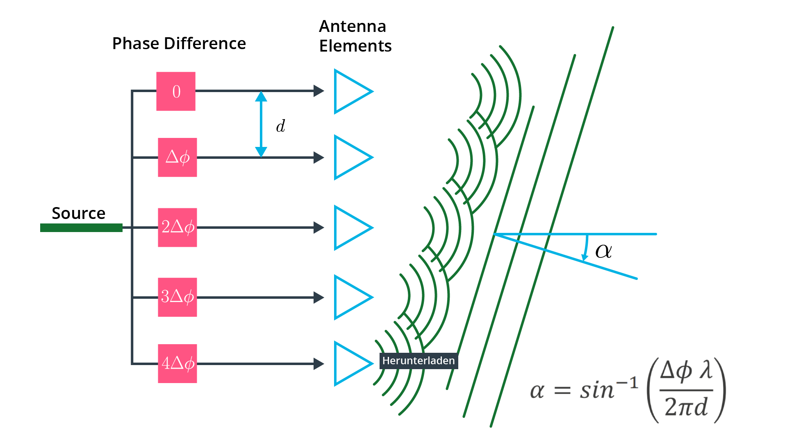
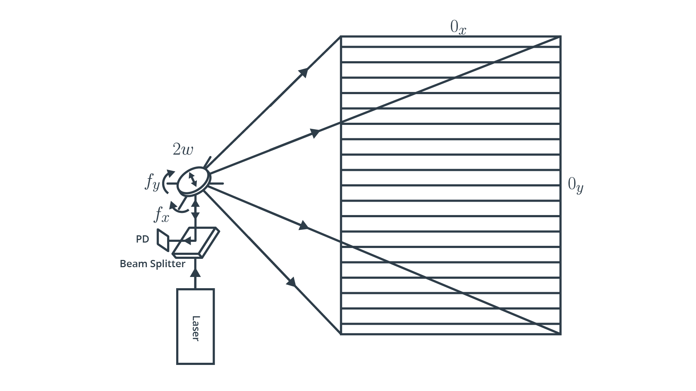
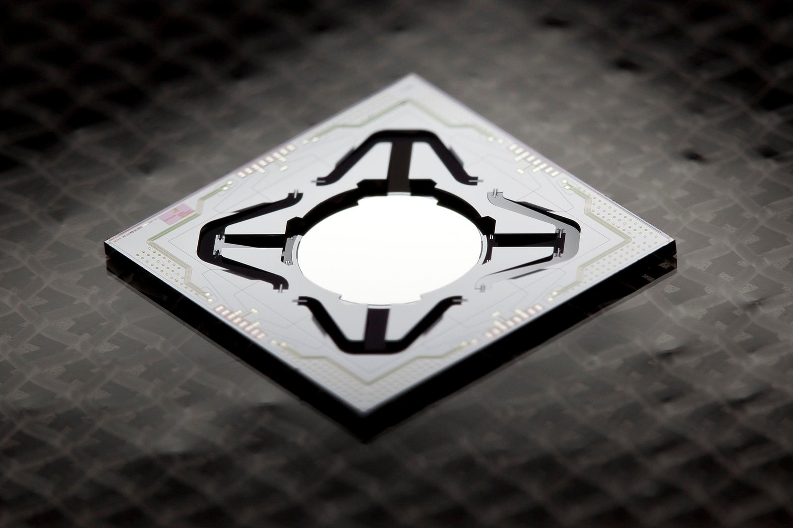
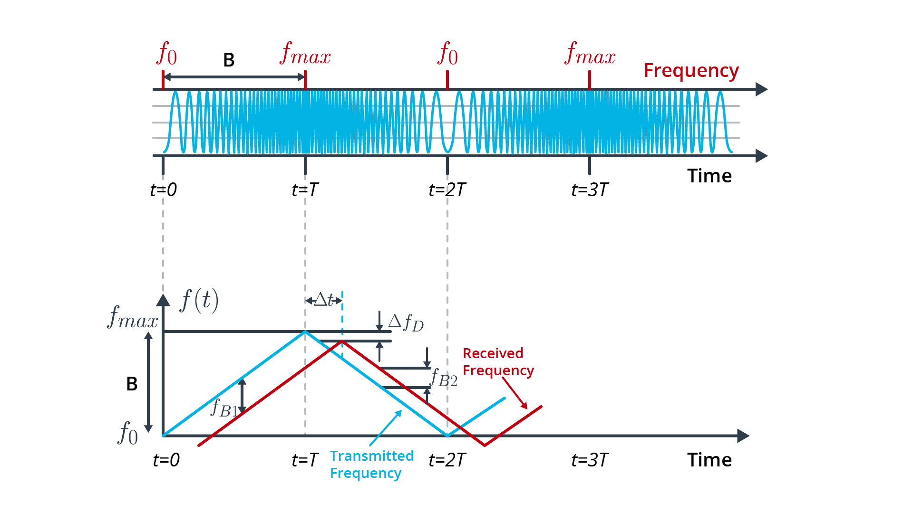

# Overview of Available LiDAR Types

> Part of: **The Lidar Sensor**

## Video

[Watch on YouTube](https://www.youtube.com/watch?v=dGsoA5s15Ks)

## Summary

**LiDAR Scanning Process**
=========================

This README file provides an overview of LiDAR (Light Detection and Ranging) scanning processes used in autonomous vehicles, specifically highlighting the differences between various types of LiDAR systems.

**Key Concepts**
---------------

* **Motorized Mechanical Scanning LiDAR**: A type of LiDAR sensor that uses a rotating scan unit to redirect laser beams into the scene. This technology is commonly used in autonomous vehicles and has been around for some time.
* **Advantages and Disadvantages of Motorized Mechanical Scanning LiDAR**:
	+ Advantages: High accuracy, robustness, and reliability
	+ Disadvantages: Complex mechanical design, high power consumption, and potential for mechanical failure
* **Types of LiDAR Scanning Processes**: Various scanning processes used in different LiDAR systems, including:
	+ Mechanical scanning (e.g., rotating scan unit)
	+ Solid-state scanning (e.g., using a fixed laser array)
	+ Phased-array scanning (e.g., using an array of lasers)

**Practical Notes**
-------------------

* When designing or selecting a LiDAR system for autonomous vehicles, consider the trade-offs between accuracy, complexity, power consumption, and reliability.
* Different applications may require different types of LiDAR systems, depending on factors such as speed, range, and environmental conditions.

## Transcript

Now in the previous section, we have already taken a look at the LiDAR sensors used in the Waymo dataset. In order to create a 360 degree scan, the roof-mounted LiDAR uses a rotating scan unit that redirects the beams of 64 vertically arranged laser diodes into the scene. This type of sensor can be categorized as a motorized mechanical scanning LiDAR, and it has been used for quite some time now in the context of autonomous vehicles. Now in the current market, there are several types of LiDAR systems available that differ in various aspects, but one of them is the scanning process which they employ. Let's briefly discuss now these scanning process categories and also highlight the advantages and disadvantages of the respective technologies.

## Additional Content

## Overview of Available LiDAR Types
The following figure shows a typical classification of LiDAR sensors:

*LiDAR classification based on scanning techniques*

### Scanning LiDAR - Motorized Opto-Mechanical Scanning

Motorized optomechanical scanners are the most common type of LiDAR scanners. In 2007, the company Velodyne, a pioneer in LiDAR technology,  released a 64-beam rotating line scanner, which has clearly shaped and dominated the autonomous vehicle industry in their early years. The most obvious advantages of this scanner type are its long ranging distance, the wide horizontal field-of-view and the fast scanning speed. 

With most sensors of this type, there are several transmitter-receiver channels, which are stacked vertically and rotated by a motor to create a 360° field-of-view.

*360° LiDAR with vertically stacked beams*

Even though the resulting point-cloud enables a high-quality object detection around the vehicle, there are several significant drawbacks of this scanner type. There are (a) a high power consumption, (b) susceptibility to vibration and mechanical shocks, (c) a bulky package and (d) - in most cases - a very high price. Also, due to the limited number of vertically stacked laser LEDs, (e) their vertical resolution is limited. However, there are several companies world-wide that aim at mitigating these drawbacks while maintaining the high-quality point-clouds that this sensor class is able to produce. The following figure shows a product line-up of Velodyne LiDARs, which illustrate the evolution of package size:

*Velodyne automotive LiDARs - Adapted from [this source](https://commons.wikimedia.org/wiki/File:Velodyne_ProductFamily_BlueLens_32GreenLens.png)*

#### Non-Scanning Flash LiDAR

This LiDAR type does not perform a sequential reconstruction of a scene by redirecting laser beams but instead illuminates everything at once, similar to a camera using a flash-light. Within such a **flash LiDAR**, an array of photodetectors simultaneously picks up the time-of-flight of each individual laser beam, providing a series of depth images where each pixel has been captured at the same time instant. As there are no moving parts, this sensor type is also referred to as "solid-state LiDAR". 

Since this method captures the entire scene in a single image compared to the mechanical laser scanning method, the data capture rate is much faster. Also, as each image is captured in a single flash, this scanning type achieves a higher robustness towards vibrations, which could otherwise distort the scanning process. The following figure visualizes the basic principle and compares it to the standard line-scanning technique we have already discussed previously as well as to a sequential raster-scanning technique in two dimensions.

*Flash LiDAR vs. line and raster scanning*

A downside of flash LiDAR is that the amount of energy required to light the scene is comparatively high as the entire scene is illuminated at once. Reducing the power to acceptable levels leads to a degradation of the SNR of the return signal, which severely limits the range at which targets can be detected. 

A downside to this method is the presence of retroreflectors in the real-world environment. Retroreflectors reflect most of the light and back-scatter very little, in effect blinding the entire sensor and rendering it useless. Another disadvantage to this method is the very high peak laser power needed to illuminate the entire scene and see far enough.
#### Optical phase array (OPA)

Another sensor type belonging to the class of solid-state sensors is the Optical Phased Array (OPA) LiDAR. Other than flash LiDAR though, this sensor belongs to the class of scanning LiDARs, as the position of laser beam in the scene is actively directed. In an OPA system, an optical phase modulator is used to control the speed of light passing through the lens. OPA systems are able to shape the wave-front by delaying individual beams by varying amounts, which effectively steers the laser beam into different directions.

*OPA LiDAR principle*

In the schematic, there are multiple emitters, from which light waves with carefully controlled phase differences are emitted. As can be seen, the resulting combined wave front propagates in a direction $\alpha$, which depends on the wavelength of the light, on the phase difference $\Phi$ between the emitters as well as on their spatial distance $d$.

Even though the OPA technology is very promising, it belongs to the least-developed types yet and has not been used on any meaningful scale in automotive applications. Also, at this point, beam steering with most OPA systems works only in a single plane, which effectively corresponds to the functionality of a line-scanner. Two-dimensional beam steering is possible though, but requires a significant research and development effort.
### MEMS Mirror-Based Quasi Solid-State LiDAR

Lastly, there is another type of scanning LiDAR, which is a hybrid between the solid-state flash and OPA LiDARs and the motorized opto-mechanical scanner: A Micro-Electro-Mechanical Systems (MEMS) LiDAR system uses tiny mirrors whose tilt angle varies when applying a voltage. They thus substitute the mechanical scanning hardware with an electromechanical equivalent on the silicon.

*MEMS mirror-based LiDAR*

The following figure shows an example of a MEMS mirror:

*MEMS mirror example - [Source](https://commons.wikimedia.org/wiki/File:Translatmsm.jpg)*

MEMS mirrors are able to steer and modulate the light source and even control its phase. Compared to motorized scanners, MEMS scanners are superior in terms of size, scanning speed and also cost. Instead of moving the entire LiDAR unit, a MEMS device only needs to rotate the tiny mirror plates (whose diameter is in the range of 1–9 mm), while the rest of the system remains stationary. Due to the low moment of inertia of the tiny mirrors, a two dimensional scan over the entire field of view can be performed in a small fraction of a second, which is a clear advantage with regard to the real-time requirements of autonomous vehicles. 

Unlike a spinning LiDAR though, MEMS LiDAR systems have a limited field of view both in horizontal and in vertical directions, so multiple units have to be combined to generate a 360° scan. Also, due to the small size of the mirrors, beam divergence is higher for MEMS LiDARs, which currently limits their use to short-range applications mostly.  As with OPA LiDARs, there are several start-up-companies working on improving MEMS LiDARs in the automotive context.
#### Frequency-modulated continuous wave (FMCW) LiDAR

While the methods listed so far are based on the time-of-flight principle using narrow light pulses, FMCW LiDAR sends out a constant stream of light (i.e. “continuous-wave”) and changes the frequency of that light at regular intervals (i.e. “frequency-modulated”). By measuring the phase and frequency of the returning light, an FMCW system is able to measure both distance (up to 300m) and velocity (by exploiting the Doppler effect). The following figure illustrates the principle:

*FMCW LiDAR principle*

Assume the wave emitted at t = 0 encounters an object located at a range R moving at with a velocity of v_r . After a time $\Delta_t = \frac{2R}{c}$, the reflected wave reaches the transmitter-receiver, where it interferes with the wave emitted at that instant. The received wave will have a different frequency than the wave emitted at that instant due to two factors: the round-trip travel time $\Delta_t$ determined by the range R of the object and the Doppler shift $\Delta f_D$ due to the wave being reflected from an object moving at relative velocity. From the interference of the two waves, one can determine simultaneously both range and radial velocity of the object.

Today's time-of-flight LiDAR (ToF) systems operate at wavelengths of 850 and 905 nm, which are very close to the visible light spectrum. On the one hand, protection of the eyes from radiation damage is a major concern, but on the other hand, this limits both the maximum laser power and the range of the systems. In addition, there is significant solar radiation in the range of 850 to 905 nm, which causes interference in daylight. FMCW systems on the other hand use a wavelength of 1550 nm, which means far fewer concerns with regard to eye safety and less interference from solar radiation. 

While FMCW LiDAR sensors have a great future ahead of them, they are still in an early development stage as of 2020. Until they reach maturity, the standard time-of-flight systems will remain the best choice for autonomous vehicles.
