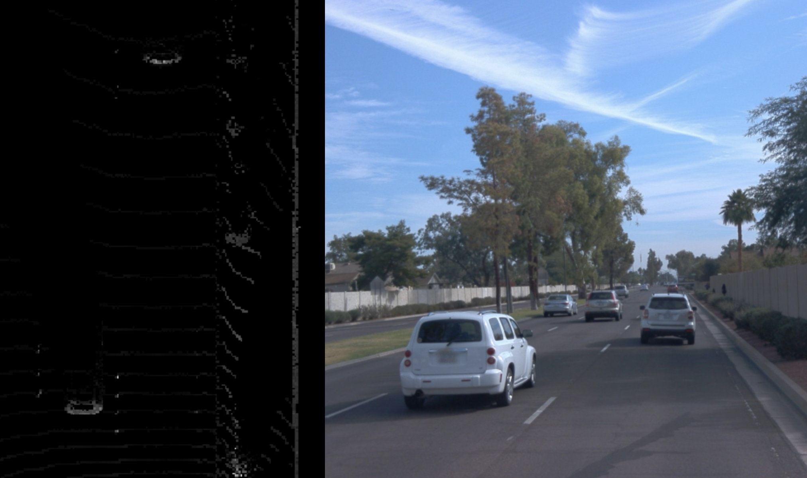
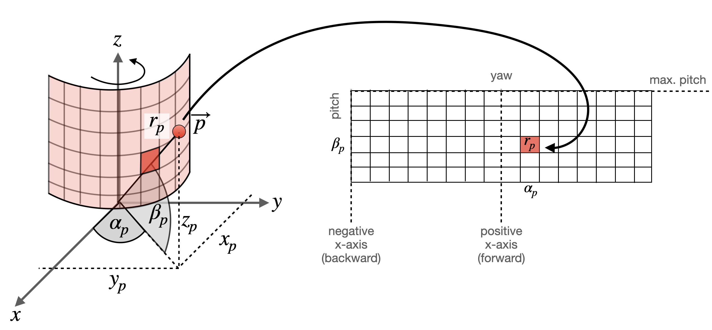

# Visualizing Range Images

> Part of: **The Lidar Sensor**

## Video

[Watch on YouTube](https://www.youtube.com/watch?v=Jeg97pAnF_4)

## Summary

**Range Images and Point Clouds**

This README file provides an overview of range images and point clouds, a fundamental concept in lidar technology. It covers the basics of extracting range images from lidar data and converting them into 3D point cloud representations.

### Key Concepts

* **Range Image**: A two-dimensional representation of the distance between objects in a scene, where each pixel corresponds to a specific measurement.
* **Point Cloud**: A collection of individual 3D points that represent measurements taken by a lidar sensor.
* **Lidar Data Structure**: The format in which lidar data is stored, including the Waymo Open Dataset and KITTI dataset.
* **Conversion from Range Image to Point Cloud**: The process of transforming a range image into a list of 3D coordinates.

### Practical Notes

When working with actual lidar data taken from a publicly available dataset, such as the Waymo Open Dataset, you will need to extract a range image before converting it into a 3D point cloud representation. This involves:

* Understanding the structure of the lidar data and how to access the range image for each frame.
* Converting the range image into a list of 3D coordinates using programming code.

Note: The specific steps and code patterns will be covered in more detail throughout this chapter, along with practical examples and exercises.

## Transcript

Welcome to this chapter on range images and point clouds. Now that you are familiar with the basics behind lidar technology, it's time now to look at actual measurements, such as in the Waymo Open Dataset. We have already looked at the basic structure of a Waymo frame in the previous chapter, and you might have noticed a structure called a range image there. We did not go into details back then, but now it's time to look closer at this particular concept. When you start working with actual lidar data taken from a publicly available dataset, you will notice that some measurements are stored as individual 3D point clouds, such as in the KITTI dataset, for example.

But as you will be working with a Waymo dataset in this course, you will not be able to just load a point cloud from a file and then visualize it or process it directly. Before you can do that, you will instead have to extract something called a range image, which is available for every lidar attached to a certain frame. You need to convert this structure into a three-dimensional coordinates list first. This is what this chapter is about, make you understand range images and also help you convert these images into a 3D point cloud representations. On the way through the processing pipeline and by coding all the examples and exercises, you will learn even more about lidar and its properties in automotive environments than you have been in the previous chapter on theory alone.

Have fun now also with the coding examples and see you soon further into this chapter

## Images


*3D lidar point-cloud and front camera image*


*Mapping of 3d points into range image cells*

## Additional Content

## Visualizing Lidar Data: Range Images
## What are Range Images?
Let us start this section with a quick comparison between point clouds and range images. 

Typically, the sensor data provided by a lidar scanner is represented as a 3d point cloud, where each point corresponds to the measurement of a single lidar beam. Each point is described by a coordinate in $(x, y, z)$ and additional attributes such as the intensity of the reflected laser pulse or even a secondary return caused by partial reflection at object boundaries. In the following figure, a point cloud is shown where the brightness of a 3d point encodes the intensity of the laser reflection.
As can be seen, the rear sections of the preceding vehicles and the wall on the right side are clearly visible with high intensity values in the birds-eye-view on the left, whereas the road surface or even the side of the vehicle in the center lane do hardly register at all. 

An alternative form of representing lidar scans are range images. This data structure holds 3d points as a 360 degree "photo" of the scanning environment with the row dimension denoting the elevation angle of the laser beam and the column dimension denoting the azimuth angle. With each incremental rotation around the z-axis, the lidar sensor returns a number of range and intensity measurements, which are then stored in the corresponding cells of the range image. 

In the figure below, a point

$\vec{p}$

in space is mapped into a range image cell, which is indicated by the corresponding azimuth angle

$\alpha_p$

and the inclination

$\beta_p$

of the sensor. In the literature,

$\alpha_p$

is often referred to as "yaw" whereas

$\beta_p$

is called "pitch". 

In this example, only the range (i.e. the target distance) of

$\vec{p}$

is stored in the cell. However, in the Waymo dataset, the range image structure stores range, intensity, elongation and the vehicle pose at the time the measurement was created.
The elongation of the laser pulse beyond its nominal width in conjunction with the intensity can be useful for classifying atmospherical conditions such as rain, fog or dust. Experiments conducted by Waymo suggest that a signal with high elongation and low intensity suggests the presence of atmospherical hazards. 


Now that you have a first understanding of the concept of range images, let us visualize them properly.
### Visualizing Range Images

As a first step, let us locate the range image data structure within the Waymo Open Dataset: 

```
-- lasers ⇒ one branch for each entry in LaserName
        |-- name (LaserName)
        |-- ri_return1 (RangeImage class)
            |-- range_image_compressed
            |-- camera_projection_compressed
            |-- range_image_pose_compressed
            |-- range_image
        |-- ri_return2 (same as ri_return1)
```

---

#### Example C1-5-1 : Load range image

You can experiment with the code in file `lesson-1-lidar-sensor/examples/l1_examples.py` by calling the function `print_range_image_shape` from `basic_loop.py`.
For each of the lidar sensors, you can extract its associated range image with the following code: 

```
lidar_name = dataset_pb2.LaserName.TOP
lidar = [obj for obj in frame.lasers if obj.name == lidar_name][0]
if len(lidar.ri_return1.range_image_compressed) > 0: # use first response
    ri = dataset_pb2.MatrixFloat()
    ri.ParseFromString(zlib.decompress(lidar.ri_return1.range_image_compressed))
    ri = np.array(ri.data).reshape(ri.shape.dims)
    print(ri.shape)
```

After executing the code, we get the following output: 

```
processing frame #1
(64, 2650, 4)
```

---

We now know that a range image has 64 lines and 2650 columns. From the previous section, we know that the top lidar covers a horizontal angle of 360°. This means that each column in the range image covers an arc of $\frac{360\degree}{2650} = 0.1358\degree$, which corresponds to a horizontal resolution of $\approx 8'$ *angular minutes*. 

In order to compute the vertical resolution, we need to make use of the minimum and maximum inclination (i.e. *pitch*).
