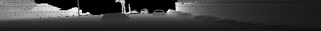

# Further Range Image Examples

> Part of: **The Lidar Sensor**

## Images


*Range image range data in 8-bit grayscale*


*Cropped range image range data*

## Additional Content

## Further Range Image Examples

### Example C1-5-3 : Retrieve maximum and minimum distance

You can experiment with the code in file `lesson-1-lidar-sensor/examples/l1_examples.py` by calling the function `get_max_min_range` from `basic_loop.py`.
In order to find and print the maximum and minimum range values, you can simply use the following commands: 

```python
print('max. range = ' + str(round(np.amax(ri[:,:,0]),2)) + 'm')
print('min. range = ' + str(round(np.amin(ri[:,:,0]),2)) + 'm')
```

From the output, we can see that the maximum range to a target is at $\approx 75m$. This value is consistent with the range cut-off value mentioned in the Waymo [paper](https://arxiv.org/pdf/1912.04838.pdf) on the details of the dataset. 

The minimum range of $-1m$ does not make sense geometrically, but instead is the value used to flag invalid points without a return signal. In order to not interfere with range image visualization and other operations such as object detection, we will set all elements with the entry `-1` to `0.0`  instead using the following command: 

```python
ri[ri<0]=0.0
```

Now that the range image has been properly extracted from the frame and invalid entries have been removed, we can proceed with the next step, which is properly scaling and visualizing the content.

---

### Example C1-5-4 : Visualizing the range channel

*You can experiment with the code in file `lesson-1-lidar-sensor/examples/l1_examples.py` by calling the function `vis_range_channel` from `basic_loop.py` in the workspace further above. You'll need to have the Desktop window open (see button in bottom right of workspace) to view the output.*

First, we want to visualize the actual range information. To do this, we need to extract the first channel and scale it in a way that entire value range from 0.0m to 75m is properly mapped to  the 8bit color depth of a grayscale image. To do this, we can use the following code: 

```python
ri_range = ri[:,:,0]
ri_range = ri_range * 255 / (np.amax(ri_range) - np.amin(ri_range))
img_range = ri_range.astype(np.uint8)
```

Once we have scaled and converted the range image content, we can visualize it using the OpenCV. Also, to make sure we have exploited the entire 8bit resolution, we can simply print the max. and min. values again with the code from the last exercise:

```python
print('max. val = ' + str(round(np.amax(img_range[:,:]),2)) )
print('min. val = ' + str(round(np.amin(img_range[:,:]),2)) )

cv2.imshow('range_image', img_range)
cv2.waitKey(0)
```

From the output, you can see that all the columns of the range image have been properly visualized and the range values have been mapped stretched to exploit the 8bit color depth of the grayscale image:

```python
max. val = 255
min. val = 0
```

In order to focus on the direction of driving, we can narrow the horizontal field-of-view to $\pm 45\degree$ around the forward-facing x-axis. As stated in the [Waymo dataset paper](https://arxiv.org/pdf/1912.04838.pdf), the center of the image corresponds to the positive x-axis. Also, we know that the distance between center and left as well as the distance between center and right correspond to 180°. Therefore, as 45° amounts to 1/8th of the number of range image columns, we can extract the center 90° with the following code: 

```python
deg45 = int(img_range.shape[1] / 8)
ri_center = int(img_range.shape[1]/2)
img_range = img_range[:,ri_center-deg45:ri_center+deg45]
```

Note however that this approach only works in case the lidar sensor is aligned exactly into the driving direction. If this is not the case, the sensor calibration matrix needs to be used instead to perform the correction (see next section). For the purpose of our visualization though, this step is not (yet) required.

The resulting image looks like the following:
As can be seen, the invalid pixels have been properly set to 0 and the preceding vehicles as well as the wall on the right side show plausible depth values.
