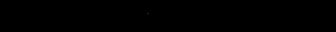
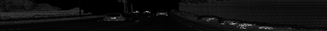

# Solution: Visualizing the Intensity Channel

> Part of: **The Lidar Sensor**

## Images


*Range image intensity data (min-max normalization)*


*Range image intensity data (max-adapted normalization)*

## Additional Content

## Solution: Visualizing the Intensity Channel
### Tips & Tricks

In case your result looks like the following image, it is safe to assume that you have been using the same method to map the intensity values to the 8bit-range of the image as with the range values in the previous exercise.
Note that there is a single very bright pixel left of the center while the rest of the intensity map is mostly zero. The reason for this behavior of the scaling process is that the range of values extends over several powers of ten from the darkest to the brightest region. This is a common problem with Lidar data in an automotive context due to the presence of retro-reflective materials (e.g. some traffic signs, tail-lights, some license plates) in a typical scene. For such materials, the intensity of the reflected laser beam is significantly higher than for other materials. Therefore, if we were to normalize the data using standard approaches from the literature such as z-normalization or similar methods, we would succeed in mitigating the influence of "intensity outliers" but at the same time boost the noise level significantly. Therefore, a somewhat heuristic approach to this lidar-specific problem could be to simply multiply the entire intensity image with half the value of the max. intensity value. In computer vision, this operation would be termed "contrast adjustment". In code, this looks like the following: 

```
ri_intensity = np.amax(ri_intensity)/2 * ri_intensity * 255 / (np.amax(ri_intensity) - np.amin(ri_intensity))
```

When you run the program again, the resulting intensity image will look like the following:
As you can see, the vehicles in front are cleary visible now, with their license plates being the most reflective materials. Also, the bushes on the right side of the image show up clearly. 
### My Approach

You can find my approach to the exercise below:

```python
def vis_intensity_channel(frame, lidar_name):

    # extract range image from frame
    lidar = [obj for obj in frame.lasers if obj.name == lidar_name][0] # get laser data structure from frame
    if len(lidar.ri_return1.range_image_compressed) > 0: # use first response
        ri = dataset_pb2.MatrixFloat()
        ri.ParseFromString(zlib.decompress(lidar.ri_return1.range_image_compressed))
        ri = np.array(ri.data).reshape(ri.shape.dims)
    ri[ri<0]=0.0

    # map value range to 8bit
    ri_intensity = ri[:,:,1]
    ri_intensity = np.amax(ri_intensity)/2 * ri_intensity * 255 / (np.amax(ri_intensity) - np.amin(ri_intensity)) 
    img_intensity = ri_intensity.astype(np.uint8)

    # focus on +/- 45° around the image center
    deg45 = int(img_intensity.shape[1] / 8)
    ri_center = int(img_intensity.shape[1]/2)
    img_intensity = img_intensity[:,ri_center-deg45:ri_center+deg45]

    cv2.imshow('intensity image', img_intensity)
    cv2.waitKey(0)
```
