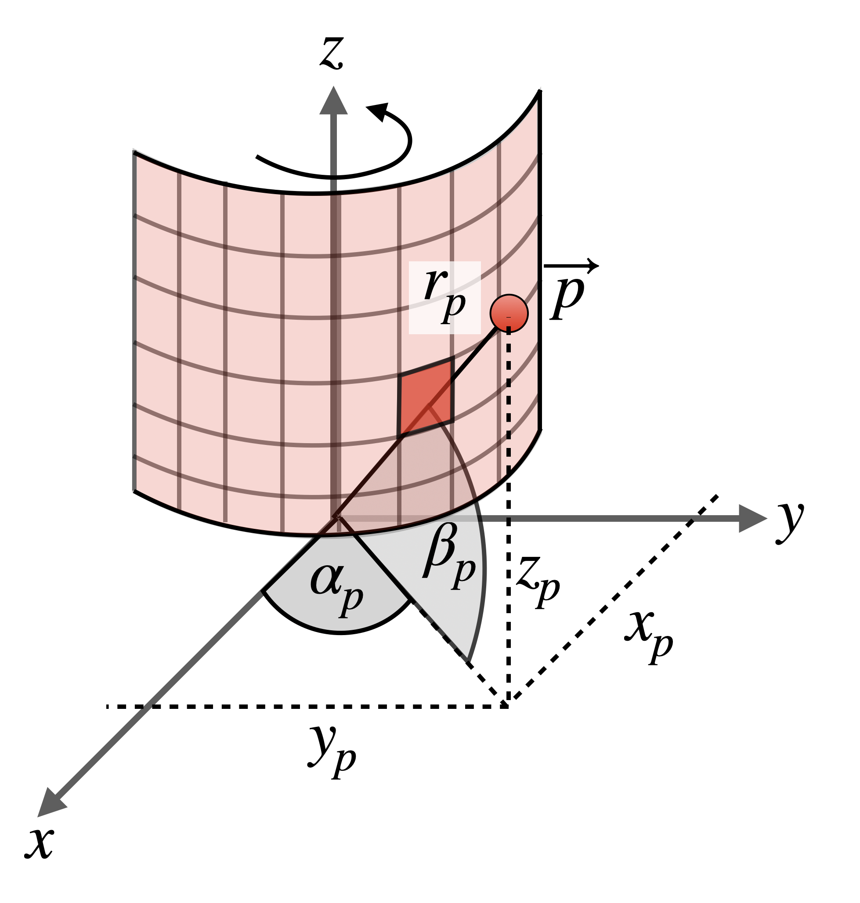
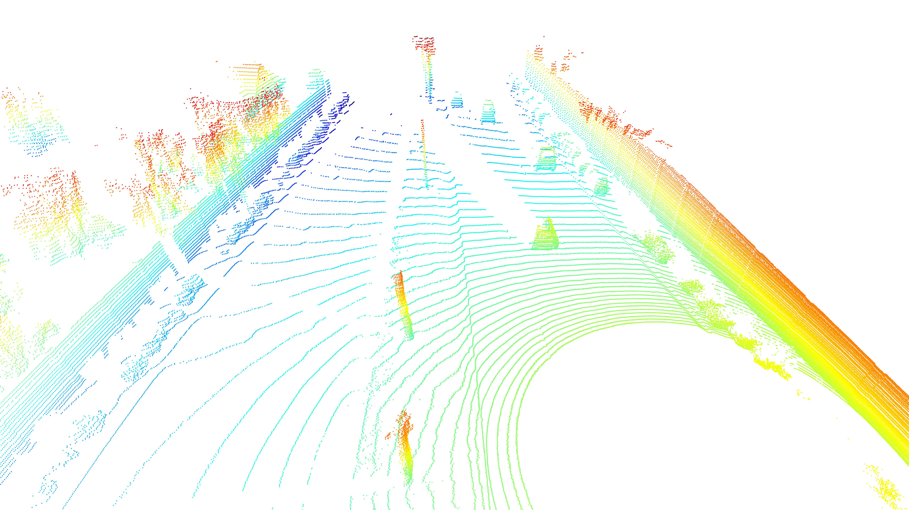

# Visualizing Point Clouds

> Part of: **The Lidar Sensor**

## Images


*Azimuth and inclination of 3d points*


*Final 3D point-cloud*

## Additional Content

## Visualizing Lidar Data: Point Clouds

### Converting Range Images to Point Clouds

Now that you have an understanding of the concept of range images, we will look at how they can be transformed into a three-dimensional point-cloud. In order to perform this spatial reconstruction, we simply need to invert the mapping process that we have discussed at the beginning of this chapter: 
### Example C1-5-6 : Convert range image to 3D point-cloud

You can experiment with the code in file `lesson-1-lidar-sensor/examples/l1_examples.py` by calling the function `range_image_to_point_cloud` from `basic_loop.py` You'll need to have the Desktop window open (see button in bottom right of workspace) to view the output.
Based on pitch and yaw angle as well as on the actual range of a point

$\vec{p}$

, we can use the concept of

[spherical coordinates](https://en.wikipedia.org/wiki/Spherical_coordinate_system)

to reconstruct the

$x$

,

$y$

and

$z$

components of

$\vec{p}$

:

$$x = r_P \cdot \cos{\alpha_P} \cdot \cos{\beta_P}$$

$$y = r_P \cdot \sin{\alpha_P} \cdot \cos{\beta_P}$$

$$z = r_P \cdot \sin{\beta_P}$$

As a first step, we need to extract the angles

$\alpha_P$

and

$\beta_P$

for each cell of the range image. This can be accomplished by retrieving the max. and min. vertical beam inclinations from the lidar calibration data and by creating a linear space of values between the two based on the height of the range image: 

```
height = ri.shape[0]
inclination_min = calibration.beam_inclination_min
inclination_max = calibration.beam_inclination_max
inclinations = np.linspace(inclination_min, inclination_max, height)
inclinations = np.flip(inclinations)
```

Note that the inclinations have to be reversed in order so that the first angle corresponds to the top-most measurement. Printing the beam inclinations to the terminal results in the following list: 

```
[    2.47544479   2.15226665   1.82908851   1.50591037   1.18273223
  0.8595541    0.53637596   0.21319782  -0.10998032  -0.43315846 ...
...
    -15.29935282 -15.62253096 -15.9457091  -16.26888724 -16.59206538
    -16.91524352 -17.23842166 -17.56159979 -17.88477793    ]
```

As a next step, we need to correct the azimuth angle in such a way that the center of the range image corresponds to the direction of the forward-facing x-axis of the Waymo vehicle. To do this, we need to extract the

[extrinsic calibration matrix](https://en.wikipedia.org/wiki/Camera_resectioning)

of the top lidar sensor:

$$\begin{bmatrix} R_{3x3} & T_{3x1} \\ 0_{1x3} & 1 \end{bmatrix}$$

In this representation, the matrix

$R_{3x3}$

describes the rotation of the sensor around its three coordinate axes in relation to the superior coordinate system (e.g. the vehicle) while the vector

$T_{3x1}$

denotes the relative center of the coordinate system. The rotation matrix is composed of a sequence of individual rotations around the axes of the coordinate system with the first column looking as follows:

$$R = \begin{bmatrix} \cos{\alpha}\cos{\beta} & ... \\ \sin{\alpha}\cos{\beta} & ... \\ -\sin{\beta} & ... \end{bmatrix}$$

When you compare the first and second component with the spherical coordinates transformation equations, you will notice that the first component corresponds to

$x$

and the second component to

$y$

. Therefore, in order to get the rotation angle of the coordinate system around the z-axis (which is the azimuth correction), we can use the following equation:

$$\alpha_{corr} = \arctan{\frac{y}{x}}$$

In code, the azimuth correction looks like the following: 

```
extrinsic = np.array(calibration.extrinsic.transform).reshape(4,4)
az_correction = math.atan2(extrinsic[1,0], extrinsic[0,0])
azimuth = np.linspace(np.pi,-np.pi,width) - az_correction
```

When we print the correction value for the first frame, we get the following output:

```
az_correction = 148.50°
```

Printing the corrected azimuth angles to the terminal results in the following list: 

```
[  31.4964375 ,   31.36053716,   31.22463682, ..., -328.23176182, -328.36766216, -328.5035625 ]
```
Next, we can use the following code to compute the x, y and z coordinates for each range image entry: 
```
# expand inclination and azimuth such that every range image cell has its own appropriate value pair
azimuth_tiled = np.broadcast_to(azimuth[np.newaxis,:], (height,width))
inclination_tiled = np.broadcast_to(inclinations[:,np.newaxis],(height,width))

# perform coordinate conversion
x = np.cos(azimuth) * np.cos(inclination) * ri_range
y = np.sin(azimuth) * np.cos(inclination) * ri_range
z = np.sin(inclination) * ri_range
```

Lastly, before we can properly use the point-cloud to e.g. detect objects, we need to transform all points, which are currently expressed within the sensor coordinate system, in vehicle coordinates. To do this, we need to first add a fourth component to express them as [homogeneous coordinates](https://en.wikipedia.org/wiki/Homogeneous_coordinates) and multiply them with the extrinsic transformation matrix. In Python, this can be expressed efficiently using the [einsum function](https://rockt.github.io/2018/04/30/einsum), where the indices `i,j` represent the dimensions of the extrinsic matrix and `j,k,l` are the dimensions of the range image with a set of homogeneous coordinates per cell: 
```
xyz_sensor = np.stack([x,y,z,np.ones_like(z)])
xyz_vehicle = np.einsum('ij,jkl->ikl', extrinsic, xyz_sensor)
xyz_vehicle = xyz_vehicle.transpose(1,2,0)
```

The resulting structure `xyz_vehicle` contains the transformed vehicle coordinates with the fourth component being 1, which can thus be ignored. With the following code, all 3d points with a range greater than zero are extracted and visualized using the `open3d` toolbox: 
```
pcl = xyz_vehicle[ri_range > 0,:3]
pcd = o3d.geometry.PointCloud()
pcd.points = o3d.utility.Vector3dVector(pcl)
o3d.visualization.draw_geometries([pcd])
```

The resulting point cloud looks like the following: 
On the right, you can see the wall separating the street from the residential area behind. The circular patch without 3d points is the current location of the Waymo vehicles and gives an impression of the size of the blind spot of the top lidar sensor. In front of the Waymo vehicle, you can see the outlines of the preceding vehicles, which both cast a detection shadow which is relative to the scanning direction of the lidar sensor. 

In function `range_image_to_point_cloud`  in the file `l1_examples.py` you can execute the code and play around with the visualization to get a feeling for the properties of the point cloud.
