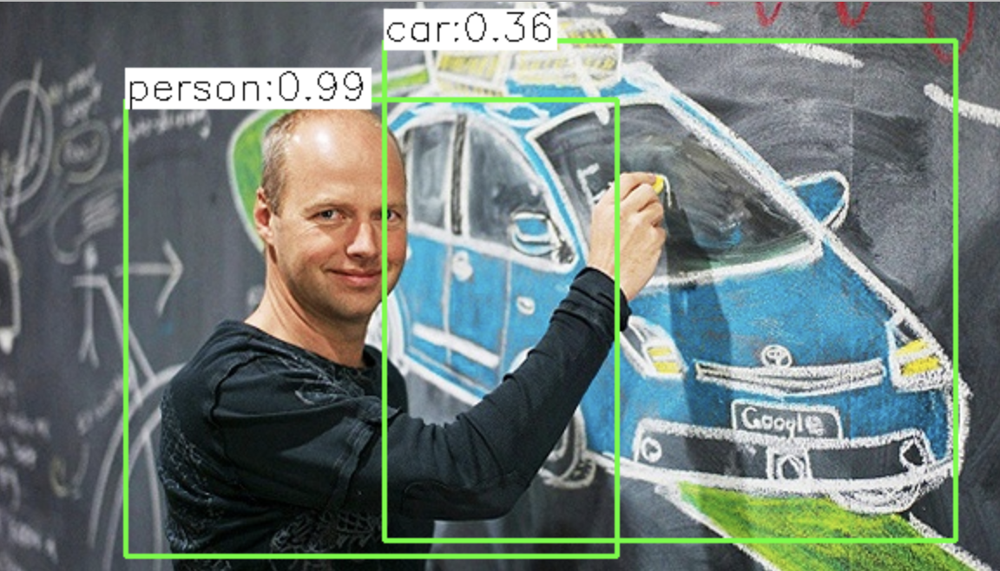

# Introduction

> Part of: ** Detecting Objects in Lidar**

## Video

[Watch on YouTube](https://www.youtube.com/watch?v=7IQfWNHs30w)

## Summary

**Lidar-Based Object Detection**
=====================================

This lesson introduces the exciting field of lidar-based object detection using deep learning algorithms. These techniques enable autonomous vehicles to not only measure distances but also interpret and extract objects from lidar point clouds, such as vehicles, pedestrians, and cyclists.

### Key Concepts

* **Lidar**: A type of sensor that measures distance by emitting laser light and detecting the reflections.
* **Point Clouds**: 3D representations of the environment created by collecting lidar data points.
* **Deep Learning**: A subset of machine learning that uses neural networks to analyze complex data, such as images and point clouds.
* **Object Detection**: The task of identifying and classifying objects within a scene or image.

### Practical Notes

This lesson lays the foundation for understanding how deep learning algorithms can be applied to lidar-based object detection. While no specific code patterns or real-world applications are introduced in this transcript, it sets the stage for exploring more advanced techniques and technologies that will transform 3D sensing in the same way computer vision has been transformed by deep learning.

## Transcript

Now welcome to this lesson on lidar based object detection. It will be a real pleasure for me to introduce you to this fascinating new domain of algorithms based on deep learning, which basically enable autonomous vehicles to not only measure single points, but rather interpret them, and also extract objects from them, such as vehicles, and pedestrians, and cyclists. I strongly believe that deep learning will basically transform 3D sensing in the same way as computer vision has been already transformed over the past years, by this amazing new technology. Let's start on this journey through a fascinating new class of algorithms, which brings us one step closer to a self-driving future. Let's take a look.

## Images

*YOLO object detection*

## Additional Content

## Introduction
In the previous lesson, we have analyzed the lidar sensor from a technology perspective: You are now familiar with the underlying principles and you know how point-clouds are generated. However, based on point-clouds alone, autonomous vehicles can not safely navigate. In order to make decisions, perform path planning or issue braking maneuvers, an autonomous vehicle needs to identify relevant objects in its surroundings. Such objects are other vehicles of various types (e.g. cars, trucks, trailers), cyclists, pedestrians, lane-boundaries, road-signs and several others.

In computer vision, deep-learning approaches are often used to detect and classify relevant objects in a scene. In the image below this video, a person and a vehicle have been detected and correctly classified by the [YOLO detection framework](https://pjreddie.com/darknet/yolo/).

Until recently, 2d image processing was the major domain, in which detection and classification based on deep-learning was performed. In recent years however, deep learning based on 3D point-clouds has been attracting the attention of both academic communities and the automotive industry. Especially in the last four or five years, the number of published methods to address problems related to point-cloud processing has increased significantly.

Compared to images, deep learning based on point clouds has been facing several challenges, such as the following:

1. Point clouds are of a sparse and unstructured nature as the location of points in a scene and therefore both their density and number varies with the presence of objects in a scene. An image taken by a camera on the other hand always has the same number of pixels which can be fed to a neural network.
1. As autonomous vehicles need to react very quickly, object detection must be performed in real-time. This means that a detection network must provide results within the time interval in between two scans.
