# State-of-the-Art in 3D Object Detection

> Part of: ** Detecting Objects in Lidar**

# Audio (Transcript)

<audio controls>
  <source src="state-of-the-art-in-3d-object-detection.mp3" type="audio/mpeg">
  [Audio](./state-of-the-art-in-3d-object-detection.mp3)
</audio>

&nbsp;

# Audio (Natural reading)

<audio controls>
  <source src="state-of-the-art-in-3d-object-detection_natural.mp3" type="audio/mpeg">
  [AudioNatural](./state-of-the-art-in-3d-object-detection_natural.mp3)
</audio>

## Video

[Watch on YouTube](https://www.youtube.com/watch?v=QkTtLK_m1cI)

## Summary

**Object Detection Techniques for Autonomous Vehicles**
=====================================================

This project provides an overview of object detection techniques in the deep learning domain, with a focus on converting 3D point cloud data into 2D representations suitable for processing by convolutional neural networks (CNNs).

### Key Concepts
* **Object Detection**: A three-step process consisting of:
	+ Data representation: Converting 3D point cloud data into a format suitable for analysis.
	+ Feature extraction: Using CNN-based techniques to extract relevant features from the data.
	+ Refinement: Improving detection and prediction results through refinement algorithms.
* **CNN-based Techniques**: Can be transferred from 2D image processing to 3D point cloud domain, enabling access to optimized algorithms.
* **BV Map (Bird's Eye View Map)**: A 2D representation of the 3D point cloud that encodes range information, point intensity, and other properties useful for object detection.

### Practical Notes
To implement object detection in autonomous vehicles, it is essential to consider real-time performance requirements. Single-stage detectors are a suitable choice for this application, as they can process data efficiently. In the next chapter, we will explore Complex YOLO, a network specifically designed for processing LiDAR point clouds.

## Transcript

Now the main purpose of this chapter here has been to provide you with an overview of object detection techniques in the deep learning domain. At this point, you know that object detection consists of three steps, data representation, feature extraction, and also the refinement of detection and prediction results. Also, you now know that CNN based techniques can be transferred from the 2D image processing domain into the 3D point cloud domain, which makes a large class of tests and also well-optimized algorithms available to you. Using these algorithms means that the 3D point cloud needs to be converted into a 2D flat representation, such as the BV map, which we focused on in this chapter, which not only encodes the range information but also point intensity and other properties that can be used as discriminating features. As one of the most important properties of object detection in the context of autonomous vehicles is real-time performance.

We will focus on single-stage detectors. In the next chapter, we will therefore look at a network which is called Complex YOLO, which has been specifically tailored to process LiDAR point clouds.

## Additional Content

## State-of-the-Art in 3D Object Detection
In this chapter, we will have a look at a processing pipeline for object detection and classification based on point-clouds. The pipeline structure consists of three major parts, which are (1) data representation, (2) feature extraction and (3) model-based detection. The following figure shows the data flow through the pipeline with raw point cloud on one end and the classified objects on the other end:

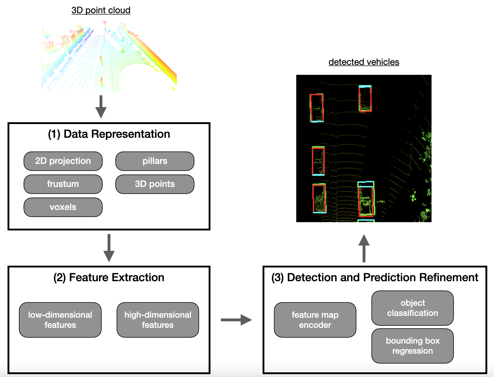
*Typical object detection pipeline*

In the first part, the point cloud provided by the lidar sensor is organized into a structure that is suited for an efficient processing of the data in the subsequent pipeline stages. In the existing research, two major approaches for data representation exist: Either the point cloud is transformed into a structure such as "voxels", "pillars" or "frustums", or the point cloud is left as-is and processed directly. Both approaches have their respective advantages and disadvantages and we will look at both in this chapter.

In the second part, which is about feature extraction, different types of low-dimensional and high-dimensional characteristics are extracted from the transformed point-cloud, which might now be represented as a two-dimensional birds-eye view in a grid. Once a set of features has been detected, the results are forwarded to the actual detection network.

The third part represents the actual detection network, which is the place where the object detection is performed. This step comprises operations such as object class prediction, bounding box regression around detected objects and the determination of object orientation.

In addition to introducing the three-step detection pipeline, this chapter also aims at offering a comprehensive overview of the currently available deep learning methods for object detection based on point clouds. Please note that this chapter is of a more theoretical nature and does not contain any coding examples. However, you will strongly benefit from this content in the next chapter, which is about the actual implementation of one of the methods introduced here.
### Step 1 : Data representation

As we have seen in the last lesson, lidar point clouds are an unstructured assortment of data points which are distributed unevenly over the measurement range. With the prevalence of convolutional neural networks (CNN) in object detection, point cloud representations are required to have a structure that suits the need of the CNN, so that convolution operations can be efficiently applied. Let us now have a look at the available methods:

#### Point-based data representation

Point-based methods take the raw and unfiltered input point cloud and transform it into a sparse representation, which essentially corresponds to a clustering operation, where points are assigned to the same cluster based on some criterion (e.g. spatial distance). In the next step, such methods extract a feature vector for each point by considering the neighboring clusters. Such approaches usually first look for low-dimensional local features for each single point and then aggregate them to larger and more complex high-dimensional features. One of the most prominent representatives of this class of approaches is [PointNet](https://arxiv.org/abs/1612.00593) by Qi et al., which has in turn inspired many other significant contributions such as [PointNet++](https://arxiv.org/abs/1706.02413) or [LaserNet](https://arxiv.org/abs/1903.08701). One of the major advantages of point-based methods is that they leave the structure of the point cloud intact so that no information is lost, e.g. due to clustering. However, one of the downsides of point-based approaches is their relatively high need for memory resources as a large number of points has to be transported through the processing pipeline.

#### Voxel-based data representation

A voxel is defined as a volume element in a three-dimensional grid in space. A voxel-based approach assigns each point from the input point cloud to a specific volume element. Depending on the coarseness of the voxel grid, multiple points may land within the same volume element. Then, in the next step, local features are extracted from the group of points within each voxel. One of the most significant advantages of voxel-based methods is that they save memory resources as they reduce the number of elements that have to be held in memory simultaneously. Therefore, the feature extraction network will be computationally more efficient, because features are extracted for a group of voxels instead of extracting them for each point individually. A well-known representative of this class of algorithms is [VoxelNet](https://arxiv.org/abs/1711.06396).  The following figure shows a point cloud whose individual points are clustered based on their spatial proximity and assigned to voxels. After the operation is complete, the amount of data representing the object has significantly decreased.

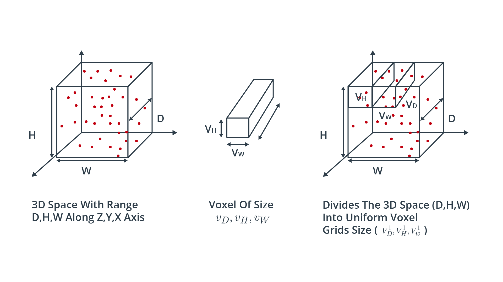
*Voxel-based data representation*

#### Pillar-based data representation

An approach very similar to voxel-based representation is the pillar-based approach. Here, the point cloud is clustered not into cubic volume elements but instead into vertical columns rising up from the ground up.

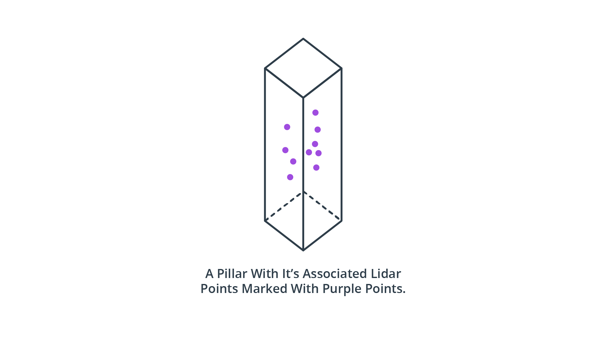
*Pillar-based data representation*

As with the voxel-based approach, segmenting the point cloud into discrete volume elements saves memory resources - even more so with pillars as there are usually significantly fewer pillars than voxels. A well-known detection algorithm from this class is [PointPillars](https://arxiv.org/abs/1812.05784).

#### Frustum-based data representation

When combined with another sensor such as a camera, lidar point clouds can be clustered based on pre-detected 2d objects, such as vehicles or pedestrians. If the 2d region around the projection of an object on the image plane is known, a frustum can be projected into 3D space using both the internal and the external calibration of the camera. One method belonging to this class is e.g. [Frustum PointNets](https://arxiv.org/pdf/1711.08488v1.pdf). The following figure illustrates the principle.

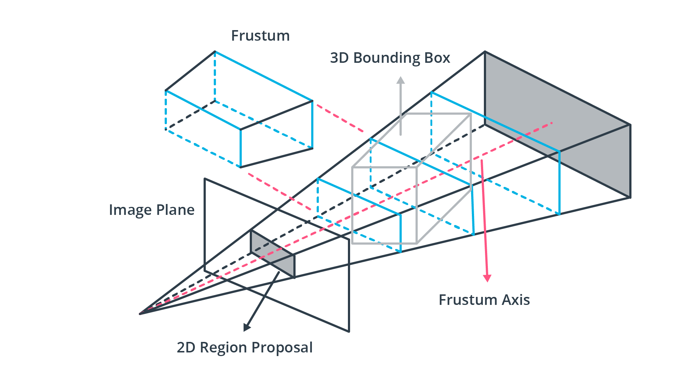
*Frustum-based data representation*

One obvious disadvantage of this method when compared to the previous ones is that it requires a second sensor such as a camera. However, as these are already used for object detection in autonomous driving and guaranteed to be on-board a vehicle, this is not a significant downside.

#### Projection-based data representation

While both voxel- and pillar-based algorithms cluster the point-cloud based on a spatial proximity measure, projection-based approaches reduce the dimensionality of the 3D point cloud along a specified dimension. In the literature, three major approaches can be identified, which are front view (RV), range view (RV) and bird's eye view (BEV). In the FV approaches, the point cloud is compacted along the forward-facing axis while with BEV images, points are projected onto the ground plane. The following figure illustrates both methods.

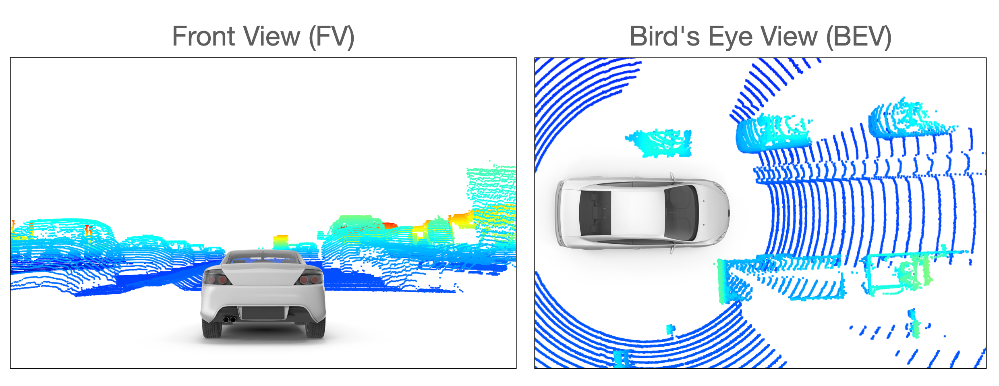
*Projection-based data representation*

RV methods are very similar to the FV approach with the exception that the point cloud is not projected onto a plane but onto a panoramic view instead. As you will recall from the previous lesson, this concept is the one implemented in the Waymo dataset, in which lidar data is stored as range images.

In the literature, BEV is the projection scheme most widely used. The reasons for this are three-fold: (1) The objects of interest are located on the same plane as the sensor-equipped vehicle with only little variance. Also, (2) the BEV projection preserves the physical size and the proximity relations between objects, separating them more clearly than with both the FV and the RV projection. In the next chapter, we will implement the BEV projection as the basis for the object detection method used in this course.
### Step 2 : Feature extraction

After the point cloud has been transformed into a suitable representation (such as a BEV projection), the next step is to identify suitable features. Currently, feature extraction is one of the most active research areas and significant progress has been made there in the last years, especially in improving the efficiency of the object detector models. The type of features that are most commonly used are (1) local, (2) global and (3) contextual features:

1. Local features, which are often referred to as low-level features are usually obtained in a very early processing stage and contain precise information e.g. about the localization of individual elements of the data representation structure.
1. Global features, which are also called high-level-features, often encode the geometric structure of an element within the data representation structure in relation to its neighbors.
1. Contextual features are extracted during the last stage of the processing pipeline. These features aim at being accurately located and having rich semantic information such as object class, bounding box shape and size and the orientation of the object.

In the following, we will look at a number of feature extractor classes found in the current literature:

#### Point-wise feature extractors

The term "point-wise" refers to the fact that the entire point cloud is used as input. This approach is obviously suited for the point-based data representation from the first step. Point-wise feature extractors analyze and label each point individually, such as in

[PointNet](https://arxiv.org/abs/1612.00593)

and

[PointNet++](https://arxiv.org/abs/1706.02413)

, which currently are among the most well-known feature extractors. To illustrate the principle, let us briefly look at the PointNet architecture, which is illustrated in the following figure:

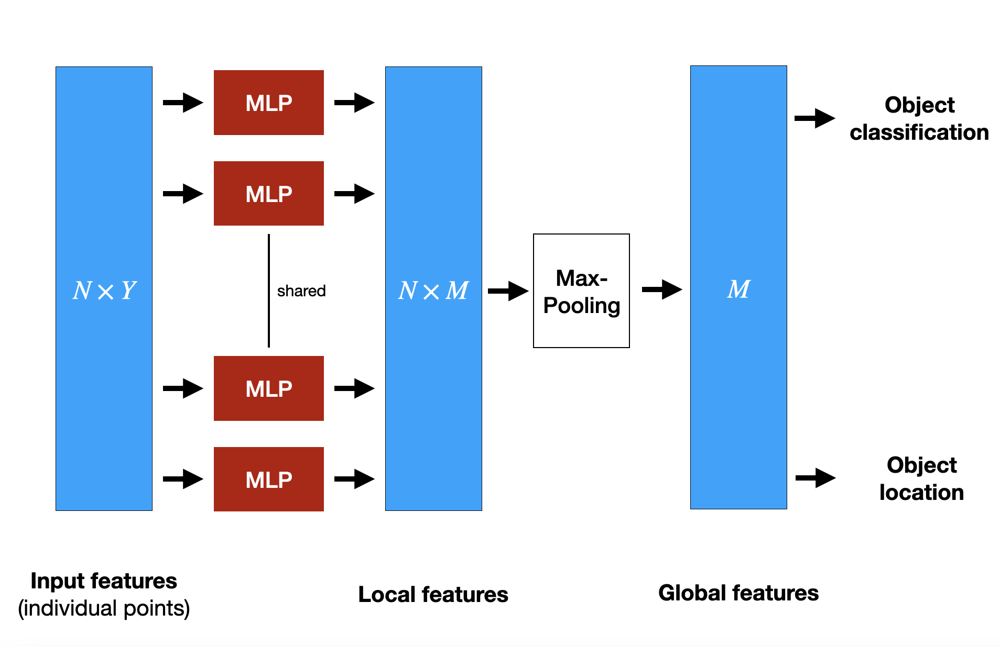
*PointNet architecture*

PointNet uses the the entire point cloud as input. It extracts global structures from spatial features of each point within a subset of points in Euclidean space. To achieve this, PointNet implements a non-hierarchical neural network that consists of the three main blocks, which are a max-pooling layer, a structure for combining local and global information and two networks that align the input points with the extracted point features. In the diagram,

$N$

refers to the number of points that are fed into PointNet and

$Y$

is the dimensionality of the features. In order to extract features point-wise, a set of multi-layer perceptrons (MLP) is used to map each of the

$N$

points from three dimensions (

$x, y, z$

) to 64 dimensions. This procedure is then repeated to map the

$N$

points from 64 dimensions to

$M=1024$

dimensions. When this is done, max-pooling is used to create a global feature vector in

$\mathbb{R}^{1024}$

.  Finally, a three-layer fully-connected network is used to map the global feature vector to generate both object classification and object location.

One of the downsides of PointNet is its inability to capture local structure information between neighboring points, since features are learned individually for each point and the relation between points is ignored. This has been improved e.g. in PointNet++, but for reasons of brevity we will not go into further details here. Even though point-wise feature extractors show very promising results, they are not yet suitable for use in autonomous driving due to high memory requirements and computational complexity.

#### Segment-wise feature extractors

Due to the high computational complexity of point-based features, alternative approaches are needed so that object detection in lidar point clouds can be used in a real-time environment. The term "segment-wise" refers to the way how the point cloud is divided into spatial clusters (e.g. voxels, pillars or frustums). Once this has been done, a classification model is applied to each point of a segment to extract suitable volumetric features. One of the most-cited representatives of this class of feature extractors is

[VoxelNet](https://arxiv.org/abs/1711.06396)

. In a nutshell, the idea of VoxelNet is to encode each voxel via an architecture called "Voxel Feature Extractor (VFE)" and then combine local voxel features using 3D convolutional layers and then transform the point cloud into a high dimensional volumetric representation. Finally, a region proposal network processes the volumetric representation and outputs the actual detection results.

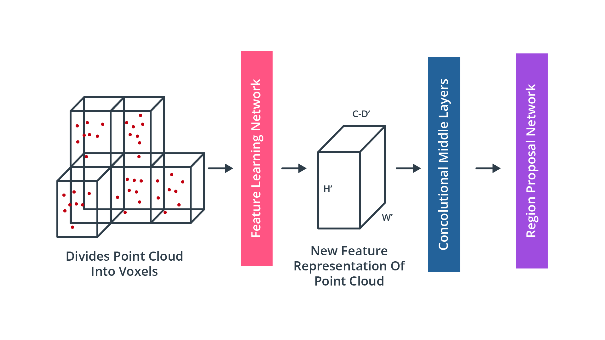
*VoxelNet processing pipeline*

To illustrate the concept, the figure below shows the architecture of the [Voxel Feature Extractor](https://arxiv.org/abs/1711.06396) within the feature learning network shown in the previous diagram:

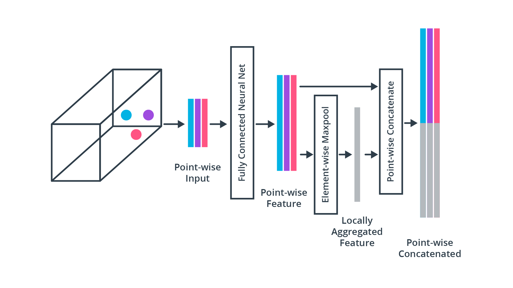
*Voxel Feature Extractor*

As this chapter is intended to provide a broad overview of the literature, we will not go into further details on VoxelNet or VFE. If you would like to see the algorithm in action, please refer to [this unofficial implementation](https://github.com/qianguih/voxelnet).

#### Convolutional Neural Networks (CNN)

For years, CNN have been used successfully to detect and classify objects in camera images. One of the first landmark papers which showed that CNN-based image classification outperformed the back-then state-of-the-art methods such as support vector machines (SVM), was published in 2012 by [Krizhevsky et al.](https://dl.acm.org/doi/10.1145/3065386) In recent years, many of the approaches for image-based object detection have been successfully transferred to point cloud processing. In this section, we will thus briefly revisit the principles of CNN-based detection in images and then make the leap to point clouds with only a few adjustments.  

In CNN-based object detection methods, the processing pipeline relies heavily on the use of "backbone networks", which serve as basic elements to extract features. This approach allows for the adaptive and automatic identification of features without the need to invest manual (and thus often heuristic) engineering efforts as with many classic approaches. In most cases, the backbone networks used for image-based object detection can be directly used for point clouds as well. In order to balance between detection accuracy and efficiency, the type of backbones can be chosen between deeper and densely connected networks or lightweight variants with few connections.

Even though the results achieved with CNNs such as [AlexNet](https://papers.nips.cc/paper/2012/file/c399862d3b9d6b76c8436e924a68c45b-Paper.pdf) were stunning at the time, these networks had the problem that with the network depth increasing, the accuracy of detection became saturated and degraded rapidly, due to a problem referred to as ["vanishing gradients"](https://towardsdatascience.com/the-vanishing-gradient-problem-69bf08b15484). This problem generally occurred in all architectures with a high number of layers, i.e. in all "deep" networks. To overcome this problem, the ResNet architecture was proposed by He et al. [in this paper](https://arxiv.org/abs/1512.03385), which used "skip connections" (i.e. shortcuts) to directly pass values of one layer to the next layer without using a non-linear transformation. By using such shortcuts, gradients can be directly propagated, leading to significant reductions in training difficulty. This means that network depth can be increased without compromising the model’s training capabilities. In the mid-term project, you will be using a ResNet model to perform object detection on point clouds.
### Step 3 : Detection and Prediction Refinement

Once features have been extracted from the input data, a detection network is needed to generate contextual features (e.g. object class, bounding box) and finally output the model predictions. Depending on the architecture, the detection process can either perform a single-pass or a dual-pass. Based on the detector network architecture, the available types can be broadly organized into two classes, which are **dual-stage encoders** such as [R-CNN](https://arxiv.org/pdf/1311.2524.pdf), [Faster R-CNN](https://papers.nips.cc/paper/2015/file/14bfa6bb14875e45bba028a21ed38046-Paper.pdf) or [PointRCNN](https://arxiv.org/abs/1812.04244) or **single-stage encoders** such as [YOLO](https://arxiv.org/abs/1506.02640) or [SSD](https://arxiv.org/abs/1512.02325). In general, single-stage encoders are faster than dual-stage encoders, which makes them more suited for real-time applications such as autonomous driving.

A problem faced by CNN-based object detection is that we do not know how many instances of a certain object type are located within the input data. It could be that only a single vehicle is visible in the point cloud, or it could also be 10 vehicles. A naive approach to solve this problem would be to apply a CNN to multiple regions and check for the presence of objects within each region individually. However, as objects will have different locations and shapes, one would have to select a very large number of regions, which quickly becomes computationally infeasible.

To solve this problem,  Ross Girshick et al. proposed a method (R-CNN) where a selective search is used to extract ~2000 regions, which he called region proposals. This meant a significant decrease in the number of regions that needed to be classified. Note that in the original publication, the input data were camera images and not point clouds. The candidate regions are then fed into a CNN to produce a high-dimensional feature vector, from which the presence of objects within the candidate regions is inferred using a support vector machine (SVM). The following figure illustrates the process:

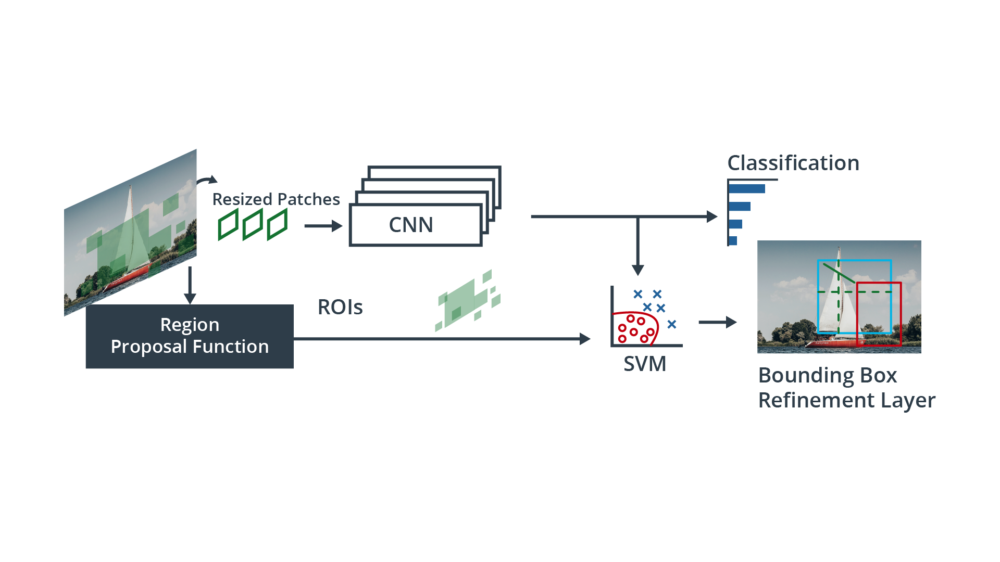
*R-CNN with region proposal function*

In order to refine the predictions and increase the accuracy of the model output, dual-stage encoders feed the results from the first stage to an additional detection network which refines the predictions by combining different feature types to produce refinement results.

Single-stage object detectors on the other hand perform region proposal, classification and bounding box regression all in one step, which makes them significantly faster and thus more suitable for real-time applications. In many cases though, two-stage detectors tend to achieve better accuracy.

One of the most famous single-stage detectors is YOLO (You Only Look Once). This model runs a deep learning CNN on the input data to produce network predictions. The object detector decodes the predictions and generates bounding boxes, as shown in the figure below:

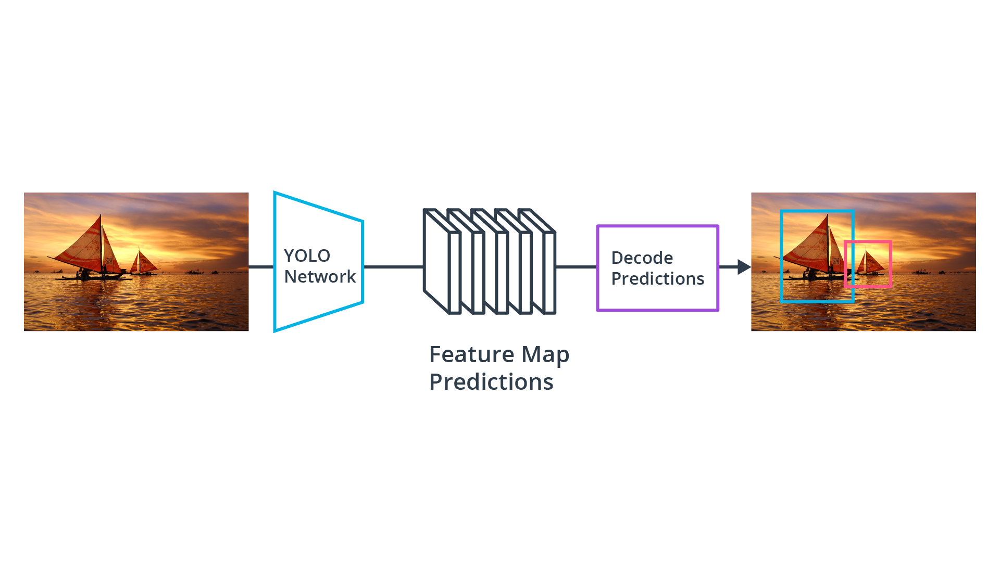
*YOLO object detection with prediction decoder*

YOLO uses anchor boxes to detect classes of objects, which are predefined bounding boxes of a specific height and width. These boxes are defined to capture the scale and aspect ratio of specific object classes (e.g. vehicles, pedestrians) and are typically chosen based on object sizes in the training dataset. During detection, the predefined anchor boxes are tiled across the image. The network predicts the probability and other attributes, such as background, intersection over union (IoU) and offsets for every tiled anchor box. The predictions are used to refine each individual anchor box.

When using anchor boxes, you can evaluate all object predictions at once without the need for a sliding-window as with many classical applications. An object detector that uses anchor boxes can process the entire input data at once, making real-time object detection systems possible.

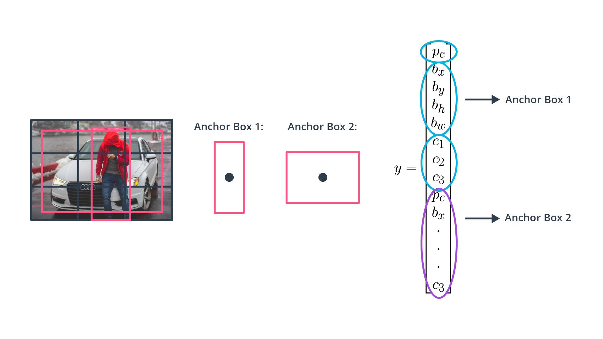
*YOLO anchor boxes and feature vector*

The network returns a unique set of predictions for every anchor box defined. The final feature map represents object detections for each class. The use of anchor boxes enables a network to detect multiple objects, objects of different scales, and overlapping objects.

As stated before, most of the CNN-based approaches originally come from the computer vision domain and have been developed with image-based detection in mind. Hence, in order to apply these methods to lidar point clouds, a conversion of 3d points into a 2d domain has to be performed. Which is exactly what we will be doing in the next chapter on object detection in point clouds.

### 3D Object Detection Overview Outro

[Watch on YouTube](https://www.youtube.com/watch?v=QkTtLK_m1cI)