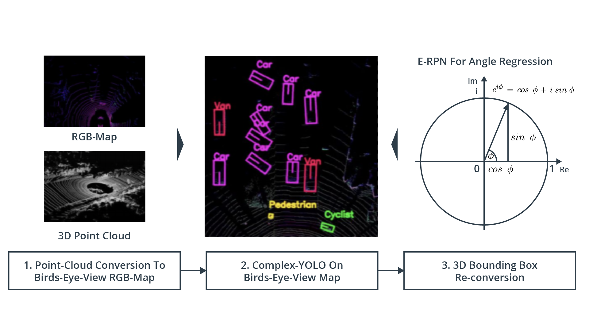
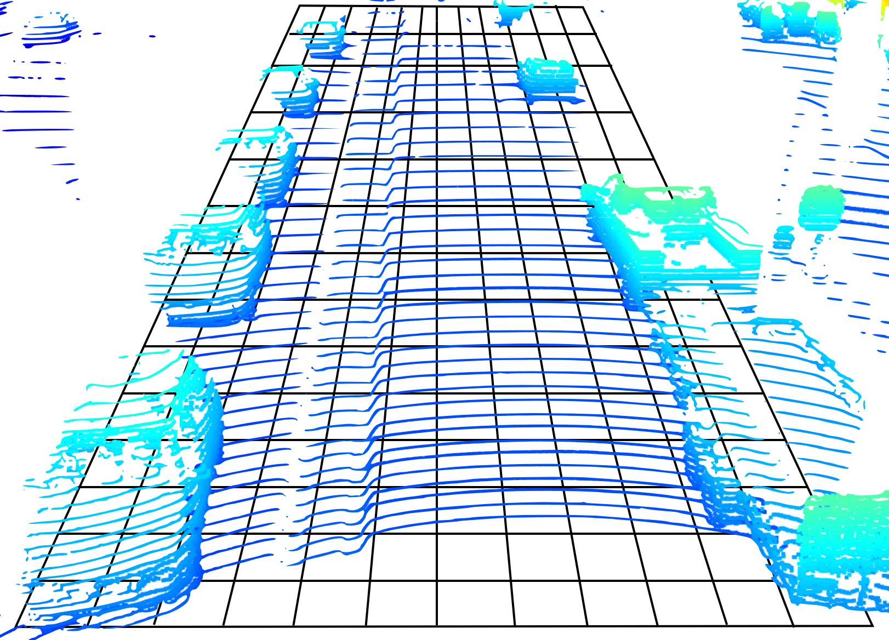
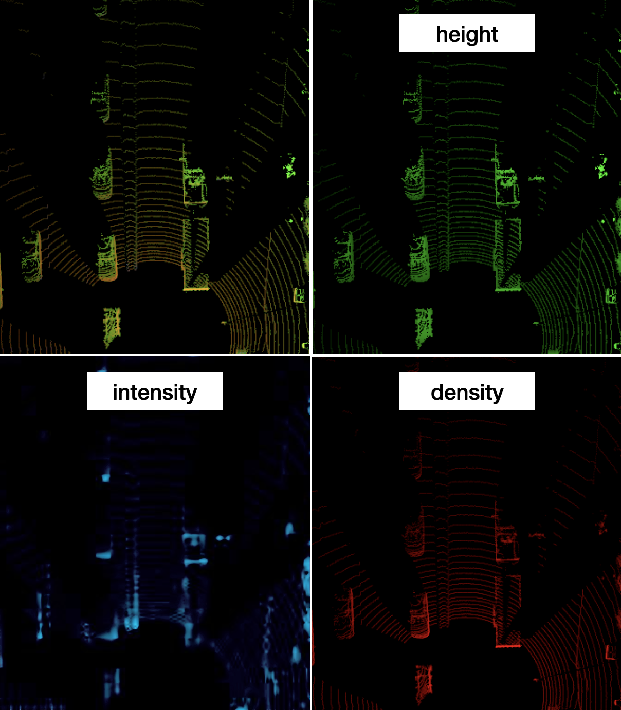
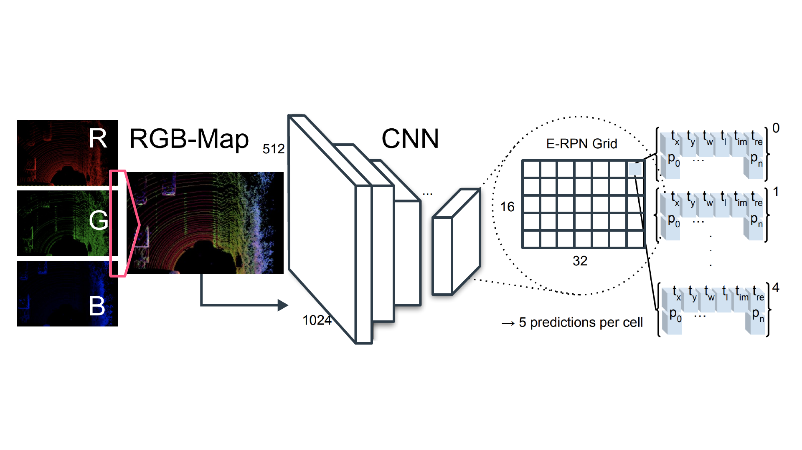
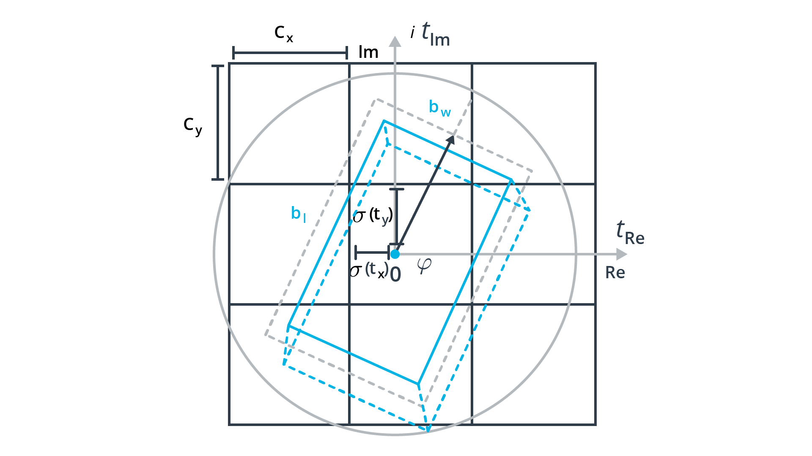
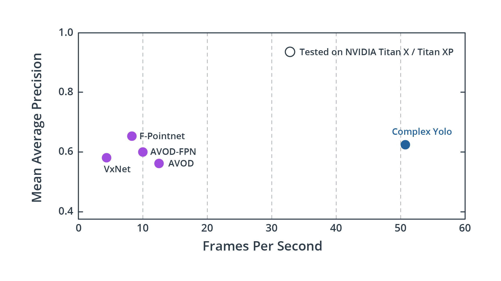

# Real-time 3D Object Detection on Point Clouds

> Part of: ** Detecting Objects in Lidar**

# Audio (Transcript)

<audio controls>
  <source src="./real-time-3d-object-detection-on-point-clouds.mp3" type="audio/mpeg">
  GitHub does not support the audio element. Click on link below to play audio.
</audio>

[Audio](./real-time-3d-object-detection-on-point-clouds.mp3)

&nbsp;

# Audio (Natural reading)

<audio controls>
  <source src="./real-time-3d-object-detection-on-point-clouds_natural.mp3" type="audio/mpeg">
  GitHub does not support the audio element. Click on link below to play audio.
</audio>

[AudioNatural](./real-time-3d-object-detection-on-point-clouds_natural.mp3)

## Video

[Watch on YouTube](https://www.youtube.com/watch?v=9kh61TNt_LA)

## Summary

**Complex-YOLO: A Deep Learning Approach for Object Detection**

This README file provides an overview of the key concepts and techniques introduced in the Udacity lesson on Complex-YOLO, a deep learning approach for object detection.

### Key Concepts

* **Object Detection**: The process of identifying and locating objects within a 3D point cloud using deep learning approaches.
* **Point Cloud Transformation**: Three methods to feed data to the input layer of a network:
	+ Using point load directly
	+ Transforming into volumetric shapes (voxels or pillars)
	+ Compacting 3D point cloud into 2D projection along a specific axis
* **Complex-YOLO**: A variant of the YOLO framework that is fast and suitable for real-time applications.
* **Bird's-Eye-View (BEV) Map**: A 2D representation of a 3D point cloud, used as input to the YOLO network.

### Practical Notes

* To implement Complex-YOLO, you will need to convert a 3D point cloud into a BEV map using a specific algorithm.
* The lesson assumes prior knowledge in deep learning and convolutional neural networks (CNNs).
* For more details on the concepts mentioned, refer to the original publication presented in the chapter.

Note: This summary is based on the provided transcript and does not include any code or formulas. If you need to include those, please provide the relevant information.

## Transcript

Now in the last chapter, you have learned that several approaches exist for performing object detection in point-clouds using deep learning approaches. You now know that there are basically three ways to feed data to the input layer of a network. Either you can use the point load directly or you can transform it into a volumetric shape such as voxels or pillars, or you compact the 3D point cloud into 2D projection along a specific axis. The advantage of doing the latter is that you can use this 2D projection, which is basically an image to feed to one of the established and well proven detectors from the image processing domain, such as, for example, YOLO, or the ResNet architecture. In this chapter, you will learn how to do just that by using a variant of the YOLO framework, which is called Complex-YOLO, which has the additional advantage of being really fast and also even suitable for real-time applications.

In the first part of this chapter here, we will be discussing the idea behind Complex-YOLO, and also look at the processing pipeline and its most important components. In the second part, you will learn how to convert a 3D point cloud into a 2D bird's-eye-view, the BEV map, which we'll then use as the input to the YOLO network. Once you understand how YOLO works or how BEV maps are created, you're almost prepared to complete the midterm project which is coming up. The only thing missing before you can start with the midterm project is some knowledge on how to assess the performance of an object detector. This will be the topic of the next chapter to come.

Now, please note that the main purpose of this chapter here is to provide you with a top level description of a well-known algorithm for object detection using deep learning. In order to limit the scope of the course, so to not overburden you with too many details, we cannot dive into every nook and cranny of the algorithm and explain all the concepts I will mention here. I assume that you have some prior knowledge in these areas, areas of deep learning, and also convolutional neural networks, the CNN. Also, in case you do not understand something, please refer to the original publication which I'll present to you in this chapter for more details. But now let's dive into 3D object detection by having a good look at the main ideas behind Complex-YOLO.

## Additional Content

## Real-time 3D Object Detection on Point Clouds
### The Complex YOLO Algorithm

In the paper [Complex-YOLO: Real-time 3D Object Detection on Point Clouds](https://arxiv.org/abs/1803.06199), M. Simon et al. extend the famous YOLO network for bounding box detection in 2D images to 3D point clouds. As can be seen from the following figure, the main pipeline of Complex YOLO consists of three steps:

*Complex YOLO detection pipeline*

#### 1. Transforming the point cloud into a bird's eye view (BEV)

First, the 3D point cloud is converted into a bird's eye view (BEV), which is achieved by compacting the point cloud along the upward-facing axis (the
$z$ -axis in the Waymo vehicle coordinate system). The BEV is divided into a grid consisting of equally sized cells, which enables us to treat it as an image, where each pixel corresponds to a region on the road surface. As can be seen from the following figure, several individual points often fall into the same grid element, especially on surfaces that are orthogonal to the road surface. The following figure illustrates the concept:

*Point cloud superimposed on the BEV grid cells*

As can be seen, the density of points varies strongly between cells, depending on the presence of objects in the scene. While on the road surface, the number of points is comparatively low due to the angular resolution in vertical direction (64 laser beams), the number of points on the front, back or side of a vehicle is much higher as neighboring vertical LEDs are reflected from the same distance. This means that we can derive three pieces of information for each BEV cell, which are the intensity of the points, their height and their density. Hence, the resulting BEV map will have three channels, which from the perspective of the detection network, makes it a color image.

The process of generating the BEV map is as follows:

1. First, we need to decide the area we want to encompass. For the object detection in this course, we will set the longitudinal range to  0...50m and the lateral range to -25...+25m. The rationale for choosing this particular set of parameters is based partially on the original paper as well as on design choices in existing implementations of Complex YOLO.
2. Then, we divide the area into a grid by specifying either the resolution of the resulting BEV image or by defining the size of a single grid cell. In our implementation, we are setting the size of the BEV image to 608 x 608 pixels, which results in a spatial resolution of $\approx 8cm$.
3. Now that we have divided the detection area into a grid, we need to identify the set of points $P_{ij}$ that falls into each cell, where $i,j$ are the respective cell coordinates. In the following, we will be using $N {i,j}$ to refer to the number of points in a cell. As proposed in the original paper, we will assign the following information to the three channels of each cell:
   - Height $H_{i,j} = \max\left(P_{i,j} \cdot \left[0,0,1\right]T\right)$

   - Intensity $I_{i,j} = \max\left(I\left(P_{i,j}\right)\right)$

   - Density $D_{i,j} = \min\left( 1.0, \frac{\log(N+1)}{64}\right)$

As you can see,

- $H_{i,j}$ encodes the maximum height in a cell,

- $I_{i,j}$ the maximum intensity and

- $D_{i,j}$ the normalized density of all points mapped into the cell. The resulting BEV image (which you will be creating in the second part of this chapter) looks like the following:

*BEV channels*

On the top-left, you can see the BEV map with all three channels superimposed. On the top right you can observe the height coded in green. It can clearly be seen that the roofs of the vehicles have a higher intensity than the road surface. On the lower left, you can see the intensity in blue. Depending on the contrast of your screen, you might be able to distinguish objects such as rear lights or license plates. If not, don't worry, we will investigate this more closely further on in this chapter. Finally, on the lower right, the point cloud density is displayed in red and it can clearly be seen that vehicle sides, fronts and rears show up the most. Also, with increasing distance, the point density on the road surface gets smaller, which obviously is related to perspective effects and the vertical angular resolution of the lidar.
#### 2. Complex YOLO on BEV map

Let us now take a look at the network architecture, which can be seen in the following figure:

*Complex YOLO network architecture*

In the original publication, a simplified YOLOv2 CNN architecture has been used. Note that in our implementation in the mid-term project we will be using [YOLOv4](https://arxiv.org/abs/2004.10934) instead. Extensions to the original YOLO network are a complex angle regression and an Euler-Region Proposal Network (E-RPN), which serve to obtain the direction of bounding boxes around detected objects.

The YOLO Network has been configured to divide the image into a 16 x 32 grid and predicts 75 features. The model has a total of 18 convolutional layers and 5 pooling layers. Also, there are 3 intermediate layers, which are used for feature reorganization. More details on the network layout can be obtained from the [original publication](https://arxiv.org/pdf/1803.06199.pdf) (table 1).

Let us discuss how the features per grid cell are obtained:

* The YOLO network predicts a fixed set of boxes per cell, in this case 5. For each box, 6 individual parameters are obtained, which are its two-dimensional position in the BEV map, its width and length and two components for the orientation angle: $\left[x,y,w,l,\alpha_{Im}, \alpha_{Re} \right]$.
* In addition to the box parameters, there is one parameter to indicate whether the bounding box contains an actual object and is accurately placed. Also, there are three parameters to indicate whether a box belongs to the classes "car", "pedestrian" or "bicycle".
* Finally, there are the 5 additional parameters used by the Region Proposal Network to estimate accurate object orientations and boundaries.

#### 3. 3D bounding box re-conversion

One of the aspects that makes Complex YOLO special is the extension of the classical Grid RPN approach, which estimates only bounding box location and shape, by an orientation angle, which it encodes as a complex angle in Euler notation (hence the name "E-RPN") such that the orientation may be reconstructed as $\mathrm{arctan2}(Im,Re)$. The following figure shows the parameters estimated during the bounding box regression:

*Bounding box regression parameters*

The regression values are then directly passed to the computation of a loss function, which is based on the YOLO concept (i.e. the sum of squared errors) using [multi-part loss](https://arxiv.org/pdf/1912.12355v1.pdf) but extends it by an Euler regression part, which is obtained by calculating the difference between the ground truth and predicted angle which is always assumed to be inside the circle shown above.

#### Why use Complex YOLO?

One of the major advantages of the Complex YOLO networks is its speed in comparison to other currently available methods. As can be seen from the following graph, the achievable frame rate of Complex YOLO is significantly higher than e.g. PointNet or VoxelNet while achieving a similar detection performance. This makes it well suited for real-time applications such as autonomous vehicles. Note that the term "mean Average Precision (mAP)" used in the figure will be explained thoroughly in the next chapter.

*Complex YOLO performance assessment - [Source](https://arxiv.org/pdf/1803.06199.pdf)*

One disadvantage of the current implementation of Complex YOLO though is the lack of bounding box height and vertical position. All bounding boxes are assumed to be located on the road surface and height is set to a pre-defined constant based on the detection class. In the tracking stage, this might lead to inaccuracies for driving scenarios with varying elevation. An improved version of Complex YOLO, which extends the concept to full 3D is described in [this paper](https://arxiv.org/pdf/1808.02350v1.pdf).
