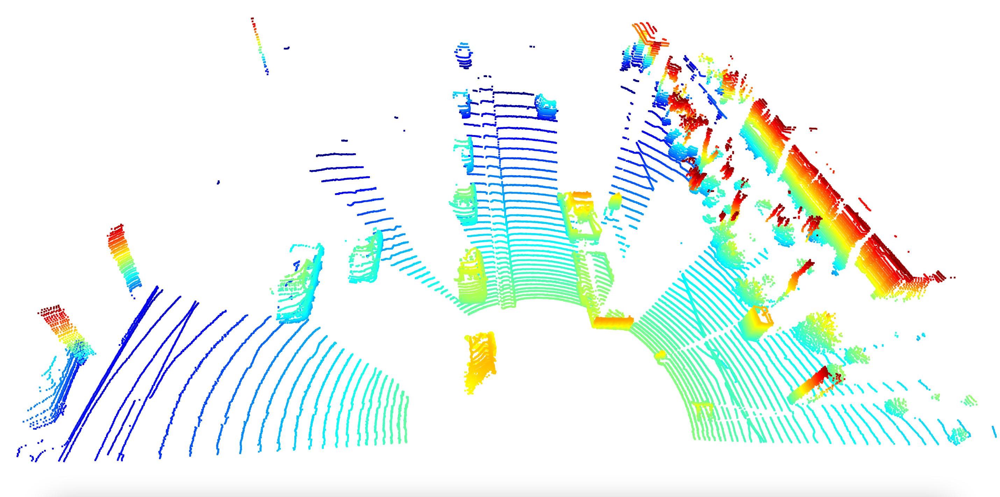
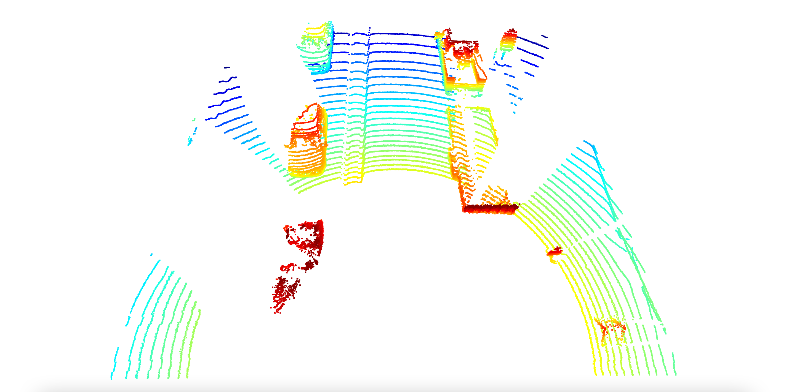

# Transform a Point Cloud into a Birds-Eye View

> Part of: ** Detecting Objects in Lidar**

## Images


*Cropped point cloud (large area)*


*Cropped point cloud (small area)*

## Additional Content

## Creating the BEV map for Complex YOLO
In this section, we will be creating the actual bird's eye view from lidar point clouds. As outlined prior in this chapter, this process follows a series of steps, which are

1. filtering all the points which are outside of a defined area

2. creating the actual BEV MAP by dividing the defined area into cells and by converting the metric coordinates of each point into grid coordinates

3. computing height, intensity and density for each cell and converting the resulting values into 8 bit integers.

Let us start with the first step and remove all points from the lidar point cloud which do not fulfill the following criteria:

$\begin{aligned}
0m \leq  p_x \geq +50m \\
-25m \leq  p_y \geq +25m \\
-1m \leq  p_7 \geq +3m
\end{aligned}$

As mentioned previously, the parameters have been chosen based on the original publication and on existing implementations of the algorithms.

In code, defining these limits looks like the following:

```python
lim_x = [0,50]
lim_y = [-25,25]
lim_z = [-1, 3]
```

Next, we can use `np.where` to retrieve the points whose coordinates are within these limits:

```python
mask = np.where((lidar_pcl[:, 0] >= lim_x[0]) & (lidar_pcl[:, 0] <= lim_x[1]) &
				   (lidar_pcl[:, 1] >= lim_y[0]) & (lidar_pcl[:, 1] <= lim_y[1]) &
				   (lidar_pcl[:, 2] >= lim_z[0]) & (lidar_pcl[:, 2] <= lim_z[1]))
lidar_pcl = lidar_pcl[mask]
```
### Example C2-3-1 : Crop point cloud

You can experiment with the code in file `lesson-2-object-detection/examples/l2_examples.py` by calling the function `crop_pcl` from `basic_loop.py`. Additionally, note that there are two lines to uncomment for this, as the `lidar_pcl` output from the first line feeds to the second line. If you want to see the point cloud, set the `False` at the end of `range_image_to_point_cloud` to `True` (but make sure to set it back to false before you proceed, or later lines will force you to re-view these visualizations first). You'll need to have the Desktop window open (see button in bottom right of workspace) to view the output. 

Note also that we begin making use of the [Open3D library](http://www.open3d.org/) in this example, which you'll also be able to use throughout the lesson exercises and on into the project. This is a great open-source library for working with 3D data (such as lidar) that can be used in either Python or C++.
For the pre-defined limits, the resulting point cloud looks like the following:
Changing the limits to a more restrictive setting has an immediate effect on the number of remaining points, as can be seen from the following image:
In the next step, we will create the BEV map by first discretizing the cells and then converting the point coordinates from vehicle space to BEV space. The following code gives you the dimensions of a single BEV cell in `meters/pixel`:

```python
bev_width = 608
bev_height = 608
bev_discret = (lim_x[1] - lim_x[0]) / bev_height
```

Next, we want to perform the actual coordinate conversion, which will be your job in the following exercise.
