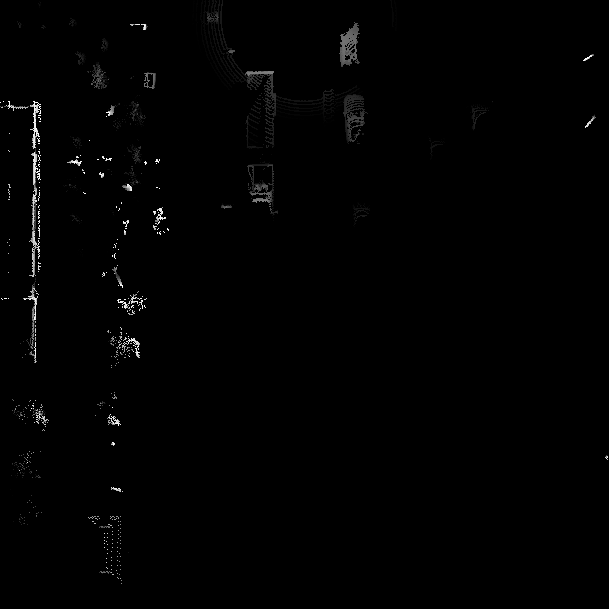

# Exercise: Transform a Point Cloud into a Birds-Eye View

> Part of: ** Detecting Objects in Lidar**

## Video

[Watch on YouTube](https://www.youtube.com/watch?v=ohmgcHogDic)

## Summary

**README**

This repository contains the implementation of a Bird's Eye View (BEV) image creation process, which transforms 3D LiDAR point cloud data into a 2D representation suitable for object detection tasks.

**Key Concepts**

* **Bird's Eye View (BEV)**: A 2D representation of 3D point cloud data, where the x-axis represents the horizontal direction and the y-axis represents the vertical direction.
* **Discretization**: The process of converting metric coordinates to BEV image coordinates using a discretization factor.
* **Coordinate Transformation**: The process of transforming metric x-coordinates into BEV image coordinates using the discretization value.
* **Sorting**: The process of sorting points within each grid cell based on their height, intensity, and other criteria.
* **Normalization**: The process of scaling values to fit within a specific range (e.g., 0-255).
* **Unique function**: A NumPy function that removes duplicate values from an array, keeping only the first occurrence.

**Practical Notes**

The implementation involves several steps:

1. **Coordinate Transformation**: Transform metric x-coordinates into BEV image coordinates using the discretization value.
2. **Sorting**: Sort points within each grid cell based on their height and intensity.
3. **Normalization**: Normalize intensity values by the difference between the highest and lowest intensities.
4. **Intensity Map Creation**: Insert normalized intensity values into the BEV image matrix.

The implementation uses NumPy functions such as `numpy.copy()`, `np.lexsort()`, and `np.unique()` to perform sorting, normalization, and other operations.

To run the code, ensure that you have completed Exercise 231 and have uncommented the necessary lines. The final BEV image will be displayed when running the code with visualization enabled.

## Transcript

Now welcome to your first exercise in this chapter here. Your task will be to convert the coordinates of the original point Cloud into the UV space, such that the leftmost column and the bathroom image corresponds to a limb underscore y zero element, while the topmost row corresponds to limb underscore x first element. When the conversion is performed, just make sure to convert all coordinates to integers, so that you can use the coordinates to access actual pixels in the bathroom. But because it just wouldn't do to use floating point numbers here, and when transforming the y-coordinates, please also make sure to center the forward facing x-axis in the bathroom image, so that is corresponds to its center column. This is really important to not have negative coordinates here.

Once you have done that, things become a little bit trickier because we now need to identify all the points within each pair grid cell, and just sort them according to the requirements of the specific F color channel as described in the first section of this chapter. Firstly, you need to create the height channel, which assigns the height value of the topmost point to each cell, and in order to do this, I recommend that you make use of two really helpful functions from the NumPy package, which are lake sort, and also Unique. These functions will enable you to really quickly sort all points and also extract the data point for each F cell which you want to sort for, and all that lake sort, are sorts in ascending order, which means that you need to negate the search criterion to make sure that the Unique function which you have to go afterwards really extract the maximum you are looking for. Now let's take a look at the starter code for this exercise and walk you through each step you will need to implement here. Let's take a look at Exercise 232, which is about transforming the metric point coordinates to the bird's eye view space, the BEV space.

This is an important step because it transforms the actual 3D points into a 2D format which can be input to the neural network that performs the actual object detection in the next step. The function to call this is this one here it's called PCL to BEV and it takes as parameters, the cropped point cloud cropped in this context means that all the points outside of the detection area have been removed in the prior step, this step here, the crop point cloud and in order to execute this code, you obviously have to have access to this part here. This means that you have to uncomment this one here so we can use this as the input here for this function. Let's uncomment this here. Obviously as this one takes as input the actual lidar point clouds, the unfiltered lidar point clouds, you also have to load the latter point cloud.

By loading, I mean you have to convert the actual frame range image into the point cloud, which we covered in this exercise here. In order for you to run Exercise 232, you need to complete Exercise 231. Now we can uncomment this function here as well. Let's have a look into it. PCL to BEV looks like this, this is the function.

You can see that there's a visualization flag which is set to true by default. This flag actually cause this visualization routine here at the low end of the function and if you want to take a look at the outcome of the map, we will be producing right now is simply have to uncomment this function here. Well, let's take a look at the individual steps which should make up this rather complex exercise. The first step we have to compute the discretization of the BEV map, which means that we have to compute how many meters in world space correspond to how many pixels in BEV space. In order for this to work, we simply have to basically subtract the lower boundary, let's say in x and the upper boundary in x and divide it by the height parameter, which is also to be found in the config file.

By dividing meters by pixels, you get the discretization value, which helps you make this transformation from metric space from world space into BEV space. Now in the next step, once we have this discretization factor, we have to create a copy of the lineup point cloud, which is the first thing we're going to do. Let's make a copy so we are sure we do not change the actual input point cloud and only want to work because we are going to perform some coordinate transformations and the following, and we do not want to alter the original. This is why we take a copy and you can use numpy copy to perform this task. Then we want to perform a transformation of the metric x coordinates into BEV image coordinates.

In order to do so, what you need to do is you need to apply this discretization value from the previous step and use it to answer the question, what is the BEV coordinate of each lidar point in BEV coordinates. We have the actual metric values of all lidar points in lidar PCL copy, and we want to transform it into the BEV pixel space. You need to use the discretizations value from the step before and make sure you actually get integer values as a return. You should not use floating point values here. After transforming the coordinates, makes sure to use the numpyint_function to transform the results into eight bit integers.

Next and the next step, we want to transform all the metric y-coordinates. Also the center of the forward facing x-axis, which needs to be in the middle of the resulting image. In order to do this, we also can use, again, similar to the coordinate transformation of the x values in the previous step. We can also use the discretization value from the first step, but we have to add a certain factor. The question is, which factor should you add here to ensure that the forward facing x-axis really resides in the middle of the resulting image.

That's what you have to do here. In the next step, we need to shift the level of the ground plane to avoid a flipping of these binary values from zero to 245. When you have neighboring values and neighboring in terms of having very similar coordinates in the BEV space, the problem is that we are using integer values here and let's imagine the ground plane is at a certain level and this lowest level should correspond to an integer value of zero. Now imagine there's a single point which is beneath this lowest level, so it would be, let's say minus 1 or minus 2 or minus 10 in the BEV coordinate space. Now, when you convert a negative value to the unsigned integer space, it basically flips to the other side of the value spectrum.

This results in this actually neighboring pixel, which only it might be a few degrees apart in the BEV space to flip over to 255, so it's going to appear as a very bright value. You should really try to run the code once it's finished and not perform this step to see what I mean, you will surely find many sequences where you have a ground plane with actually zero values as it should be or close to zero values. At some points in the image, especially when you have a curvature in the road, you might notice that the color changes suddenly, and the height image changes suddenly from very dark to very bright, and that's what I mean by flipping. This happens when the values actually fall below the position of the ground plane. In order to avoid this, you have to subtract the lower limit of the z-coordinate to avoid this shifting of the ground plane or to avoid this flipping of the color space.

That's what's meant by this step here. In the next step, we want to rearrange the elements in this data structure, the copied lidar point Clouds, and we want to perform sorting. The idea here is we want to look for points which fall into the same grid cell. By grid cell I mean, one coordinate in the bev-image. Let's say you have the position 1020 in bev-image and the bev-map, and into this cell which corresponds to some centimeters in world space, let's say there are 10 points which are at various positions within this discrete space.

What we want to do now is we want to reduce this large number of points within the same grid cell to only a single point. In order to do this, we have to find out which point actually is the point we want to keep and which are the ones we want to discard. This is why we want to perform a triple sorting here. We want to first sort by the x-coordinate, then by the y-coordinate, and as we want to produce the height map and this first step of creating the actual bev-image, which consists of height and intensity and also density but now we are looking for height. The third sorting value, once we have sorted by x and by y, will be sorting by the z value.

In order to make sure that you have the highest point first, we want to sort by the negative z value because the function which we want to be using is called the lexsort function, it's part of the NumPy package. This sorts in ascending order, but we want the highest point on top, so in order to get this done, we need to put a minus sign in front of the z-coordinates so that the highest point is actually the lowest point in terms of the lexsort sorting order. First sort by x, then by y, then by z, and once you have done this, you can rearrange the order of the points and the data point cloud because the return data of the np lexsort function is an index vector and this index vector can be used for resorting the original point cloud. Once you have done this, you're done with this step here, then we get to the next step which is about extracting all points with identical x and y such that only the top most z-coordinate is kept. What I've been talking about just now.

We want to pair the lexsort function with another function from the NumPy package, which is called np unique. Np unique has the job to remove all the other values which are below the first encountered file. Let's imagine we have this script cell again, 1020 and the bev-image space and there are 10 points inside. We have sorted these 10 points in ascending order by negative heights. The top most point of these 10 points in the same cell will be the point with the highest z-coordinate.

The unique function which you should be using here removes all the other nine so that the only point remaining is the highest point, which we are looking for here. Once you have done this, once the sorting is complete, you can remove all the other point by using the return data from the np unique function, which is again an index which helps you to only keep those points from the original point Cloud which should be kept. That means for each grid cell and the bev-image, the highest z-coordinate. Let's move on to the next step here. Now this step is about assigning the height value of each unique entry, which we just talked about in this structure in the LiDAR point cloud to the height map and makes sure that each entry is normalized on the differences between the upper and the lower height as defined in the config file.

What I mean by this is, what we have to do here is, we have to map this stretch of height from lowest point on the road surface up to the highest point as defined in the config file, and we have to squeeze it into an 8-bit integer space which consists of only 256 values. The lowest point should correspond to a zero and the highest point, wherever it might be, look it up in the config file, this should correspond to 255. The idea here of this step is to squeeze all the resulting Z values into this 8-bit space. That's what needs to be done here. Once this is done, we can move on to the next step, which is about sorting the points, such that in case of identical BEV grid coordinates, the points in each grid cell are sorted now, not according to their height, but according to their intensity.

That's actually the next step. Once we have I finished the previous step here, then we can move on to the next step, which is about creating the second channel of the BEV image. In the first channel we have just put into the height. Now we want to put into the channel, the intensity. That's actually done in the very same way.

You can, again, use the lx sort function to make sure that the original lidar point Cloud is sorted in the way that it's first sorted by x and then by y, and then lastly, not by z as before, but now by intensity. We only want to keep the point in a grid cell that has the highest intensity value of all the points. This will, in most cases, not be the point with the highest Z coordinates. You have to sort again to make sure that one supplying your LX slot function, and then thinning out all the values in this grid cell with the unique function, that only those points remain which have the highest intensity coordinate. That's also what's meant by this next step here, keep only one point per grid cell, in this case, the point with the highest intensity.

Now we want to create this intensity map here. By creating the intensity map, I mean that you actually have to insert all these values which are still in the list into the actual BEV image, which is a 3-channel two-dimensional matrix. You have to use the index in x and y, which you have transformed to integers, and add the respective data value, which in this case is the intensity. In order to squeezing the intensity in just the right amount, what you need to do is, you need to normalize it because the problem with the intensity here is that, it's actually a very non-uniform space which we are talking about. It highly depends on the sensor which you are using.

But usually relevant intensities will range between zero and one. For some very highly reflective items, intensities go up into the thousands. It's not really a very predictable space, but only for some sensors such as the way more LiDAR. We are totally content here with normalizing this intensity value by the difference between the point with the highest intensity and the point with the lowest intensity. You shoot when you assign the intensity values to each pixel and the BEV.

Intensity channel, you should normalize them by the difference between highest intensity and lowest intensity. That's what needs to be done here. Once you have achieved this, you're basically finished. You can then comment in these lines below for the visualization, then run the code. Actually, we have included an image and the lesson description which shows you where you should get to.

When you get to the midterm project, you also can visualize the actual BEV image by calling the respective visualization functions in the main loop. But this is the code where you can check whether you have created a good representation of the intensity map. That's what this function is about.

## Images

*BEV map : height channel*

## Additional Content

## Exercise: Transform a Point Cloud into a Birds-Eye View
### The Starter Code

The starter code for this lesson's exercises is in the [same repository](https://github.com/udacity/nd013-c2-fusion-exercises) as the previous lesson (and will also be provided in the workspace further below).
**Files to work in:**

- `basic_loop.py`
- `lesson-2-object-detection/exercises/starter/l2_exercises.py`
- Sequence 3, frame 0
Once you are done, please execute the code and turn on the visualization. The resulting height map should look like this:
As can be expected, the roof-tops of vehicles as well as trees and the wall on the left are significantly brighter than e.g. the road surface.
