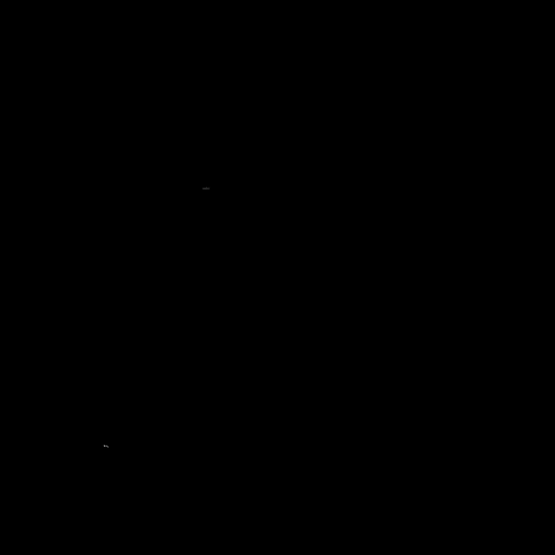
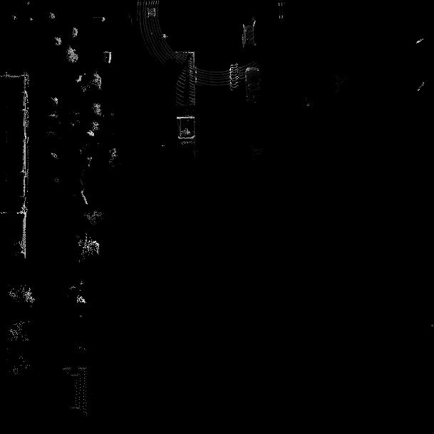

# The Intensity Channel

> Part of: ** Detecting Objects in Lidar**

## Video

[Watch on YouTube](https://www.youtube.com/watch?v=c3JvHJFhovI)

## Summary

**YOLO Detection Network Overview**
=====================================

The YOLO (You Only Look Once) Detection Network is a fast algorithm for object detection that has been adapted from 2D computer vision to the 3D point cloud domain. This network is reliable and efficient in detecting specific object classes, such as vehicles.

**Key Concepts**
---------------

* **YOLO Detection Network**: A fast algorithm for object detection that transfers established algorithms from 2D computer vision to 3D point clouds.
* **Object Classes**: Specific categories of objects that can be detected using the YOLO network, such as vehicles.
* **Pre-trained Networks**: Existing networks that have been trained on large datasets and can be used as a starting point for further implementation.

**Practical Notes**
-------------------

The lesson covers the individual steps of the YOLO Detection algorithm and provides guidance on implementing code to create input data for pre-trained networks. The midterm project will require students to fully implement the complex YOLO Detection framework using a pre-built implementation available on GitHub. This implementation can be reused in parts throughout the course.

Note: There are no specific practical steps or code patterns mentioned in this transcript, but it provides an overview of the topic and sets the stage for future lessons on assessing performance and comparing detection algorithms.

## Transcript

Now in this chapter, we have looked at an overview of the complex YOLO Detection Network, which is a very fast algorithm for objects detection. One of its major contributions, is that it transfers well-established and also powerful algorithms from the field of 2D computer vision into the 3D point cloud domain. This means it is a reliable and also fast method for detecting certain object classes such as vehicles, for example. The main purpose of this section here has been to familiarize you with the individual steps of the algorithm and also to implement the code to create the input data for the pre-trained network. Then the midterm project, it will be your task to fully implement the complex YOLO Detection framework based on a pre-built implementation, that has been made available on GitHub and it's in parts reused in this course.

Based on the knowledge you will have gained after completing the midterm project, you will have no problem with understanding and also integrating other famous object detection algorithms from GitHub or directly from the publication authors, which you can then easily find in proceedings of the ACCV or the ECCV, for example, which are famous Computer Vision Conferences. But before you start with the midterm project, we will first need to discuss one more thing here, which is how to assess the performance of a detection algorithm. How to compare it to other detectors, in such a way that the results are both comprehensive and also meaningful and also concise and of course, quick to grasp. In the next and last chapter of this lesson, I will show you how this is done in practice. Let's go and see you there.

## Images


*BEV map : intensity channel (full scale) - it's hard to see!*


*BEV map : intensity channel (clipped at 1.0)*

## Additional Content

## The Intensity Channel
Now that we have created the first layer of the bird's eye view, let us take a look at the intensity channel in the following. As with height, the idea is to store the value with maximum intensity in each cell. Note that using the intensity values of the points we have previously selected based on maximum height will not work as in most cases, the highest point of a cell will not at the same time also have the highest intensity. Instead, we need to perform the sorting process once more, this time based on intensity rather than height.

One problem you will encounter in practice when dealing with LiDAR sensors is that the reflected intensity differs significantly between sensor models. When comparing the Velodyne LiDAR used in the KITTI dataset with the Waymo lidar, you will note that the maximum intensity values present in a scene is significantly higher with the Waymo sensor in most cases.

#### Example C2-3-3 : Minimum and maximum intensity

As a small experiment, let us extract the minimum and maximum intensities for each frame, so we can get a feeling for the range of values that the Waymo LiDAR sensor produces. Note that for other LiDAR sensors, the intensity values and the range will differ.

To run this experiment, you need to execute the function `min_max_intensity` in file `l2_examples.py`. This small function will simply print the minimum and maximum intensity of all points for a given frame to the terminal.
When you process the first 5 frames of sequence 3 for example, the output will look like the following:

```
processing frame #0
min. intensity = 0.0002117156982421875, max. intensity = 91648.0
------------------------------
processing frame #1
min. intensity = 0.000316619873046875, max. intensity = 86528.0
------------------------------
processing frame #2
min. intensity = 0.0003261566162109375, max. intensity = 80384.0
------------------------------
processing frame #3
min. intensity = 0.000209808349609375, max. intensity = 75776.0
------------------------------
processing frame #4
min. intensity = 0.00019168853759765625, max. intensity = 70656.0
------------------------------
processing frame #5
min. intensity = 0.00023746490478515625, max. intensity = 66048.0
```

As you can see, the difference between min. and max. intensities spans a total of 8 powers of ten. Let us investigate this observation a little more closely. We can copy and adjust the code we have used for creating the height map to now create the intensity map. Note that the code is not provided here as the creation of the intensity map is one of the exercises in the mid-term project.

Now please take a look at the intensity map given below.
We can see that only a very small number of pixels is visible while the vast majority of projected 3d points has a brightness value of zero. Based on the value range which we exposed by printing the min. and max. intensities, it is clear that the intensity channel is dominated by only a few high-intensity points. Let us investigate this observation further and compute a histogram of the intensity values:

```
b = np.array([0, 1e-5, 1e-4, 1e-3, 1e-2, 1e-1, 1, 1e+1, 1e+3, 1e+3, 1e+4, 1e+5, 1e+6, 1e+7])
hist,bins = np.histogram(lidar_pcl[:,3], bins=b)
print(hist)
```

Note that the bins are not equally spaced, but represent a logarithmic scale. This will help us to find the decade, which holds most of the intensity values. The output of the code looks like this:

```
hist = [0, 0, 40, 5722, 15258, 9886, 49, 70, 0, 62, 70, 0, 0]
```

Based on these numbers, we can clearly see that the vast majority of intensity values lies between

$0.001$

and

$1.0$

. As the number of points with higher intensity amounts to less than 1% of the data, we can safely perform a filtering operation such that each point with an intensity above 1.0 is clipped to 1.0:

```
idx_limit = lidar_pcl[:,3]>1.0
lidar_pcl[idx_limit,3] = 1.0
```

Now, the dominating influence of overly large intensity has been removed. When we now compute the intensity map again, the result looks like the following:
While the contrast of the BEV map has been slightly boosted to make more details visible to you, it can clearly be seen that the number of visible points is considerably higher, which will make it easier for the object detection network to locate vehicles based on the intensity of the reflected lidar pulses.

In the upcoming mid-term project, you will implement the code to create this channel as well as the point density channel, which encodes the number of points per grid cell. The combination of height, intensity and density will make up the BEV map, which we can use to perform object detection.
### Bird's-Eye View Outro
### A Note on Model Training

You may be asking yourself at this point - what about training the model? We've covered the conversion into these BEV maps from the 3D lidar point cloud data, and next will consider evaluating the performance of pre-trained models on given data, but the training of a model may be unclear. This is because in this case, we are *now able to use a 2D object detection model* (as you will in the project)! The BEV map is quite similar to an RGB image you might normally use in 2D object detection - the height, intensity and density are each effectively a channel of a BEV "image", just as red, green and blue are channels for an RGB image. In this case, each object is detected from above (with associated 2D bounding boxes), instead from the side, as you might with a camera image from the same vehicle.

All the same principles apply, so we won't directly cover the training of such models in this course.
