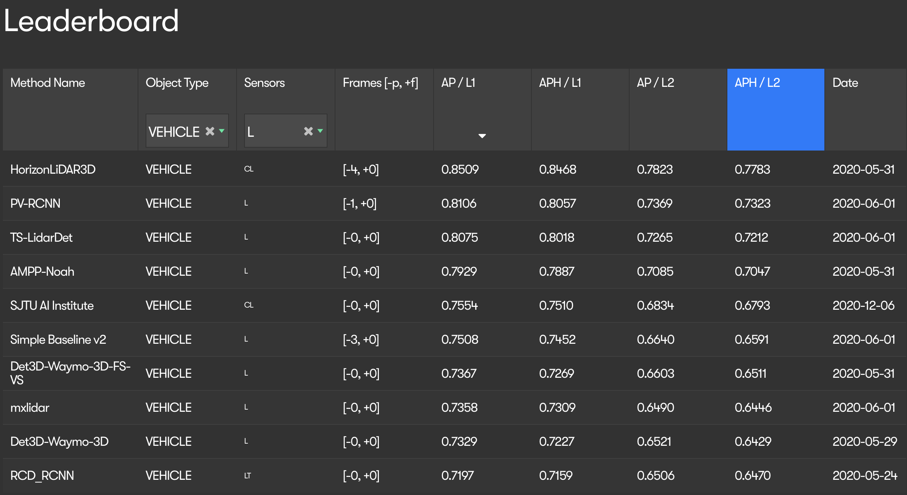
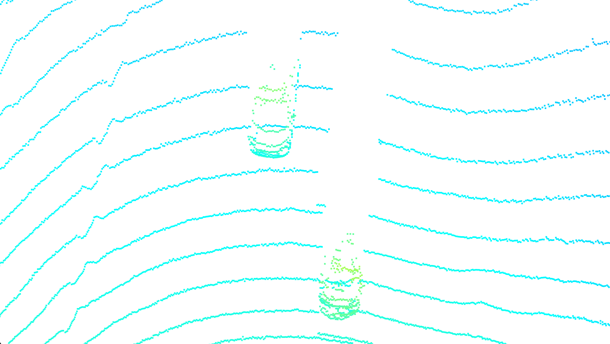
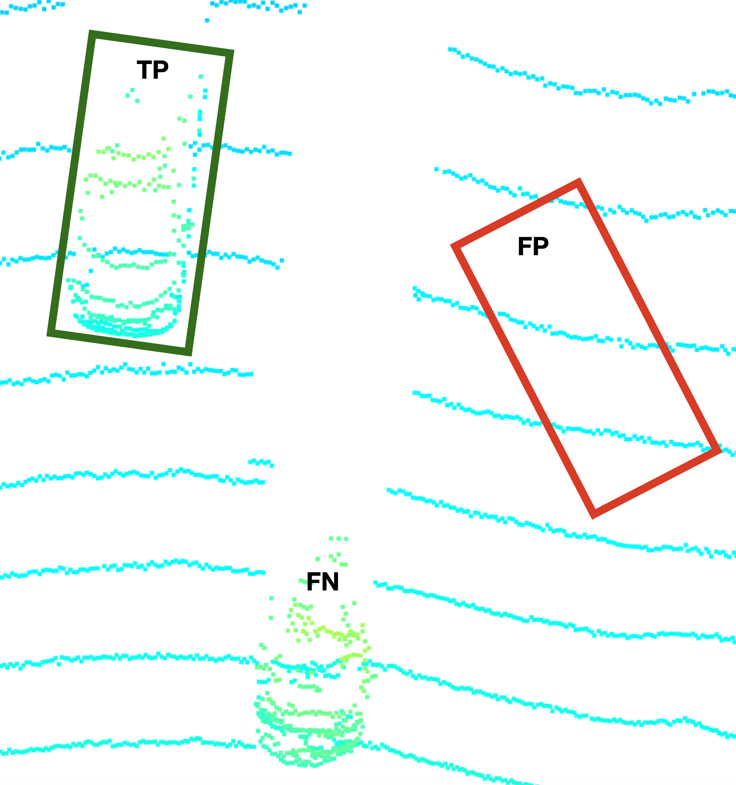
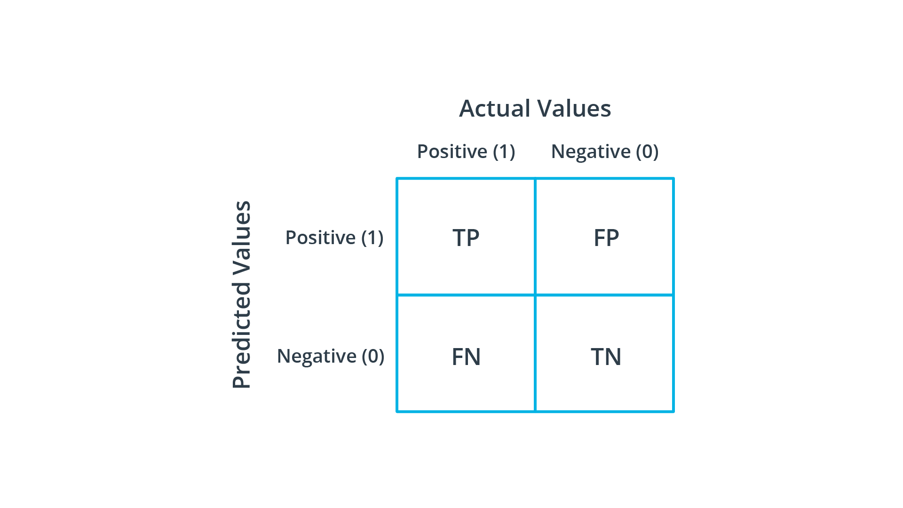
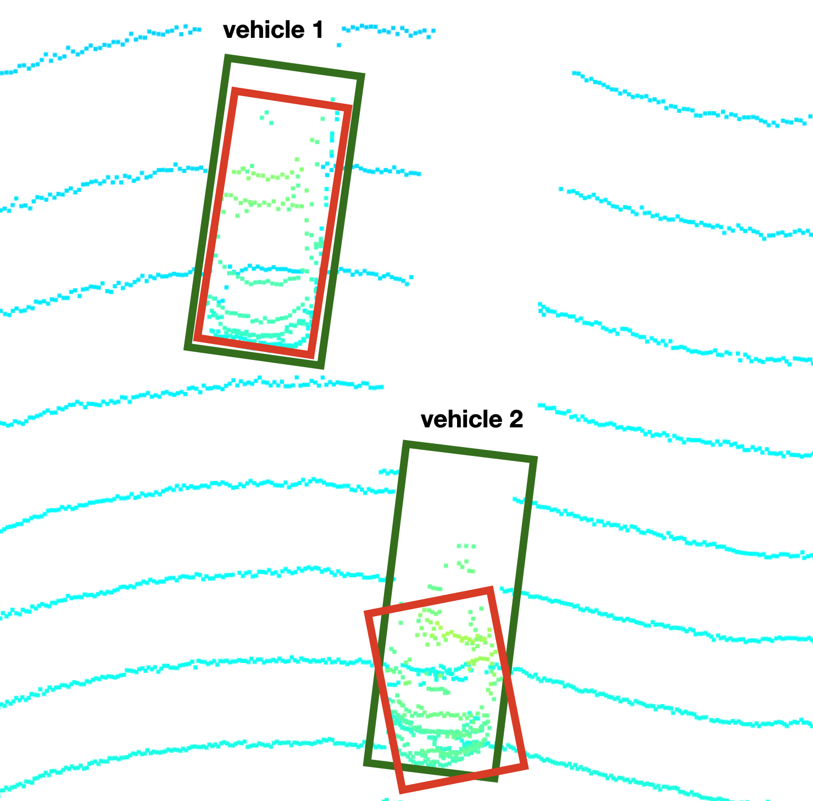
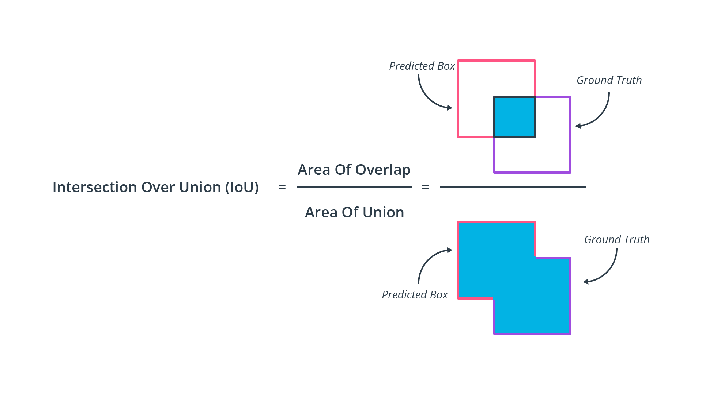
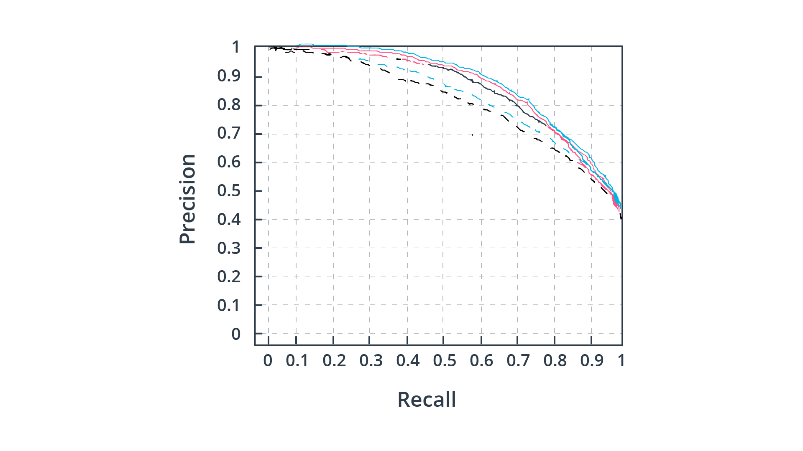
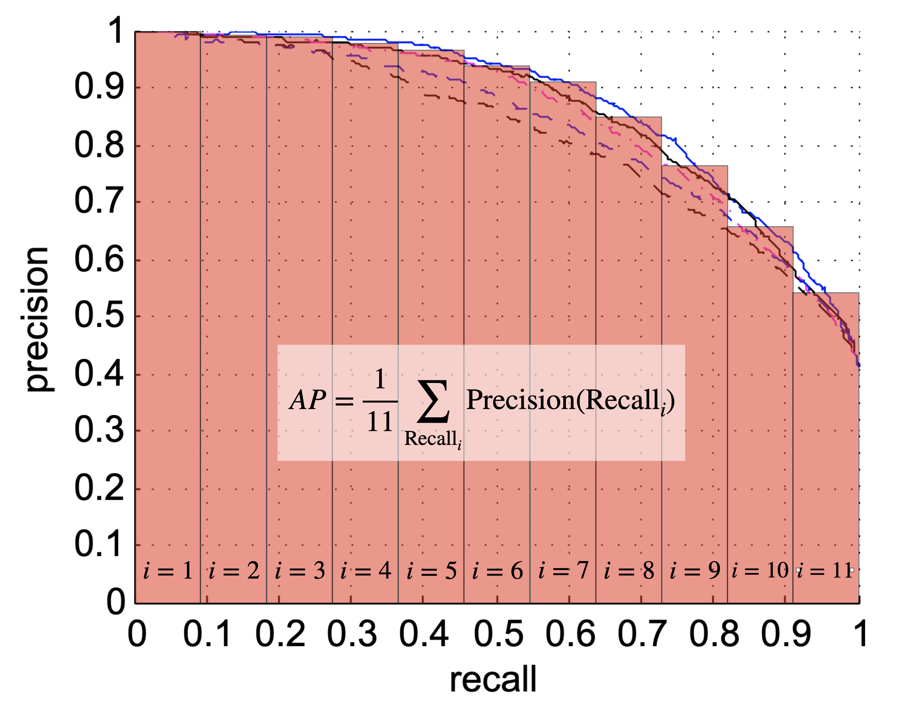
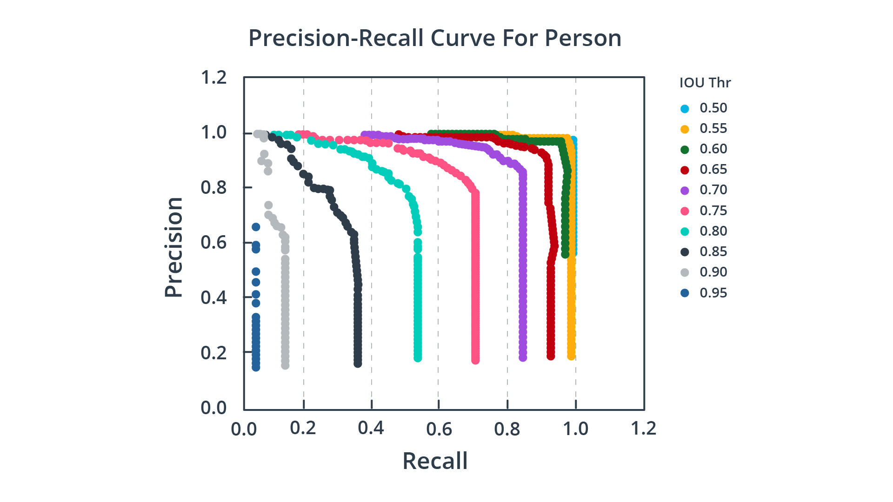

# Evaluating Object Detection Performance

> Part of: ** Detecting Objects in Lidar**

## Video

[Watch on YouTube](https://www.youtube.com/watch?v=xDsVtHcUZBY)

## Summary

**Object Detection from Point Clouds: Selecting the Right Algorithm**

This README file provides an overview of selecting a suitable algorithm for object detection from point clouds. With numerous models available, choosing the right one can be challenging, especially when working on projects like autonomous vehicles.

### Key Concepts

* **Benchmark listings**: Understanding how to read and interpret benchmark listings, such as the Waymo Benchmark or the KITTI Benchmark.
* **Performance metrics**: Familiarity with suitable metrics for comparing object detection algorithms from point clouds.
* **Objective comparison**: The importance of making an informed decision by objectively comparing multiple candidates.

### Practical Notes

If you're working on a project that requires object detection from point clouds, this chapter will guide you through the process of:

* Interpreting benchmark listings to understand how different algorithms perform
* Creating a performance assessment for your own algorithm or implementation
* Comparing your algorithm with others in the field to make an informed decision

This knowledge is essential if you want to put your object detection algorithm to the test and compare it with other state-of-the-art methods.

## Transcript

Now the number of models for object detection from point clouds has been growing for really some time now with dozens of new papers and also GitHub implementations being published on a yearly basis. When it comes to selecting a specific algorithm for, let's say, an autonomous vehicle project you want to perform the large number which is available to you of candidates makes it really hard to pick the right one for your project. To facilitate this decision an objective comparison is required, which makes it possible for you to just select few candidates in a pre-selection and then compare them among each other and at the end, arrive at an informed decision on which method to pick. This chapter is about introducing to you a set of suitable metrics just to do this so you can, A: understand benchmark listings which exist on the Internet, for example, the way more benchmark or the kitty benchmark and then B: create a performance assessment of your own. If you really want to put your algorithm to the test one day, let's say you have developed your own detection algorithms, this chapter here will tell you how to compare it to other algorithms around.

Have fun learning and see you soon for the first exercise.

## Images

*Waymo Challenge Leaderboard*

*Two vehicles in point cloud*

*True Positive (TP), False Positive (FP), False Negative (FN)*

*Confusion matrix*

*Labels (green) vs. detections (red)*

*Intersection-over-Union (IoU)*

*Precision-Recall curves for 5 detectors*

*Average precision*

*Precision-Recall curves for varying IoU thresholds*

## Additional Content

## Evaluating Object Detection Performance
In many papers, rankings and challenges such as the [Waymo Open Challenge](https://waymo.com/open/challenges/3d-detection/#) or the [KITTI 3D Object Detection Benchmark](http://www.cvlibs.net/datasets/kitti/eval_object.php?obj_benchmark=3d),  metrics such as "Average Precision" (AP) and "mean Average Precision" (mAP) are often used as the de-facto standard for comparing detection algorithms in a meaningful way. The following figure shows the leaderboard of the Waymo Open Challenge:
The board is sorted after the AP/L1 column, which ranks the various algorithms using a single number between 0.0 and 1.0. This chapter will be about carefully explaining the AP and mAP metric and their relevance for object detection.

### Evaluating Object Detectors

Consider the following point cloud:
As can be seen in the image, two vehicles are present in the scene. Object detection algorithms need to perform two main tasks, which are

1. to decide whether an object exists in the scene and
2. to determine the position, the orientation and the shape of the object

The first task is called "classification", while the second task is most often referred to as "localization". In real-life scenarios, a scene will consist of several object classes (e.g. vehicles, pedestrians, cyclists, traffic signs), which leads to the necessity of assigning a confidence score to each detected object, usually in the range between 0.0 and 1.0. Based on this score, the detection algorithm can be assessed at various confidence levels, which means that the threshold for accepting or rejecting an object is systematically varied.

In order to address these issues, the Average Precision (AP) metric was proposed as a suitable metric for object detection.  To understand the concept behind AP, you first need to understand the terms "precision" and "recall" as well as the four characteristics "true positive" (TP), "true negative" (TN), "false positive" (FP) and "false negative" (FN).
#### TP, TN, FP and FN

Consider again the point cloud from the last example, now with a set of bounding boxes added by an object detection algorithm:
The bounding box labelled "TP" shows a correct detection: It encloses an actual object and both the shape as well as the heading are accurate. This is called a "true positive", where "positive" denotes the presence of an object as seen by the detector. On the right, there is a red bounding box labelled "FP", which does not contain any object and thus is a false detection. Such erroneous objects are called "false positive", as the detector wrongly believes in the existence of an actual object. Further, at the bottom of the image, there is an object clearly visible in the point cloud, but the detector has not found it. Such missed detections are called "false negatives", where "negative" means that the detector believes in the absence of an object. In a medicinal trial, where patients are tested for a specific illness, the following would hold:

- TP : Patient actually has the illness and the test result was positive
- FP : Patient does not have the illness, but the test was positive nonetheless
- FN : Patient has the illness, but the test was wrongly negative

Lastly, there is the case where the patient does not have the illness and the test correctly returns a negative result. This is referred to as "true negative" (TN). In object detection, this would mean that there is no object present in a scene and the detector has correctly not returned a detection. These four states can be arranged in a matrix, which is called "confusion matrix" in machine learning:
Note that the cases, where the predicted values are congruent with the actual values lie on the main diagonal of the matrix.

#### Precision and Recall

Imagine that we wanted to assess the detection algorithm used in the example above in a meaningful way. Two questions we might ask could be:

1. What is the probability that an object found by the algorithm actually corresponds to a real object?
1. What is the probability for a real object to be found by the detector?

Let us try to answer the first question based on the positives and negatives: In order to arrive at this probability, we need to divide the true positives by the number of all detections, which is the sum of the true positives and the false positives. This ratio is called "precision"

$P$

:

$$P = \frac{TP}{TP + FP}$$

In practice, precision is also sometimes referred to as "positive predictive value" (PPV).

For our hypothetical detector, the precision would be

$P = \frac{1}{1 + 1} = 0.5$

. Based on this single frame with its two detections, the probability for a detection corresponding to a real object would be at 50%. 

The second question can be answered in a similar way: In order to compute the probability for detecting an actual object, we need to divide the number of actual detections by the sum of actual detections and missed detections. This measure is called "recall"

$R$

:

$$R = \frac{TP}{TP + FN}$$

In practice, recall is also often referred to as "true positive rate" (TPR) or "sensitivity".

For our hypothetical detector, the recall would thus be

$R = \frac{1}{1+1} = 0.5$

. Obviously, it does not make much sense to compute this metric for a single frame with such a small number of measurements. Hence, in practice, precision and recall are computed over an entire dataset and should contain a number of representatives from each class (TP, TN, FN) such that the result is statistically relevant. 

To meaningfully assess the performance of a detector, we must examine both precision and recall. A perfect detector would have a recall of 1.0 and a precision of 1.0 at the same time. In practice however, both measures are often in tension, which means that improving precision e.g. by adapting some detector parameters, will most probably reduce recall and vice versa. Assume that we have a detector, which returns the following results:

$TP=80$

,

$FP=2$

,

$FN=6$

. Based on these numbers, we would get:

$$P = \frac{80}{80+2}=0.9756$$

and:

$$R = \frac{80}{80+6}=0.9302$$

If we decreased the classification threshold such that objects with a lower confidence score would be treated as detections, the number of FN would decrease, while the number of FP would increase, such that

$TP=80$

,

$FP=6$

,

$FN=2$

. For the performance measures, this would mean

$P = \frac{80}{80+6}=0.9302$

and

$R = \frac{80}{80+2}=0.9756$

.

As you can see, precision has decreased while recall has increased. In case of an increased classification threshold, this effect would reverse. In general, a detection algorithm that outperforms another algorithm on both precision and recall is most likely better.

Another measure which is also based on the prediction types is called "accuracy"

$A$

, which is the ratio of the number of correct predictions and the total number of predictions. Accuracy can be expressed as:

$$A = \frac{TP+TN}{TP+TN+FP+FN}$$

In object detection though, accuracy is not used as the number of true negatives does not correspond to a meaningful detector behavior. The state "there is no object and the detector has not detected one" would hold for all areas of a scene without detection and without objects. In practice, we require the presence of an object, be it from a detector or from a trusted source such as a human observer, to derive the states TP, FP and FN.
#### Intersection-over-Union (IoU)

In the previous examples, we have taken for granted that some entity would provide us with the information whether a detection was a TP, FP or FN. In practice however, things are not so easy. In order to classify detections into these categories, several steps need to be taken:

1. Provide a list of human-generated detections, which serve as ground-truth. Such detections are often referred to as "labels".
2. Match the list of detections provided by the algorithm that we want to evaluate with the list of ground-truth labels.
3. Decide whether a certain detection is a TP, FP or FN based on the degree of overlap between detection and ground-truth label.

Take a look at the point cloud from the previous example, which now contains bounding boxes generated by the detector (red) as well as ground-truth labels (green).
As you can see, the bounding boxes for vehicle 1 are very similar in both shape and size, with the detection-based bounding box slightly smaller than the human-labelled bounding box. For vehicle 2 though, the overlap between the two boxes is significantly smaller due to differences in shape, scale and angle.

In order to assess the detector in a meaningful way though, we need to decide whether a ground-truth label and a detection result are treated as a match - or not. In practice, we use a measure called "Intersection-over-Union" (IoU) to decide whether to assign two bounding boxes. The idea is to measure the degree of overlap between each bounding box returned by the detector and all ground-truth bounding boxes in such a way that the area of intersection and the area of the union of both rectangles is computed. The following figure illustrates the concept:
As you can see, the smaller the overlap between detection and ground truth, the smaller will be the Intersection-over-Union. In case there is no overlap at all, the IoU will be at 0.0 while for a perfect match, the IoU will be 1.0. In practice, we need to decide on an "appropriate" threshold for the IoU when matching detections and ground-truth labels. For example, if the IoU threshold is 0.5 and the IoU value for a certain label-detection match is 0.7, then we classify it as TP. On the other hand, when the IoU is below the threshold, e.g. at 0.3, we classify the corresponding detection as FP. In case there are ground-truth labels, for which there are no detections at all, these are classified as FN.

Based on the IoU threshold, the values for precision and recall will change, since at a low threshold it is expected that many detections will be matched with labels, resulting in a high number of TP.  In most benchmarks (e.g. KITTI, Waymo), the required minimum IoU is 70% for vehicles. But before we investigate the idea of varying the IoU any further, let us first take a look at the concept of precision-recall curves, which is the next step on our way to compute the "average precision" of a detector.
#### Precision-Recall Curve

As mentioned previously, there is an inverse relationship between precision and recall, which is dependent on the threshold we choose for object detection. Let us take a look at the following figure, which shows the precision-recall curves of various object detection algorithms (each color represents a different algorithm):
The curves are generated by varying the detection threshold from 0.0 to 1.0 and by computing precision and recall for each setting. Based on this metric, the solid blue curve shows the best performance, as the precision (i.e. the likelihood that a detection actually corresponds to a real object) drops the least for increasing recall values. Ideally, precision would stay at 1.0 until a recall of 1.0 has been reached. Thus, another way of looking at these curves would be to compare detectors based on the area under the curve: Thus, the larger the integral of the precision-recall curve, the higher the detector performance. Based on the precision-recall curve, engineers can make an informed decision on the detector threshold setting they want to choose by considering the demands of their application in terms of precision and recall.

#### Average Precision

The idea of the average precision (AP) metric is to compact the information within the precision-recall curve into a single number, which can be used to easily compare algorithms with each other. This goal is achieved by summing the precision values for different (=11) equally spaced recall values:

$$AP=\frac{1}{11}\sum_{\mathrm{Recall}_i} \mathrm{Precision}(\mathrm{Recall}_i)$$

The following figure illustrates the concept further:
Note that in practice, varying the threshold level in equally spaced increments does not correspond to equally spaced increases in recall. The AP score for an algorithm varies between 0.0 and 1.0 with the latter being a perfect result.

#### Mean Average Precision (mAP)

Now that you have an understanding of how the shape of the precision-recall curve is compacted into a single number for easy comparison, we can take the final step and add one more layer of complexity: Based on the observation that changing the IoU threshold affects both precision and recall, the idea of the mean average precision (mAP) measure is to compute the AP scores for various IoU thresholds and then computing the mean from these values. The following figure shows precision-recall curves for several settings of the IoU threshold:
As can be seen, the shape of the curve approaches a rectangle for decreasing IoU thresholds.

Also, some ranking sites not only consider IoU thresholds but various object classes as well. In the PASCAL VOC 2007 challenge for example, only a single IoU setting (0.5) and 20 object classes were considered. In the COCO 2017 challenge on the other hand, the mAP was averaged over 10 IoU settings and 80 object classes.
