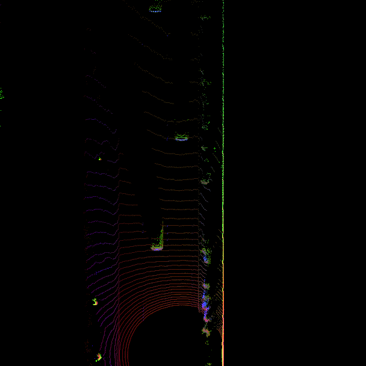
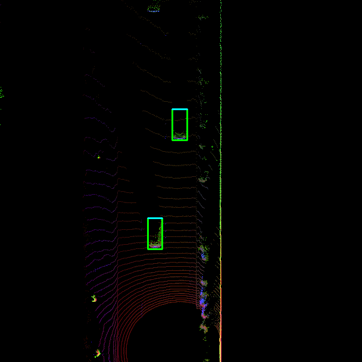
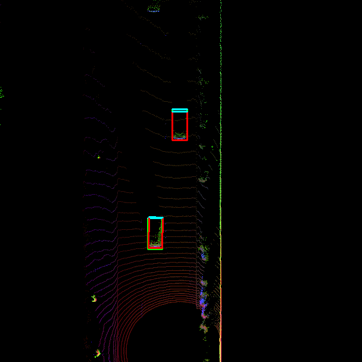
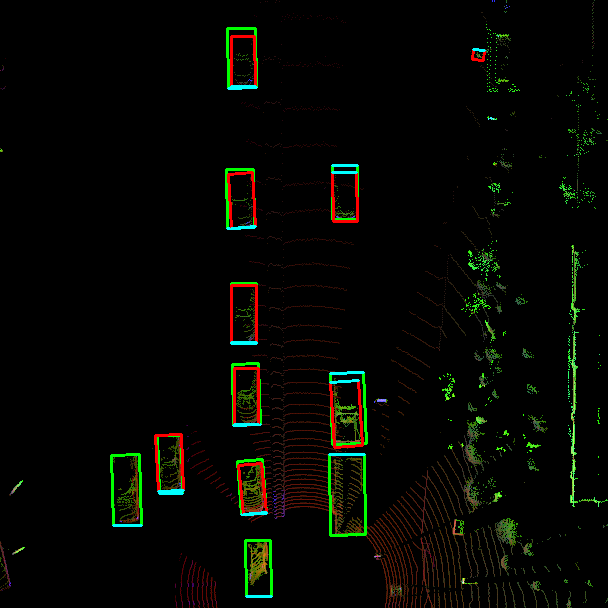

# Implementing Precision and Recall

> Part of: ** Detecting Objects in Lidar**

## Video

[Watch on YouTube](https://www.youtube.com/watch?v=mmAFiMPorFY)

## Summary

**Extracting Labels from Data and Visualizing Detection Results**
===========================================================

This README file summarizes the key concepts and practical steps covered in this chapter, which focuses on implementing theoretical concepts in code.

### Key Concepts

* **BEV Maps**: A precomputed set of bird's eye view (BEV) maps that represent the environment.
* **Detection Results**: Precomputed results from files containing information about detected vehicles.
* **Ground Truth Labels**: Manually annotated labels for vehicle bounding boxes.
* **Precision and Recall**: Metrics used to evaluate the accuracy of detection results, with precision being the ratio of true positives to total predicted positives and recall being the ratio of true positives to actual number of positive instances.

### Practical Notes

To implement the concepts covered in this chapter, you will need to:

1. Extract labels from a dataset using code.
2. Load precomputed BEV maps and detection results from files into memory.
3. Create visual overlays of ground truth labels and auto-detected vehicle bounding boxes.
4. Manually compute precision and recall for a limited number of frames.
5. Evaluate an entire sequence of 200 frames at various confidence levels to produce a precision-recall curve.

Note: This chapter assumes prior knowledge of theoretical concepts covered in the first part of the chapter.

## Transcript

Welcome to the second part of this chapter here. You've made it through the first part which was of a theoretical nature. Now that you have an understanding of the various concepts and measures, it's time for the actual implementation of all these concepts in code. First you will learn how to extract labels from the [inaudible] data set. Then you will load a precomputed set of BEV maps and also detection results from files and create a visual overlay of ground truth labels and auto-detect vehicle bounding boxes.

Based on these visualizations, you will manually compute an estimate of both precision and of recall for a limited number of frames, just to familiarize yourself with the basic principle. Once you have properly understood the concept, we will load an entire sequence into memory consisting of about 200 frames and also evaluated at various confidence levels to produce a so-called precision-recall curve.

## Images


*BEV map with all three color channels*


*BEV map with ground-truth labels (green)*


*BEV map with labels (green) and detected objects (red)*


*BEV map of a complex traffic scene with labels (green) and detected objects (red)*

## Additional Content

## Implementing Precision and Recall
### Extracting labels from the Waymo Open dataset

In this section, I will show you how to load the ground-truth labels for a specific sensor from a Waymo frame. The following list shows you the layout of a label: 

```text
`-- Label
    |-- Box
    |   |-- center_x
    |   |-- center_y
    |   |-- center_z
    |   |-- length
    |   |-- width
    |   |-- height
    |   `-- heading
    |-- Metadata
    |   |-- speed_x
    |   |-- speed_y
    |   |-- accel_x
    |   `-- accel_y
    |-- type
    |-- id
    |-- detection_difficulty_level
    `-- tracking_difficulty_level
```

As you can see, each label contains a bounding box with 7 parameters that describes the position, shape and heading of the associated object. Also, there is information available on both speed and acceleration within the `Metadata` sub-branch. Finally, each label is associated with a type (e.g. TYPE_VEHICLE), with a unique identifier as well as information on the detection and tracking difficulty level. These two are important in the performance evaluation because some objects might not be visible to a sensor (e.g. a vehicle parked behind a wall) and therefore should not be counted negatively towards the sensor performance.
#### Example C2-4-2 : Loop over all labels and count type and difficulty levels

**Note:** You can run the demo by executing function `l2_examples.count_vehicles(...)` from within the file `basic_loop.py`.
The following code loops over all the labels in a frame and counts the total number of vehicles as well as the number of vehicles that are labelled as difficult to detect:

```
for label in frame.laser_labels:
    if label.type == label_pb2.Label.Type.TYPE_VEHICLE:
        count_vehicles.cnt_vehicles += 1
        if label.detection_difficulty_level > 0:
            count_vehicles.cnt_difficult_vehicles += 1
```

When you execute the code with sequence 3 and the full range of ~200 frames, you will get the following output:

```
no. of labelled vehicles = 11339, no. of vehicles difficult to detect = 47
```

As you can see, the number of objects labelled as "difficult" is very (!) small compared to the large number of actual objects present in the scene. However, when evaluating a dataset to assess detector performance, it can still be a sensible step to exclude such labels nonetheless to not introduce a bias to the evaluation results.
#### Example C2-4-3 : Display label bounding boxes on top of BEV map

**Note:** You can run the demo by executing the function `l2_examples.render_bb_over_bev(...)` from within the file `basic_loop.py` in the workspace further above.

In the next step, we will display the label bounding boxes as an overlay atop the BEV map. With the following code, you can load a pre-computed map from file:

```python
lidar_bev = load_object_from_file(results_fullpath, data_filename, 'lidar_bev', cnt_frame)
```

Then, you will need to convert the BEV map from a tensor format into an 8 bit data structure, so that we can display it using the OpenCV:

```python
bev_map = (bev_map.squeeze().permute(1, 2, 0).numpy() * 255).astype(np.uint8)
bev_map = cv2.resize(bev_map, (configs.bev_width, configs.bev_height))

bev_map = cv2.rotate(bev_map, cv2.ROTATE_180)
cv2.imshow("BEV map", bev_map)
```

When this code is executed, the resulting image looks like the following:
The BEV map shown here unites the individual height, intensity and density maps into one color image. In the mid-term project, you will write the actual code that produces this image. For now, we will be using this  pre-computed result for visualization purposes. 

#### Example C2-4-4 : Display detected objects on top of BEV map

**Note:** You can run the demo by executing function `l2_examples.render_obj_over_bev(...)` from within the file `basic_loop.py` in the workspace further above.

Next, we need to extract the actual bounding box from all labels and overlay it onto the BEV image. To do this, you can make use of two helper functions, which perform a format conversion from Waymo bounding box format into the format used in the detection and tracking modules and then perform the actual projection:

```python
label_objects = tools.convert_labels_into_objects(labels, configs)
tools.project_detections_into_bev(bev_map, label_objects, configs, [0,255,0])
```

Both functions are located in `misc.objdet_tools.py`. When executed, the result looks like the following:
As expected, the green bounding boxes are placed around the corresponding vehicle point clouds. Note that the partially visible vehicle at the top of the BEV map has not been marked, as for each label, at least 50% of the area must be located within the BEV map - otherwise it is discarded.

### Loading pre-computed detections

In the next step, we will load the pre-computed object detections from file and layer it over the BEV map in the same manner as with the labels. To do this, we first need to issue the following commands: 

```python
detections = load_object_from_file(results_fullpath, data_filename, 'detections', cnt_frame)
tools.project_detections_into_bev(bev_map, detections, configs, [0,0,255])
```

Note that in the upcoming mid-term project you will implement the actual code to compute both binary and detected objects. For now though, as we are focussing on the evaluation process, it is sufficient to simply use both as-is and not be concerned with too many details regarding their implementation at this point.
As you can see from the image, both vehicles have been detected successfully by the detection algorithm and are thus true positives (TP). As there are no missed detections (FN) or phantom objects (FP), the detector scores perfectly for this single frame. Given another sequence though, things look different:
In this frame, even though the majority of vehicles has been detected, several detector errors are visible.
### Computing recall and precision

Obviously, a single frame is not sufficient to compute reliable estimates for precision and recall. So in order to get more meaningful results, we need to analyze a larger number of frames. As manual processing, such as with the single image from the previous exercise, is not feasible for large datasets, the evaluation needs to be automated. In order to do this, the label boxes need to be paired with the detection boxes in a way that for each box, the match with largest overlap (=IoU) is kept. For this purpose, I have created a large number of pre-computed files which contain TP, FP and FN for ~200 frames of sequence 1 for several settings of the confidence threshold level used in object detection to decide when to keep object candidates. Note that the actual code to perform the matching is a part of the mid-term project.

In order to load the results for a single frame, we need to execute the following code for every frame:

```python
conf_thresh = 0.5
det_performance = load_object_from_file(results_fullpath, data_filename, 'det_performance_' + str(conf_thresh), cnt_frame)
det_performance_all.append(det_performance)
```

Note that in the second line, a variable containing the current confidence threshold (used for object detection) is appended. This makes it possible to load the TP, FP and FN for various confidence levels such that we can arrive at an estimate of the average precision. For now though, we will only use a single setting.  The third line appends the performance results of the current frame to a list containing all previous results, such that at the end of the loop over all frames, `det_performance_all` contains all of the TP, TN and FN of the entire sequence.
