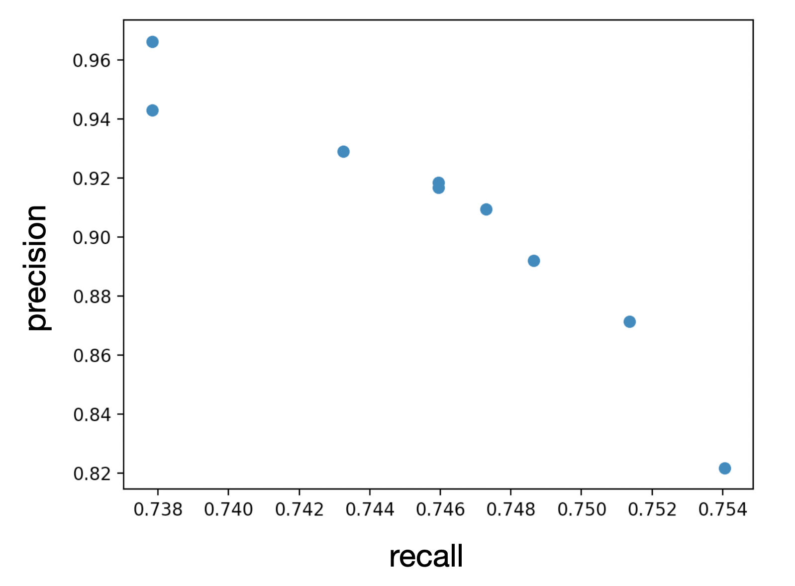

# Exercise: Plotting the Precision & Recall Curve

> Part of: ** Detecting Objects in Lidar**

## Video

[Watch on YouTube](https://www.youtube.com/watch?v=8ChXxG0mmEs)

## Summary

**Computing Precision and Recall with Detection Confidence Threshold**

This README file provides a summary of the key concepts and practical steps involved in computing precision and recall for different settings of the detection confidence threshold.

### Key Concepts

* **Precision**: A measure of how accurate a model is, calculated as the number of true positives divided by the sum of true positives and false positives.
* **Recall**: A measure of how well a model detects all instances of a class, calculated as the number of true positives divided by the sum of true positives and false negatives.
* **Detection Confidence Threshold**: The minimum confidence level required for a detection to be considered valid.
* **Functional Relationship**: A mathematical representation of the relationship between precision and recall based on different settings of the detection confidence threshold.

### Practical Notes

To compute precision and recall with different settings of the detection confidence threshold, follow these steps:

1. Execute the code from the previous exercise for different settings of the confidence threshold level.
2. Load the precomputed threshold levels from the result folder one after the other.
3. Use the loaded threshold levels to estimate precision and recall based on the selected threshold level.

Note: The specific code and formulas used in this exercise are not provided here, but can be found in the original lesson transcript or accompanying materials.

## Transcript

Now, the last exercise before you will be moving on to the midterm project, we will compute both precision and recall for different settings of the detection confidence threshold, so we can visualize the functional relationship between these two values. In order to do this, please execute the code you wrote in the last exercise for different settings of the confidence threshold level of the detector. In the result folder, you will find the threshold level is precomputed for you, which you need to load one after the other so that you can get different estimates for both precision and recall based on the threshold level you selected. Now, let's get started.

## Images

*Precision-recall curve of sequence 1*

## Additional Content

## Exercise: Plotting the Precision & Recall Curve
**Files to work in:**

- `basic_loop.py`
- `lesson-2-object-detection/exercises/starter/l2_exercises.py`

Once you are done, please visualize your results by creating a scatter plot such as this one:
When everything worked properly, you should be able to see that for decreasing precision, the recall increases and vice versa. Based on the full recall scale ranging from 0 to 1.0 (which we do not yet have in our case), it would then be possible to compute the average precision as described above. Note that in practice, a significantly larger number of sequences and confidence thresholds would have to be evaluated. However, to limit the scope of the course, we will be content with creating a part of the precision-recall curve and with understanding the basic concepts behind it.
