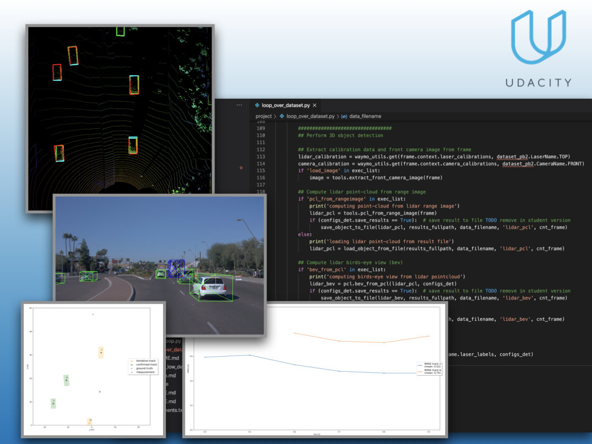
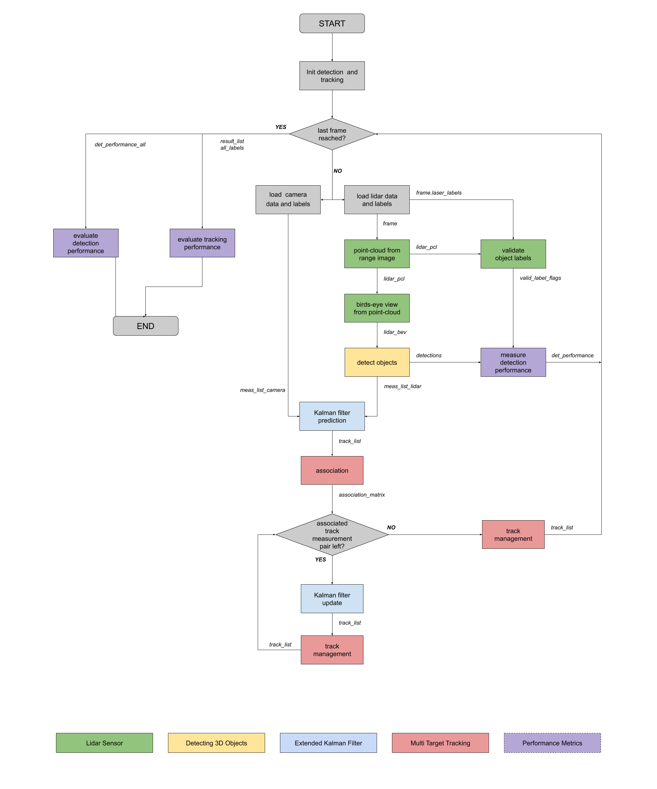

# Introduction

> Part of: **Mid-Term Project: 3D Object Detection**

## Video

[Watch on YouTube](https://www.youtube.com/watch?v=OpVgiL7kS0E)

## Summary

**Autonomous Vehicle Object Detection Project**
=====================================================

This midterm project focuses on detecting objects in autonomous vehicles using a deep learning approach. The goal is to localize and classify vehicles in 3D point clouds.

### Key Concepts

* **Point Clouds**: A set of data points in 3D space, used to represent the environment around an autonomous vehicle.
* **Bird's Eye View (BEV) Map**: A 2D representation of a 3D scene, created by projecting point cloud data onto a plane.
* **Object Detection**: The process of identifying and classifying objects within a BEV map using a pre-trained model.
* **Deep Learning Approach**: A machine learning method that uses neural networks to learn complex patterns in data.

### Practical Notes

To complete this project, you will need to:

1. Transform images into point clouds
2. Create a bird's eye view (BEV) map from the point cloud
3. Detect objects within the BEV map using a pre-trained model
4. Evaluate the performance of two detectors to determine which one is better

Note: This project builds upon previous lessons and exercises, so make sure you have completed those before starting this project. Additionally, watch the video walkthrough of the codebase to understand how everything works together.

## Transcript

Now welcome to the midterm project of the course. I'm super thrilled to introduce you to one of the most fascinating areas of autonomous vehicle technology which is the detection of objects by means of one or multiple sensors. The goal of this project here is to localize and classify vehicles in lighter point clouds using a deep learning approach. To do this, you will need to implement a number of exercises which includes transforming the way we arrange images into clouds then creating a bird's eye view or BEVmap from the point cloud, then thirdly, detecting objects within this BEVmap using a pre-trained model. Then lastly, evaluating the performance of actually two detectors to find out which one is better.

You will note that some tasks are familiar because you have been working on them before in the relevant chapters of the course. After completing the exercises in the previous lessons which you surely did, you should really be well-prepared for this project here. But before you start, please really make sure to watch the video where I'll walk you through the codebase so you know what's what or how everything works, how it comes together, and where you can find the various exercises. Now I wish you all the best for your project and also for the rest of the course.

## Images

*Object detection project result*

*A diagram of all the project pieces combined (both mid-term and final)*

## Additional Content

## Introduction
In this project, you'll fuse measurements from LiDAR and camera and track vehicles over time. You will be using real-world data from the Waymo Open Dataset, detect objects in 3D point clouds and apply an extended Kalman filter for sensor fusion and tracking.
The project consists of two major parts:

1. **Object detection**: In this part, a deep-learning approach is used to detect vehicles in LiDAR data based on a birds-eye view perspective of the 3D point-cloud. Also, a series of performance measures is used to evaluate the performance of the detection approach. The tasks in this part make up the mid-term project. 

2.  **Object tracking** : In this part, a Kalman filter will be used to track several objects over time. The tasks related to this part will be addressed in the final project.

The project and all the related files can be downloaded from the [GitHub repository](https://github.com/udacity/nd013-c2-fusion-starter).

The following diagram contains an outline of the data flow and of the individual steps that make up the algorithm.
