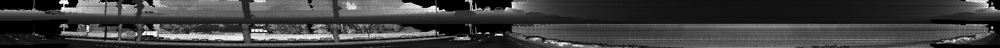
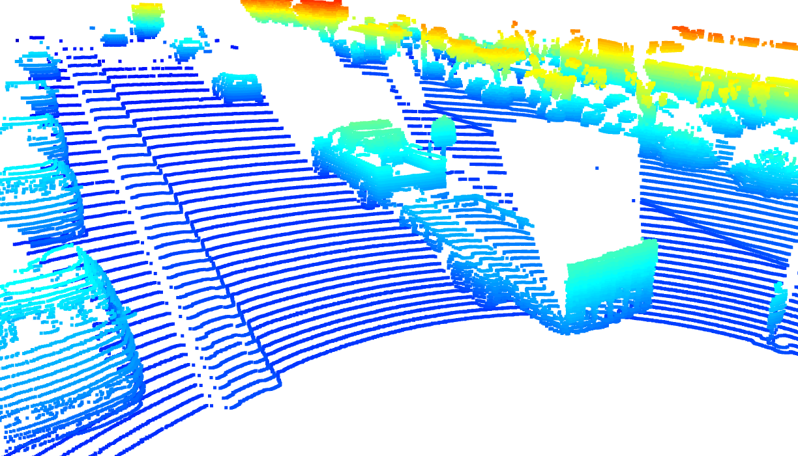

# Project Instructions Step 1

> Part of: **Mid-Term Project: 3D Object Detection**

## Images

*An example range image*

*An example point cloud visualization*

## Additional Content

## Section 1 : Compute Lidar Point-Cloud from Range Image

In the following, an introduction to the various tasks which make up the mid-term project is given. For each task, a detailed step-by-step instruction can be found in the respective code file on GitHub. To locate a task, use the ID provided and perform a project-wide search to find the location where code needs to be added by you.

Note that you should also refer to the [project rubric](https://learn.udacity.com/rubric/3008) to ensure all required tasks are completed.
### Visualize range image channels (ID_S1_EX1)

#### Task preparations
In file `loop_over_dataset.py`, set the attributes for code execution in the following way: 
- `data_filename = 'training_segment-1005081002024129653_5313_150_5333_150_with_camera_labels.tfrecord`
- `show_only_frames = [0, 1]`
- `exec_data = []`
- `exec_detection = []`
- `exec_tracking = []`
- `exec_visualization = ['show_range_image']`

#### Where to find this task? 
This task involves writing code within the function `show_range_image` located in the file `student/objdet_pcl.py`. 

#### What this task is about?
In the Waymo Open dataset, lidar data is stored as a range image. Therefore, this task is about extracting two of the data channels within the range image, which are "range" and "intensity", and convert the floating-point data to an 8-bit integer value range. Once you have done so, please use the OpenCV library to stack the range and intensity image vertically and visualize it. 

A detailed description of all required steps can be found in the code.

#### What your result should look like
#### Tips for the implementation
- Make sure that the entire range of the data is mapped appropriately onto the 8-bit channels of the OpenCV image so that no data is lost.
- Make sure that objects of interest (e.g. vehicles) in the intensity image appear with a decent value roughly in the middle of the 8-bit range.
### Visualize lidar point-cloud (ID_S1_EX2)

#### Task preparations
In file `loop_over_dataset.py`, set the attributes for code execution in the following way: 
- `data_filename = 'training_segment-10963653239323173269_1924_000_1944_000_with_camera_labels.tfrecord'`
- `show_only_frames = [0, 200]`
- `exec_data = []`
- `exec_detection = []`
- `exec_tracking = []`
- `exec_visualization = ['show_pcl']`

#### Where to find this task? 
This task involves writing code within the function `show_pcl` located in the file `student/objdet_pcl.py`. 

#### What this task is about?
The goal of this task is to use the Open3D library to display the lidar point-cloud in a 3d viewer in order to develop a feel for the nature of lidar point-clouds. A detailed description of all required steps can be found in the code.

When the code is functional, you are supposed to use the viewer to locate and closely inspect point-clouds on vehicles and write a short report that includes the following items: 
- Find and display 6 examples of vehicles with varying degrees of visibility in the point-cloud
- Identify vehicle features that appear as a stable feature on most vehicles (e.g. rear-bumper, tail-lights) and describe them briefly. Also, use the range image viewer from the last example to underpin your findings using the lidar intensity channel.

#### What your result should look like
