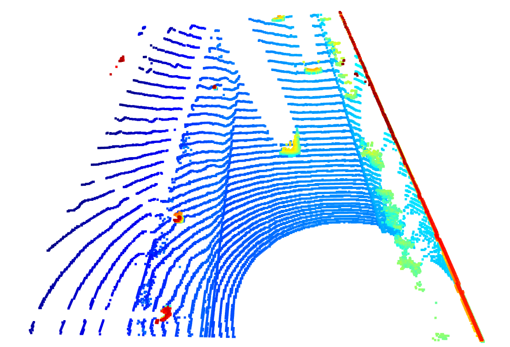
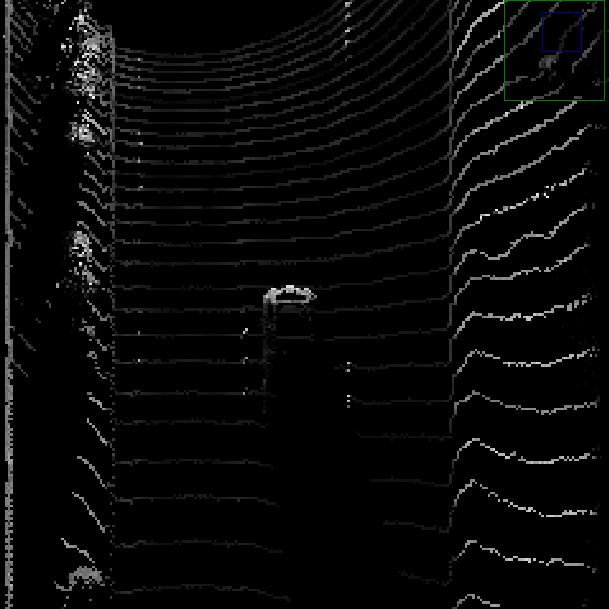
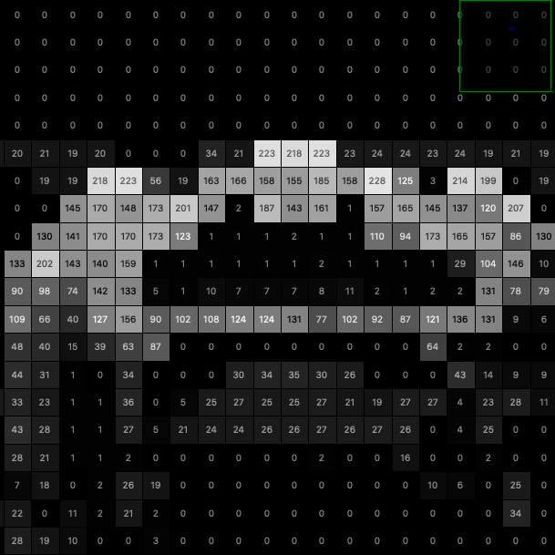
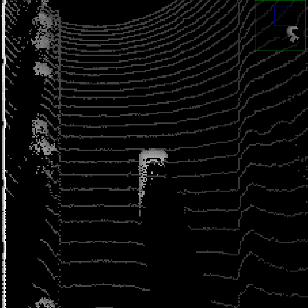
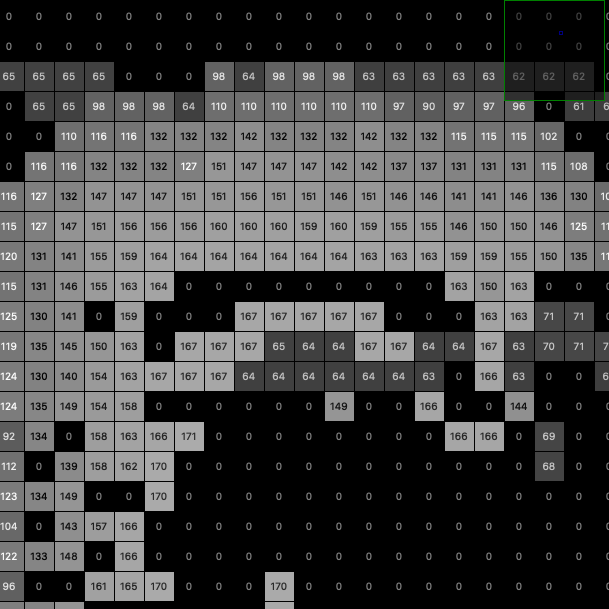

# Project Instructions Step 2

> Part of: **Mid-Term Project: 3D Object Detection**

## Images

*An example visualization into BEV map coordinates*

*An example intensity layer from the BEV map*

*Plotting intensity values from the BEV map*

*An example height layer from the BEV map*

*Plotting height values from the BEV map*

## Additional Content

## Section 2 : Create Birds-Eye View from Lidar PCL

Make sure to refer to the [project rubric](https://learn.udacity.com/rubric/3008) to ensure all tasks are completed.
### Convert sensor coordinates to BEV-map coordinates (ID_S2_EX1)

#### Task preparations
In file `loop_over_dataset.py`, set the attributes for code execution in the following way: 
- `data_filename = 'training_segment-1005081002024129653_5313_150_5333_150_with_camera_labels.tfrecord`
- `show_only_frames = [0, 1]`
- `exec_data = ['pcl_from_rangeimage']`
- `exec_detection = ['bev_from_pcl']`
- `exec_tracking = []`
- `exec_visualization = []`

#### Where to find this task? 
This task involves writing code within the function `bev_from_pcl` located in the file `student/objdet_pcl.py`. 

#### What this task is about?
The goal of this task is to perform the first step in creating a birds-eye view (BEV) perspective of the lidar point-cloud. Based on the (x,y)-coordinates in sensor space, you must compute the respective coordinates within the BEV coordinate space so that in subsequent tasks, the actual BEV map can be filled with lidar data from the point-cloud. 

A detailed description of all required steps can be found in the code.

#### What your result should look like
#### Tips for the implementation
- Use the `configs`  structure for information on the dimensions of the BEV image
- Make sure that the resulting BEV map coordinates are unsigned integers
### Compute intensity layer of the BEV map (ID_S2_EX2)

#### Task preparations
In file `loop_over_dataset.py`, set the attributes for code execution in the following way: 
- `data_filename = 'training_segment-1005081002024129653_5313_150_5333_150_with_camera_labels.tfrecord`
- `show_only_frames = [0, 1]`
- `exec_data = ['pcl_from_rangeimage']`
- `exec_detection = ['bev_from_pcl']`
- `exec_tracking = []`
- `exec_visualization = []`

#### Where to find this task? 
This task involves writing code within the function `bev_from_pcl` located in the file `student/objdet_pcl.py`. 

#### What this task is about?
The goal of this task is to fill the "intensity" channel of the BEV map with data from the point-cloud. In order to do so, you will need to identify all points with the same (x,y)-coordinates within the BEV map and then assign the intensity value of the top-most lidar point to the respective BEV pixel. Please name the resulting list of points `lidar_pcl_top` as it will be re-used in later tasks. Also, you will need to normalize the resulting intensity image using percentiles, in order to make sure that the influence of outlier values (very bright and very dark regions) is sufficiently mitigated and objects of interest (e.g. vehicles) are clearly separated from the background. 

A detailed description of all required steps can be found in the code.

#### What your result should look like
#### Tips for the implementation
- Use numpy.lexsort in step 2 to sort the point cloud. Sorting shall be performed in such a way that first, all points are sorted according to their x-coordinate in BEV space. Then, for points with the same x-coordinate, sorting shall again be performed by their y-coordinates in BEV space. In case there are points with both x and y identical, sort these by z in sensor space. Make sure to invert z as sorting is performed in ascending order and we want the top-most point for each cell. 
- Use the OpenCV to visualize the intensity distribution on vehicles and make sure that objects of interest are neither too close to zero nor clipped at 255.
### Compute height layer of the BEV map (ID_S2_EX3)

#### Task preparations
In file `loop_over_dataset.py`, set the attributes for code execution in the following way: 
- `data_filename = 'training_segment-1005081002024129653_5313_150_5333_150_with_camera_labels.tfrecord`
- `show_only_frames = [0, 1]`
- `exec_data = ['pcl_from_rangeimage']`
- `exec_detection = ['bev_from_pcl']`
- `exec_tracking = []`
- `exec_visualization = []`

#### Where to find this task? 
This task involves writing code within the function `bev_from_pcl` located in the file `student/objdet_pcl.py`. 

#### What this task is about?
The goal of this task is to fill the "height" channel of the BEV map with data from the point-cloud. In order to do so, please make use of the sorted and pruned point-cloud `lidar_pcl_top` from the previous task and normalize the height in each BEV map pixel by the difference between max. and min. height which is defined in the `configs` structure.

A detailed description of all required steps can be found in the code.

#### What your result should look like
#### Tips for the implementation
- Make sure that you convert the interval between upper and lower height interval to a floating point value before normalizing the height map
- Use the OpenCV to visualize the height distribution on vehicles and make sure that your result seems plausible with regard to the expected vehicle geometry
