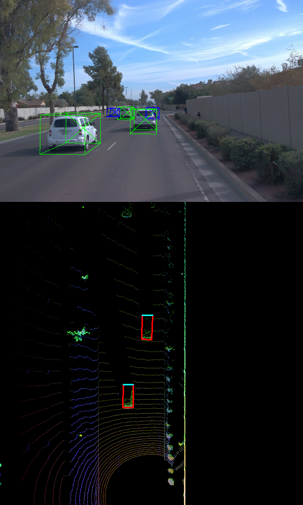

# Project Instructions Step 3

> Part of: **Mid-Term Project: 3D Object Detection**

## Images

*An example of `detections` data*

*3D bounding boxes added to the images*

## Additional Content

## Section 3 : Model-based Object Detection in BEV Image

Make sure to refer to the [project rubric](https://learn.udacity.com/rubric/3008) to ensure all tasks are completed.
### Add a second model from a GitHub repo (ID_S3_EX1)

#### Task preparations
In file `loop_over_dataset.py`, set the attributes for code execution in the following way: 
- `data_filename = 'training_segment-1005081002024129653_5313_150_5333_150_with_camera_labels.tfrecord`
- `show_only_frames = [50, 51]`
- `exec_data = ['pcl_from_rangeimage', 'load_image']`
- `exec_detection = ['bev_from_pcl', 'detect_objects']`
- `exec_tracking = []`
- `exec_visualization = ['show_objects_in_bev_labels_in_camera']`
- `configs_det = det.load_configs(model_name="fpn_resnet")` 

#### Where to find this task? 
This task involves writing code within the functions `detect_objects`,  `load_configs_model`  and `create_model` located in the file `student/objdet_detect.py`. 

#### What this task is about?
The model-based detection of objects in lidar point-clouds using deep-learning is a heavily researched area with new approaches appearing in the literature and on GitHub every few weeks. On the website [Papers With Code](https://paperswithcode.com/) and on GitHub, several repositories with code for object detection can be found, such as [Complex-YOLO: Real-time 3D Object Detection on Point Clouds](https://paperswithcode.com/paper/complex-yolo-real-time-3d-object-detection-on) and [Super Fast and Accurate 3D Object Detection based on 3D LiDAR Point Clouds](https://github.com/maudzung/SFA3D). 

The goal of this task is to illustrate how a new model can be integrated into an existing framework. The task consists of the following steps: 
1.  Clone the repo  [Super Fast and Accurate 3D Object Detection based on 3D LiDAR Point Clouds](https://github.com/maudzung/SFA3D)
2. Familiarize yourself with the code in `SFA3D->test.py`  with the goal of understanding the steps involved for performing inference with a pre-trained model
3. Extract the relevant parameters from `SFA3D->test.py->parse_test_configs()` and add them to the `configs` structure in `load_configs_model`. 
4. Instantiate the model for `fpn_resnet` in `create_model`. 
5. After model inference has been performed, decode the output and perform post-processing in `detect_objects`- 
6. Visualize the results by setting the flag `show_objects_in_bev_labels_in_camera`

Note that the pre-trained model from `SFA3D` as well as the model classes and some helper functions have already been integrated into the mid-term project. You can find all related files in the folder `tools/objdet_models/resnet`. 

Also note that in this project, we are only focussing on the detection of vehicles, even though the Waymo Open dataset contains labels for other road users as well.

#### What your result should look like
Note that the visualization of tracking results will be implemented in the next task. At this point, the content of `detections` should look like this in the VS Code inspector:
### Extract 3D bounding boxes from model response (ID_S3_EX2)

#### Task preparations
In file `loop_over_dataset.py`, set the attributes for code execution in the following way: 
- `data_filename = 'training_segment-1005081002024129653_5313_150_5333_150_with_camera_labels.tfrecord`
- `show_only_frames = [50, 51]`
- `exec_data = ['pcl_from_rangeimage', 'load_image']`
- `exec_detection = ['bev_from_pcl', 'detect_objects']`
- `exec_tracking = []`
- `exec_visualization = ['show_objects_in_bev_labels_in_camera']`
- `configs_det = det.load_configs(model_name="fpn_resnet")` 

#### Where to find this task? 
This task involves writing code within `detect_objects` located in the file `student/objdet_detect.py`. 

#### What this task is about?
As the model input is a three-channel BEV map, the detected objects will be returned with coordinates and properties in the BEV coordinate space. Thus, before the detections can move along in the processing pipeline, they need to be converted into metric coordinates in vehicle space. This task is about performing this conversion such that all detections have the format `[1, x, y, z, h, w, l, yaw]`, where `1` denotes the class id for the object type `vehicle`. 

A detailed description of all required steps can be found in the code.

#### What your result should look like
#### Tips for the implementation
- Note that the yaw angle returned by the network needs to be inverted in order to account for the directions of the coordinate axes.
