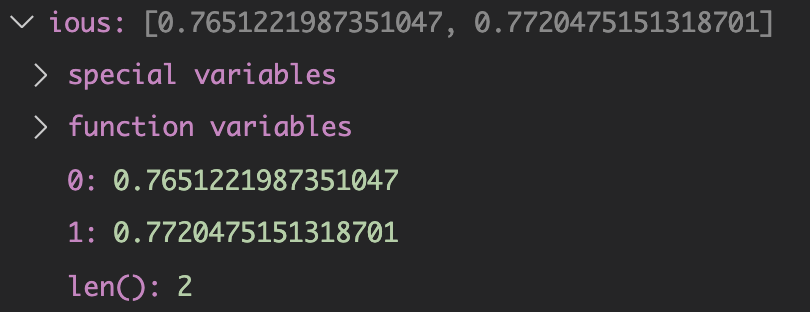
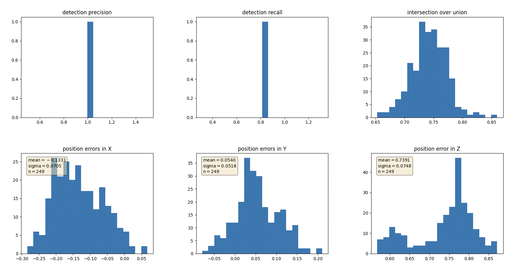
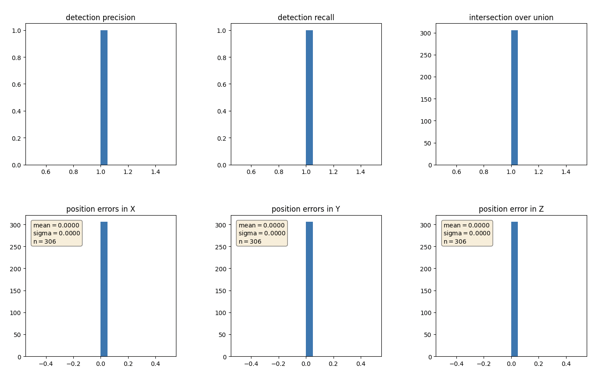

# Project Instructions Step 4

> Part of: **Mid-Term Project: 3D Object Detection**

## Images

*Example IOU values*

*Example `center_devs` values*

*Example `det_performance` values*

*Graphing performance metrics*

*Using the labels, metrics should get perfect scores*

## Additional Content

## Section 4 : Performance Evaluation for Object Detection

Make sure to refer to the [project rubric](https://learn.udacity.com/rubric/3008) to ensure all tasks are completed.
### Compute intersection-over-union between labels and detections (ID_S4_EX1)

#### Task preparations
In file `loop_over_dataset.py`, set the attributes for code execution in the following way: 
- `data_filename = 'training_segment-1005081002024129653_5313_150_5333_150_with_camera_labels.tfrecord`
- `show_only_frames = [50, 51]`
- `exec_data = ['pcl_from_rangeimage']`
- `exec_detection = ['bev_from_pcl', 'detect_objects', 'validate_object_labels', 'measure_detection_performance']`
- `exec_tracking = []`
- `exec_visualization = ['show_detection_performance']`
- `configs_det = det.load_configs(model_name="darknet")` 

#### Where to find this task? 
This task involves writing code within `detect_objects` located in the file `student/objdet_eval.py`. 

#### What this task is about?
The goal of this task is to find pairings between ground-truth labels and detections, so that we can determine wether an object has been (a) missed (*false negative*), (b) successfully detected (*true positive*) or (c) has been falsely reported (*false positive*). Based on the labels within the Waymo Open Dataset, your task is to compute the geometrical overlap between the bounding boxes of labels and detected objects and determine the percentage of this overlap in relation to the area of the bounding boxes. A default method in the literature to arrive at this value is called *intersection over union*, which is what you will need to implement in this task.

A detailed description of all required steps can be found in the code.

#### What your result should look like
After looping over all pairings of labels and detections, the data structures `ious` and `center_devs` should show the following content for frame 50 of the sequence defined in section "task preparations": 
#### Tips for the implementation

* Use the function `tools.compute_box_corners` to extract the four corners of a bounding box, which can be easily used with the Polygon structure of the Shapely toolbox.
* In case of multiple matches, keep the object/label pair with max. IOU
### Compute false-negatives and false-positives (ID_S4_EX2)

#### Task preparations
Please use the settings of the previous task

#### Where to find this task? 
This task involves writing code within `detect_objects` located in the file `student/objdet_eval.py`. 

#### What this task is about?
Based on the pairings between ground-truth labels and detected objects, the goal of this task is to determine the number of false positives and false negatives for the current frame. After all frames have been processed, an overall performance measure will be computed based on the results produced in this task. 

A detailed description of all required steps can be found in the code.

#### What your result should look like
After looping over all pairings of labels and detections, the data structure `det_performance`  should show the following content for frame 50 of the sequence defined in section "task preparations": 
### Compute precision and recall (ID_S4_EX3)

#### Task preparations
In file `loop_over_dataset.py`, set the attributes for code execution in the following way: 
- `data_filename = 'training_segment-1005081002024129653_5313_150_5333_150_with_camera_labels.tfrecord`
- `show_only_frames = [50, 150]`
- `exec_data = ['pcl_from_rangeimage']`
- `exec_detection = ['bev_from_pcl', 'detect_objects', 'validate_object_labels', 'measure_detection_performance']`
- `exec_tracking = []`
- `exec_visualization = ['show_detection_performance']`
- `configs_det = det.load_configs(model_name="darknet")` 

#### Where to find this task? 
This task involves writing code within `detect_objects` located in the file `student/objdet_eval.py`. 

#### What this task is about?
After processing all the frames of a sequence, the performance of the object detection algorithm shall now be evaluated. To do so in a meaningful way, the two standard measures "precision" and "recall" will be used, which are based on the accumulated number of positives and negatives from all frames. 

A detailed description of all required steps can be found in the code.

#### What your result should look like
For the frame sequence defined in "task preparations", the following performance measures should result: 

`precision = 0.996, recall = 0.8137254901960784`
To make sure that the code produces plausible results, the flag `configs_det.use_labels_as_objects` should be set to `True` in a second run. The resulting performance measures for this setting should be the following: 

`precision = 1.0, recall = 1.0`
