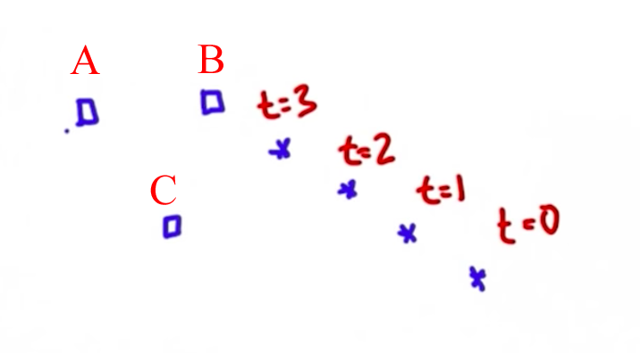

# Tracking Intro

> Part of: **Kalman Filters**

## Video

[Watch on YouTube](https://www.youtube.com/watch?v=BkjQzEyJWrE)

## Summary

**Summary of Self-Driving Car Sensor Data Processing**

This project involves processing sensor data from a self-driving car to detect and track other vehicles on the road. The main goal is to estimate the location and velocity of other cars to avoid collisions.

**Key Concepts**

* **Kalman Filter**: A popular technique for estimating the state of a system, including continuous states such as location and velocity.
* **Uni-modal distribution**: A probability distribution with a single peak or mode, resulting from the Kalman Filter's estimation process.
* **Sensor data processing**: The process of interpreting sensor data from lasers and radars to track other vehicles on the road.
* **Object tracking**: Estimating the future locations and velocities of detected objects based on past observations.

**Practical Notes**

To implement this project, you will need to write software that can take noisy and uncertain sensor data as input and estimate the location and velocity of other cars. The Kalman Filter algorithm will be used to make these estimates based on past observations. This is a critical component of safe driving in self-driving car projects, such as the Google car project.

Note: The code for implementing the Kalman Filter algorithm is not provided in this transcript, but it is expected that you will write your own implementation as part of this project.

## Transcript

<v English>So I'd like to take my students onto a little journey to Stanford and show them</v> <v English>our self-driving car that uses sensors to sense the environment.</v> <v English>So let me dive into the class very much right now.</v> <v English>So here you can see the Google self-driving car using a road map,</v> <v English>localizing itself, but in</v> <v English>addition what's shown here in red are measurements of other vehicles.</v> <v English>The car uses lasers and radars to track other vehicles.</v> <v English>And today, we're going to talk about how to find other cars.</v> <v English>The reason why we'd like to find</v> <v English>other cars is because you wouldn't want to run into them.</v> <v English>So we have to understand how to interpret</v> <v English>sensor data to make assessments not just where these other cars are,</v> <v English>as in the localization case,</v> <v English>but also how fast they're moving.</v> <v English>So if you can drive in a way that avoids collisions with them in the future,</v> <v English>it's important not just for cars and for pedestrians and for bicyclists,</v> <v English>and understanding where the cars are and making predictions where they're going to</v> <v English>move is absolutely essential for safe driving in the Google car project.</v> <v English>So in this class we will talk about tracking,</v> <v English>and the technique I like to teach you is called a Kalman Filter.</v> <v English>This is an insanely popular technique for estimating the state of a system.</v> <v English>Kalman Filters estimate a continuous state.</v> <v English>And as a result,</v> <v English>the Kalman Filter happens to give us a uni-modal distribution,</v> <v English>and I'll tell you in a second what that means.</v> <v English>Let me start with an example.</v> <v English>Consider the car down here.</v> <v English>Let's assume it senses this measurement: an object here,</v> <v English>here, here, and here at the times t equals 0,</v> <v English>t equals 1, 2 and 3.</v> <v English>Where would you assume the object would be at t equals four?</v> <v English>Check one of those three boxes.</v>

And he asked you to expect it right over here. From those observations you would say that the velocity points in the direction of this vector. Assuming no drastic change in velocity, you expect that the 5th position would be over here. The common filter takes observations like these and estimates future locations and velocities based on data like this. Today I'm going to teach you how to write a piece of software that let's you take points like those--even if they're noisy and uncertain-- and estimate automatically where future locations might be and at what velocity the object is moving.

The Google self-driving car uses methods like these to understand where other traffic is based on radar and laser-range data. So let's dive in!

## Images

*Quiz Options*

## Additional Content

## Tracking Introduction

### Quiz Image

### Solution
