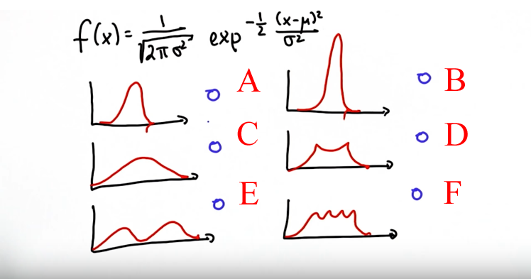

# Gaussian Intro

> Part of: **Kalman Filters**

## Video

[Watch on YouTube](https://www.youtube.com/watch?v=6IhtnM1e0IY)

## Summary

**Gaussian Distribution and Unimodality**

This README file provides an overview of the key concepts covered in this lesson on Gaussian distributions and unimodality.

### Key Concepts

* **Gaussian distribution**: a continuous function that sums up to 1 over a space of locations, characterized by two parameters:
	+ **Mean (μ)**: often represented by the Greek letter Mu
	+ **Variance (σ²)**: often written as Sigma squared
* **Unimodality**: a property of functions with a single peak, which are symmetrical and have an exponential drop-off on both sides
* **Gaussian function formula**: an exponential of a quadratic function, where the exponent is proportional to the quadratic difference between the query point X and the mean μ divided by σ²

### Practical Notes

To identify whether a function is Gaussian or not, look for the following characteristics:

* Symmetry around a single peak
* Exponential drop-off on both sides of the peak
* A single maximum value (unimodality)

Note that this lesson focuses on theoretical concepts and does not provide any practical code examples. However, understanding these key concepts is essential for working with Gaussian distributions in various applications.

## Transcript

<v English>In common features the distribution is given by what's called a Gaussian.</v> <v English>Gaussian is a continuous function over the space of</v> <v English>locations in the area underneath sums up to one.</v> <v English>So use our Gaussian again and if we call</v> <v English>the space X then the Gaussian is characterized by two parameters.</v> <v English>The mean, often abbreviated with the Greek letter Mu,</v> <v English>and the width of the Gaussian,</v> <v English>often called the variance.</v> <v English>And for reasons that I don't want to go into,</v> <v English>it's often written as a quadratic variable,</v> <v English>Sigma square so any Gaussian is 1-D,</v> <v English>which means the parameter space of a year is one dimensional,</v> <v English>is characterized by Mu and Sigma squared.</v> <v English>Our task in common spaces is to maintain a Mu and a Sigma squared</v> <v English>as our best estimate of the location of the option we are trying to find.</v> <v English>The exact formula is an exponential of a quadratic function.</v> <v English>If we take the exponent of this complicated expression over here,</v> <v English>the quadratic difference of our query point X relative to</v> <v English>the mean Mu divided by Sigma square by [inaudible] minus a half.</v> <v English>Now if X equals Mu then the enumerator becomes 0 and we have exp of zero which is one.</v> <v English>It turns out we have to normalize this by a constant,</v> <v English>one over the squared root of two Pi Sigma squared.</v> <v English>But for every thing we talked about today this constant won't matter so ignore it.</v> <v English>What matters is we have an exponential of a quadratic function over here.</v> <v English>So let me draw you a couple of functions and you tell me</v> <v English>which one you believe are Gaussian by checking the box on the right side.</v> <v English>And please excuse my poor drawing skills here.</v>

The answer is this one is a Gaussian, this one, and this one. They are all characterized by this exponential drop-off on both sides that are symmetrical, and they have a single peak. They are what's called "unimodal." This is a bimodal function that has two peaks and as a result is not Gaussian. The same is true over here and over here, so these guys don't qualify.

## Images

*Quiz Options*

## Additional Content

## Gaussian Introduction

The Gaussian equation given in the video is:

$\LARGE \frac{1}{\sqrt{2\pi\sigma^2}} \times \exp^{-1/2 \frac{(x - \mu)^2}{\sigma^2}}$

The mean is represented by

$\mu$

("mu") while the variance is represented by

$\sigma^2$

("sigma squared").

### Quiz Image

### Solution
