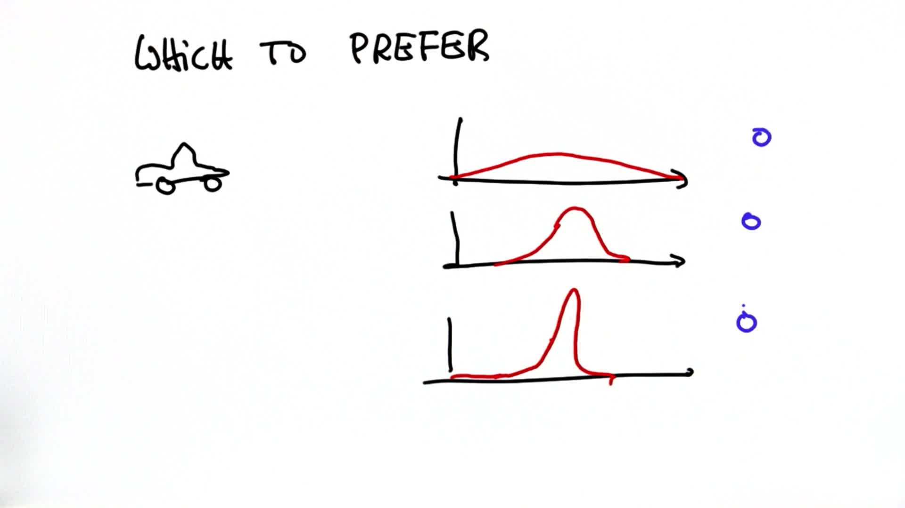

# Preferred Gaussian

> Part of: **Kalman Filters**

## Video

[Watch on YouTube](https://www.youtube.com/watch?v=sBsju-6nQWI)

## Summary

**Gaussian Distributions in Probabilistic Filters**
=====================================================

This project explores the concept of Gaussian distributions, which are used in probabilistic filters to represent uncertainty in self-driving car navigation.

### Key Concepts

* **Unimodal distributions**: A type of distribution where the data points cluster around a single peak value.
* **Symmetrical distributions**: Distributions that have mirror-image symmetry about their central point.
* **Gaussian distribution**: A specific type of unimodal and symmetrical distribution, characterized by its bell-shaped curve.
* **Probabilistic filters**: Algorithms used to update estimates of uncertainty in self-driving car navigation based on new data.

### Practical Notes

To implement a Gaussian distribution as a belief in a probabilistic filter, you can use the following code pattern:

```python
import numpy as np

# Define a Gaussian distribution with mean and standard deviation
def gaussian(x, mu, sigma):
    return np.exp(-((x - mu) / sigma)**2 / 2) / (sigma * np.sqrt(2 * np.pi))

# Example usage:
mu = 10  # Mean value
sigma = 2  # Standard deviation
x_values = np.linspace(mu - 3*sigma, mu + 3*sigma, 100)
y_values = gaussian(x_values, mu, sigma)

import matplotlib.pyplot as plt

plt.plot(x_values, y_values)
plt.show()
```

This code defines a Gaussian distribution with mean `mu` and standard deviation `sigma`, and plots the resulting bell-shaped curve.

## Transcript

[Which to prefer] If we track another care with our Google self-driving car, which Gaussian would we prefer? The first, second, or third? The answer is the third, because that's the one that's most certain, and because it is most certain, it makes a chance of accidentally hitting another car the smallest just by the fact that we know more about the car than in the two other distributions. You learned something really important. You learned the definition of a Gaussian.

You learned about the fact that these are unimodal distributions. They are also symmetrical. And you learned a little bit about how to use them as a belief in a probabilistic filter. Let's go and program a Gaussian.

## Images


*Quiz Options*

## Additional Content

## Preferred Gaussian

### Quiz Image

### Solution
