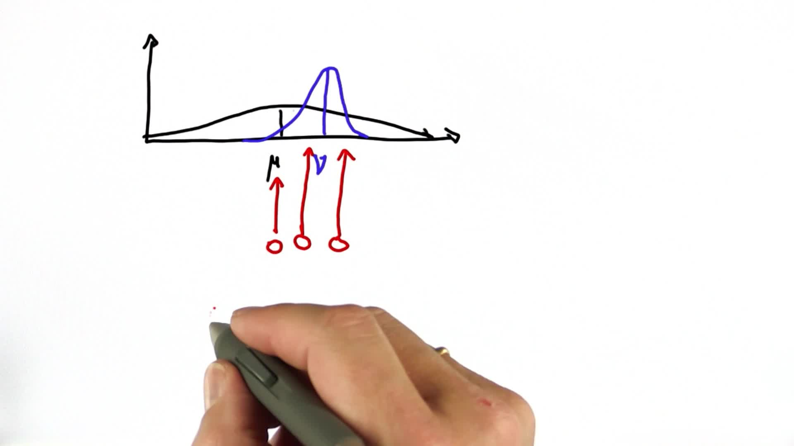

# Shifting the Mean

> Part of: **Kalman Filters**

## Video

[Watch on YouTube](https://www.youtube.com/watch?v=8c479K2UCZo)

## Summary

**Kalman Filters: Measurement Update and Prediction Cycle**

This README file provides a summary of the key concepts introduced in the Udacity lesson on Kalman filters. The lesson covers the measurement update and prediction cycle using Bayes' rule and total probability.

### Key Concepts

* **Bayes' Rule**: A product or multiplication used to update probabilities based on new information.
* **Total Probability**: A convolution or addition of probabilities, used to combine prior and posterior distributions.
* **Measurement Update**: The process of updating the prior distribution with a new measurement using Bayes' rule.
* **Prediction Cycle**: The process of predicting the state of a system based on its previous state and motion model.
* **Gaussian Distribution**: A probability distribution used to represent uncertainty in the location of an object.

### Practical Notes

The lesson demonstrates how to use Kalman filters for localization, where a prior distribution is updated with a new measurement. The example shows how the mean of the subsequent Gaussian distribution is calculated as the weighted average of the prior and measurement means, with more weight given to the measurement if it has a smaller covariance.

To implement this in code, you would need to:

* Represent the prior and measurement distributions using Gaussian objects
* Calculate the weighted average of the prior and measurement means
* Update the covariance matrix based on the new measurement

Note that this is a simplified example, and in practice, you may need to consider additional factors such as motion models and sensor noise.

## Transcript

In Kalman filters we iterate measurement and motion. This is often called a "measurement update," and this is often called "prediction." In this update we'll use Bayes rule, which is nothing else but a product or a multiplication. In this update we'll use total probability, which is a convolution, or simply an addition. Let's talk first about the measurement cycle and then the prediction cycle, using our great, great, great Gaussians for implementing those steps. Suppose you're localizing another vehicle, and you have a prior distribution that looks as follows.

It's a very wide Gaussian with the mean over here. Now, say we get a measurement that tells us something about the localization of the vehicle, and it comes in like this. It has a mean over here called "mu," and this example has a much smaller covariance for the measurement. This is an example where in our prior we were fairly uncertain about a location, but the measurement told us quite a bit as to where the vehicle is. Here's a quiz for you.

Will the new mean of the subsequent Gaussian be over here, over here, or over here? Check one of these three boxes. The answer is over here in the middle. It's between the two old means--the mean of the prior and the mean of the measurement. It's slightly further on the measurement side, because the measurement was more certain as to where the vehicle is than the prior. The more certain we are, the more we pull the mean in the direction of the certain answer.

## Images

*Quiz Options*

## Additional Content

## Shifting the Mean

### Quiz Image

### Solution

[Watch on YouTube](https://www.youtube.com/watch?v=HmcurWkA0fQ)