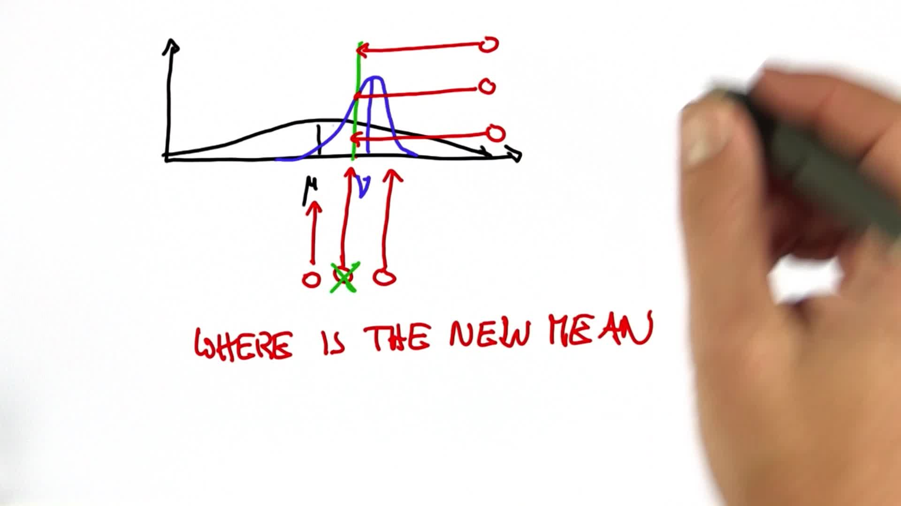

# Predicting the Peak

> Part of: **Kalman Filters**

## Video

[Watch on YouTube](https://www.youtube.com/watch?v=zc_GQiISQ3E)

## Summary

**Understanding Gaussian Mixture Models**

This README file provides an overview of the key concepts and ideas discussed in a Udacity lesson on Gaussian mixture models.

### Key Concepts

* **Gaussian Distribution**: A probability distribution that is shaped like a bell curve, with a single peak and symmetric tails. It is characterized by its mean (μ) and covariance (σ^2).
* **Mixture Models**: A statistical model that combines multiple probability distributions to represent complex data. In this case, we are combining two Gaussian distributions.
* **Posterior Distribution**: The distribution of the parameters of a model given some observed data. In this lesson, we are exploring how to compute the posterior distribution of a mixture model.
* **Covariance**: A measure of how much the values in a dataset deviate from their mean value. A smaller covariance indicates that the data points are more concentrated around the mean.

### Practical Notes

* When combining two Gaussian distributions using a mixture model, the resulting distribution can be more certain than either of the individual distributions.
* This is because the combination of the two distributions provides additional information and reduces uncertainty.
* The resulting distribution has a smaller covariance than either of the individual distributions.

## Transcript

Now, here's a question that's really, really hard. When we graph the new Gaussian, I can graph one that's very wide and very peaky. If I were to measure where the peak of the new Gaussian is, this would be a very narrow and skinny Gaussian. This would be one whose width would be in between the two Gaussians. This is one that's even wider than the two original Gaussians.

Which one do you believe is the correct posterior after multiplying these two Gaussians? This is an insanely hard question. I'd like you to take your chances here, and I'll explain to you the answer in just a second. Very surprisingly, the resulting Gaussian is more certain than the two component Gaussians. That is, the covariance is smaller than either of the two covariances in isolation.

Intuitively speaking, this is the case because we actually gain information. The two Gaussians together have a higher information content than either Gaussian in isolation. It'll look something like this. That is completely not obvious. You might have to take this with faith, but I can actually prove it to you.

## Images

https://www.youtube.com/watch?v=PsyqM704q2Y