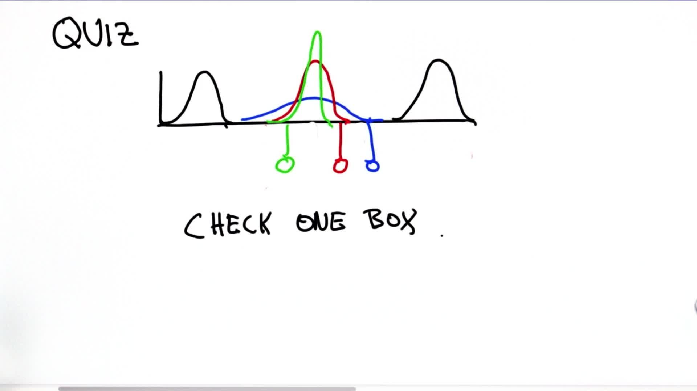

# Separated Gaussians 2

> Part of: **Kalman Filters**

## Video

[Watch on YouTube](https://www.youtube.com/watch?v=0FmTokjoRgo)

## Summary

**Understanding Gaussian Distributions and Variance**

This README file provides a summary of key concepts related to Gaussian distributions and variance. It covers the intuition behind choosing the correct type of Gaussian distribution for a given problem.

### Key Concepts

* **Gaussian Distribution**: A probability distribution that is symmetric about its mean, showing that data near the mean are more common and data far from the mean are less common.
* **Variance**: A measure of how spread out the values in a dataset are. In this context, it's used to determine the width of the Gaussian distribution.
* **Sigma-squared (σ^2)**: The variance of a Gaussian distribution. It's calculated using the formula `1 / (1/σ^2)`, which simplifies to `σ^2 / 2`.
* **Peakedness**: A measure of how focused or spread out a Gaussian distribution is. A more peaked distribution has less variance and is more certain.

### Practical Notes

When faced with multiple possible Gaussian distributions, consider the following:

* If you have two initial measurement probabilities with different means, choose a wider Gaussian distribution to account for the uncertainty.
* However, if both means are the same, the new variance squared will be half of the old one, resulting in a narrower and more peaked Gaussian distribution.

Remember that this is a counter-intuitive concept, but understanding it can help you make more informed decisions when working with Gaussian distributions.

## Transcript

Let me ask the hard question now. Will it be a Gaussian like this where the variance is larger, a Guassian with the exact same variance, or an even more peaked Guassian that's more certain than the two original factors in this calculation. Please check exactly one of the three boxes over here.

The answer is it's the more peaked Gaussian. That is somewhat counter-intuitive. You'd think if this was your initial measurement probability you really don't know where you are, and you should pick a very wide Gaussian. But the truth is our new sigma-squared is obtained independent of the means. It's this formula over here. Now because both means are the same, this resolves to 1 over 1/σ^2. That's the same as σ^2 over 2, which means a new variance squared is half of the old one. That makes it a narrower Gaussian, so the green one here that's the most peaked is indeed the correct answer. This is very counter-intuitive, but now we understand why. I hope you feel comfortable with the fact that we have actually gotten more information about the location, which is manifest by a more focused estimate.

## Images

