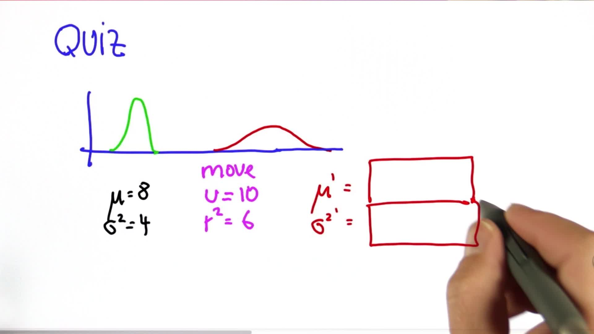

# Gaussian Motion

> Part of: **Kalman Filters**

## Video

[Watch on YouTube](https://www.youtube.com/watch?v=X7YggdDnLaw)

## Summary

**Kalman Filter Motion Update**

The Kalman filter motion update, also known as prediction, is a crucial step in estimating the state of a system over time. This update combines the current estimate with new information about the system's motion to produce a more accurate prediction.

### Key Concepts

* **Gaussian Distribution**: A probability distribution that describes the uncertainty of a random variable.
* **Motion Update (Prediction)**: The process of updating the current estimate based on new information about the system's motion.
* **Bayes' Rule**: A mathematical formula for updating probabilities based on new evidence, equivalent to multiplication in this context.
* **Total Probability (Addition)**: A method for combining multiple probability distributions by adding their means and variances.
* **Variance of Motion Gaussian**: The uncertainty associated with the system's motion.

### Practical Notes

The motion update can be calculated using a simple addition formula:

**New Mean (mu) = Old Mean + Motion (U)**
**New Variance (σ²) = Old Variance + Variance of Motion**

This means that if you have a Gaussian distribution with mean 8 and variance 4, and you move to the right by 10 meters with an uncertainty of 6, the new mean will be 18 and the new variance will be 10.

Example:
```python
old_mu = 8
old_sigma2 = 4
motion_uncertainty = 6

new_mu = old_mu + 10
new_sigma2 = old_sigma2 + motion_uncertainty ** 2

print("New Mean:", new_mu)
print("New Variance:", new_sigma2)
```
This code demonstrates how to calculate the new mean and variance after a motion update.

## Transcript

[Thrun] So let's step a step back and look at what we've achieved. We knew there was a measurement update and a motion update, which is also called prediction. And we know that the measurement update is implemented by multiplication, which is the same as Bayes rule, and the motion update is done by total probability or an addition. So we tackled the more complicated case. This is actually the hard part mathematically.

We solved this. We gave an exact expression. We even derived it mathematically, and you were able to write a computer program that implements this step of the Kalman filter. I don't want to go into too much depth here. This is a really, really easy step.

Let me write it down for you. Suppose you live in a world like this. This is your current best estimate of where you are, and this is your uncertainty. Now say you move to the right side a certain distance and that motion itself has its own set of uncertainty. Then you arrive at a prediction that adds the motion of command to the mean, and it has an increased uncertainty over the initial uncertainty.

Intuitively this makes sense. If you move to the right by this distance, in expectation you're exactly where you wish to be but you've lost information because your motion tends to lose information as manifested by this uncertainty over here. The math for this is really, really easy. Your new mean is your old mean plus the motion, often called U. So if you move over 10 meters, this will be 10 meters.

And your new σ² is your old σ² plus a variance of the motion Gaussian. This is all you need to know. It's just an addition. I won't prove it to you because it's really trivial. But in summary, we have a Gaussian over here, we have a Gaussian for the motion, with U as the mean and r-squared as its own motion uncertainty, and the resulting Gaussian in the prediction step just adds these 2 things up-- mu plus U and σ² plus r-squared.

Since this was so simple, let me quiz you. We have a Gaussian before the prediction step which mu equals 8 and σ² equals 4. We then move to the right a total of 10, with a motion uncertainty of 6. Now describe to me the predictive Gaussian and give me the new mu and the new σ². [Thrun] And the answer is just add those up.

8 + 10 = 18 4 + 6 = 10 And that's it.

## Images


*Quiz Information*

## Additional Content

## Gaussian Motion

There is a typo in the formula. It should read σ²′ ← σ² + r².

Therefore, the equations for the motion update are:

$\mu^\prime = \mu + u$

$\sigma^{2\prime} = \sigma^2 + r^2$

Where

$u$

("u") is the motion, and

$r^2$

("r squared") in this case is the variance of the motion (and

$\mu^\prime$

and

$\sigma^{2\prime}$

are the mean and variance after motion, respectively).

### Quiz Image

### Solution
