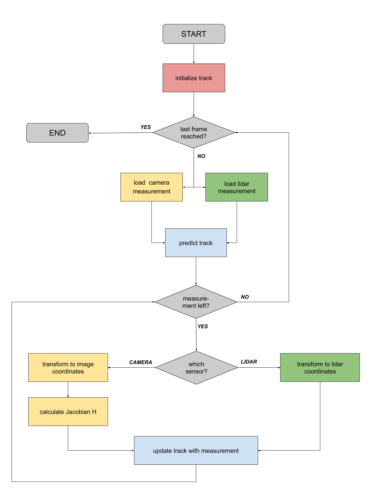

# Sensor Fusion Overview

> Part of: **Extended Kalman Filters**

## Video

[Watch on YouTube](https://www.youtube.com/watch?v=nniAHUL1060)

## Summary

**Kalman Filter Based Fusion System**
=====================================

This system combines data from various sensors, including LiDAR and camera, to estimate the state of an object in a self-driving car environment.

### Key Concepts

* **Extended Kalman Filter (EKF)**: An extension of the standard Kalman filter that can handle more complex motion and measurement models.
* **State Representation**: The state is represented by 2D position (`px`, `py`) and velocity (`vx`, `vy`).
* **Prediction Step**: Predicts the state and covariance of the tracked object to the timestamp of the next measurement based on previous measurements.
* **Update Step**:
	+ For LiDAR sensor measurements, applies a standard Kalman filter update.
	+ For camera sensor measurements, uses an EKF to handle non-linear measurement functions.
* **Sensor Coordinates Transformation**: Transforms camera measurements into sensor coordinates for updating the track state.

### Practical Notes

To implement this fusion system, you will need to:

* Initialize a new track with the first measurement
* Perform prediction and update steps in a loop:
	+ Predict the state and covariance to the next timestamp based on previous measurements
	+ Update the track state using the current measurement (LiDAR or camera)
* Use Python to implement the EKF and sensor coordinate transformation

Note: This summary provides an overview of the key concepts and practical steps involved in implementing a Kalman filter based fusion system. Further details and explanations will be covered in subsequent lessons.

## Transcript

So far you've learned a lot about car sensors and especially about camera and LiDAR. You've also implemented a simple Kalman filter in Python. In this lesson, you will combine all of your knowledge to develop a complete fusion system. There are many modules in a Kalman filter based fusion system. I want to give you a quick overview of the different components you will implement.

Don't worry if you can't follow everything yet. We will cover the topics in more detail later. Imagine we're sitting in a self-driving car and want to estimate the state of an object, for example, another vehicle or a pedestrian with our unbarred LiDAR and camera. The state is represented by a 2D position px, py and the 2D velocity vx and vy. To track objects over time, you are going to build an extended Kalman filter.

It is extended in the sense that it can handle more complex motion and measurement models than a standard Kalman filter. Here is the overall processing flow. At first, we initialize a new trick with the first measurement. Each time we receive new measurements from one of our sensors, the estimation function is triggered. We perform two steps called prediction and update.

In the prediction step, we predict the state and covariance of the tracked object to the timestamp of the next measurement. From the previous measurements, we have an estimate of position and velocity. Therefore, we can predict the new position and new velocity at the next timestamp. The update step depends on the sensor type. If the current measurement is generated by a LiDAR sensor, we can simply apply a standard Kalman filter to update the vehicle state.

However, camera measurements involves a non-linear measurement function. When we receive a camera measurement, we will use an Extended Kalman Filter to handle this non-linearity. We will learn more about Extended Kalman Filters later. After transforming to sensor coordinates, we will update our track state. In other words, we will correct our prediction based on the measurement.

Then we will repeat this loop over and over. When we receive a new measurement, we will predict our state to the next timestamp. Then we will correct our prediction with a new measurement and so on.

## Images

*Flowchart for reference*

## Additional Content

## Sensor Fusion Overview
The Kalman Filter algorithm will go through the following steps to track an object over time:
- **First measurement** - the filter will receive initial measurements of the object's position relative to thecar. These measurements will come from a camera or lidar sensor.
- **Initialize state and covariance matrices** - the filter will initialize the object's position

$\begin{pmatrix} p_x \\ p_y \end{pmatrix}$

and velocity

$\begin{pmatrix} v_x \\ v_y \end{pmatrix}$

based on the first measurement.
- Then the car will receive another sensor measurement after a time period

$\Delta t$

.
- **Predict** - the algorithm will predict where the object will be after time

$\Delta t$

.
- **Update** - the filter compares the "predicted" location with what the sensor measurement says. The predicted location and the measured location are combined to give an updated location. The Kalman filter will put more weight on either the predicted location or the measured location depending on the uncertainty of each value. The update step is often also referred to as the innovation or correction step.
- Then the car will receive another sensor measurement after a time period

$\Delta t$

. The algorithm then does another predict and update step.
